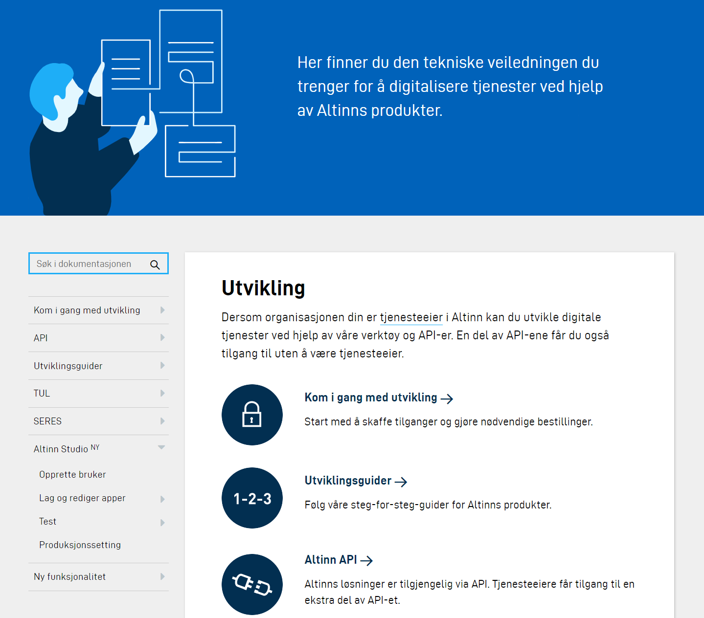

# Altinn docs

Dette er dokumentasjon for Altinn.  
[Altinn docs](https://altinn.github.io/docs/) er markdown, noe som gjør den både enkel å vedlikeholde, teste lokalt og versjonere i GitHub.

## Ønsker du å bidra?

Markdown-filene som vi genererer dokumentasjonen fra ligger [åpent på GitHub](https://github.com/altinn/docs/tree/master/content/).  
Alle kan med andre ord [gjøre endringer og forbedringer](https://help.github.com/articles/editing-files-in-another-user-s-repository/) på egen hånd.

Du kan foreslå forbedringer eller påpeke bugs ved å [opprette en issue](https://github.com/altinn/docs/issues).

Se [CONTRIBUTING](CONTRIBUTING.md) for info om hvordan du kan editere og teste docs lokalt med [vscode](https://code.visualstudio.com/) og [Hugo](https://gohugo.io).

