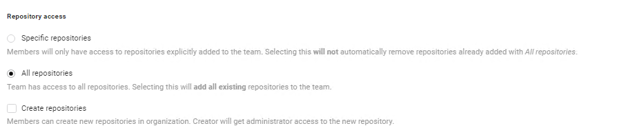
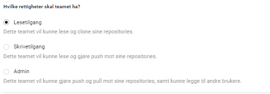
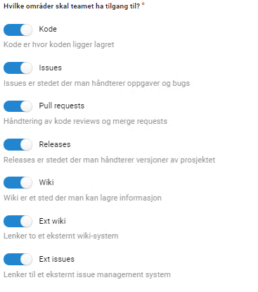

{}

## Tilgangsstyring for organisasjonen

Som eier av en organisasjon i Altinn Studio har man mulighet til å konfigurere tilgangene til 
de øvrige brukerne knyttet til organisasjonen. Dette gjøres via Gitea på følgende lenke: https://altinn.studio/repos/org/{organisasjonsnavn}/teams/

Det er definert fire standard team som legger føringer for en bruker har tillatelse til å gjøre innad i en organisasjon i Altinn Studio.
Ved behov kan man som eier kan man legge til/fjerne brukere i team, oprette nye team og endre konfigurasjon på eksisterende team.

### Owners

  
Beskrivelse

  Medlemmer i dette teamet kan tenkes på som administrator for organisasjonen. 
  De vil kunne administrere tilgangsstyringen for alle team og repositories knyttet til organisasjonen.

  Som medlem i dette teamet kan man blant annet:
  - opprette/slette team 
  - legge til og fjerne brukere i ulike team
  - endre konfigurasjon for team

  
Konfigurasjon

  
  Dette teamet ligger inne som standard i alle organisasjoner og det er ikke mulig å endre konfigurasjonen for dette teamet.

### Deploy-Prod

  
Beskrivelse

  Medlemmer i dette teamet kan deploye applikasjoner til produksjonsmiljøet.

  Øvrige rettigheter kan defineres fritt av owners.
  Default konfigurasjon inkluderer rettigheter for: 
  - Lesetilgang i samtlige repositories
  - Kan _ikke_ opprette nye repositories 
  - Full tilgang til alle områder i Gitea

  
Konfigurasjon

  Konfigurasjonen av dette teamet kan justeres av owners etter behov, 
  muligheten til å deploye til produksjon er ikke avhengig av øvrig config. 
  
  Standard konfigurasjon for teamet er vist nedenfor: 

### Deploy-TT02

  
Beskrivelse

  Medlemmer i dette teamet kan deploye applikasjoner til testmiljøet.

  Øvrige rettigheter kan defineres fritt av owners.
  Default konfigurasjon inkluderer rettigheter for: 
  - Lesetilgang i samtlige repositories
  - Kan _ikke_ opprette nye repositories 
  - Full tilgang til alle områder i Gitea

  
Konfigurasjon

  Konfigurasjonen av dette teamet kan justeres av owners etter behov, 
  muligheten til å deploye til testmiljø er ikke avhengig av øvrig config. 
  
  Standard konfigurasjon for teamet er vist nedenfor: 

### Devs

  
Beskrivelse

  Medlemmer i dette teamet jobber med å utvikle applikasjoner og har tigang til samtlige repositories.

  
Konfigurasjon

  Konfigurasjonen av dette teamet kan justeres av owners etter behov,
  avhengig av hvor mye frihet man ønsker at apputvikleren skal ha.
  Merk at det blant annet er mulig å spesifisere hvilke(t) repository teamet skal ha tilgang til.
  
  Standard konfigurasjon for teamet er vist nedenfor og inkluderer rettigheter til å
  - Opprette nye repositories
  - Skrive til samtlige repositories
  - Aksessere alle områder i Gitea

## Tilgangsstyring for repository

[Mer informasjon kommer]