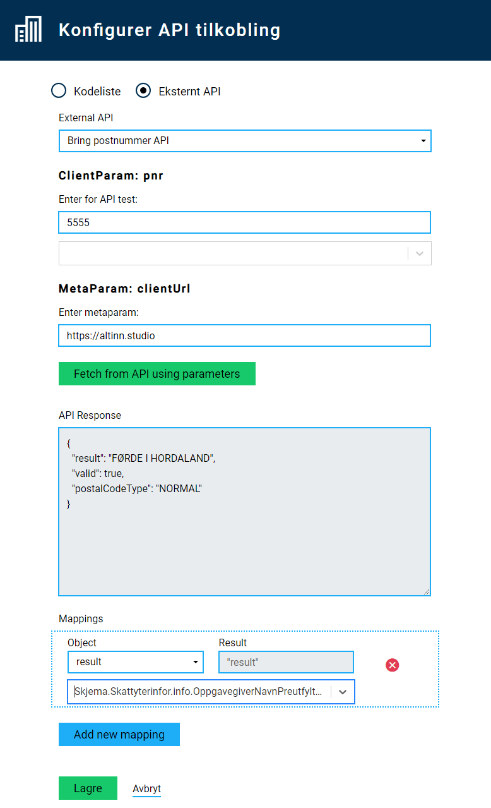

## Call external APIs to fetch data
{}
NOTE: Currently, only open APIs (that do not require authentication) are supported for this funcitonality.
{}

External APIs can be used to populate data in the form from external sources. There is currently implemented support for two types of values fetched from external APIs: _Single value_ and _List of values_. 

### APIs fetching a _single value_
This type of API potentially takes some input from a field in the form, submits this to the API as a parameter, and returns a single value in response. The connection can be configured to populate a set field in the form with this fetched value. An example of this is the _Bring poststed_ API, which takes a postal code as input and returns the postal area. 

### APIs fetching a _list of values_
This type of APIs works in a similar way to code lists. It potentially takes some input from a field in the form, submits this to the API as a parameter, and returns a list of values in response. The connection can be configured to populate the options of a form component that can have multiple values (f.ex. a dropdown list, radio buttons, checkboxes). An example of this is the _SSB kommuneliste_ API, which returns a list of all the municipalities in Norway defined in a configured time interval. 

## Available APIs

| API              | Description                                                                               | Type           |
| ---------------- | ----------------------------------------------------------------------------------------- | -------------- |
| Bring poststed   | Fetches the name of the Norwegian postal area based on input of corresponding postal code | Single value   |
| SSB kommuneliste | Fetches a list of all Norwegian municipalities, as defined in a set time interval         | List of values |

## Configure API connection

1. Add any form components that might be needed for the input/output values for the selected API. Make sure that the form components are connected to fields in the data model.
2. Select _Legg til tilkobling_ under _API-tilkoblinger_ from the left-hand menu in the GUI editor.
3. Select _Eksternt API_.
4. Select API from the list of available APIs.
5. Add client parameters,if any (_ClientParam_) -  These are any input parameters that are populated from selected form data.
	- Add an example value to test the API call
	- Select data model field that corresponds to the data model field connected to the input field.
6. Add any additional parameters required by the API (_MetaParam_) - this is input required by the API that does not come from the form data.
7. Test the API call by clicking _Fetch from API using parameters_.
	- This will test that the call is working with the selected parameters, using the example value as input.
  - The response from the test will be shown in the textbox under _API Response_
8. Select _Add new mapping_ to map the response to a field in the form.
9. Select which object from the response that should be used to populate the field (the API may return more than one object in response).
10. Select data model field that corresponds to the data model field connected to the field that will show the output from the API.
  - Note that this should be a component type that supports lists (ex. dropdown, checkboxes, radiobuttons, etc.) for APIs returning a list of values.
11. Save the configuration by clicking _Lagre_.
12. Test that it works by typing in a valid input value in the input field, and see that the output field is populated with the result of the API call.

