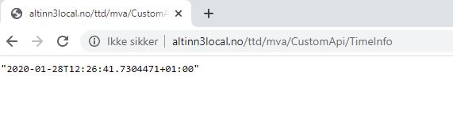

Applikasjonene som utvikles i Altinn Studio baserer seg i dag på ASP.Net Core rammeverket. 
Dette gir høy fleksibiltet til å endre og modifisere applikasjonene. 


## Legge til API kontroller

For å kunne eksponere et nytt API i applikasjonen må det legges til en eller flere API kontrollere. 


Nedenfor vises et eksempel fra en API controller som er lagt til i en gitt app. 
Her settes det opp hvilken path API skal lytte på og logikken. 


```C#
using System;
using System.Threading.Tasks;
using Microsoft.AspNetCore.Mvc;

namespace Altinn.App.Api.Controllers
{
    [Route("{org}/{app}/CustomApi")]
    [ApiController]
    public class CustomApiController : ControllerBase
    {
        public CustomApiController()
        {

        }

        [HttpGet("TimeInfo")]
        public async Task<ActionResult> Get()
        {
               return Ok(DateTime.Now);
        }
    }
}

```




Koden kan ses i dette repositoriet. 