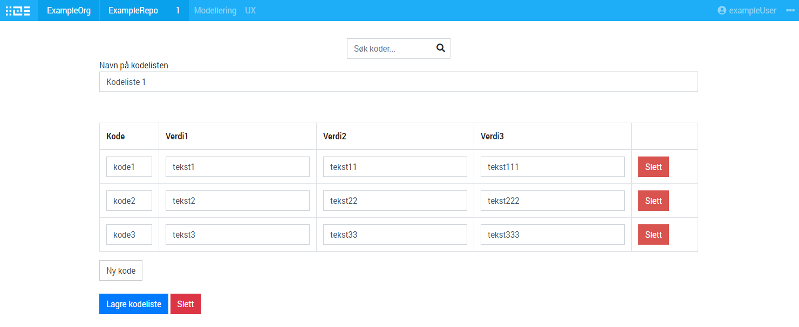
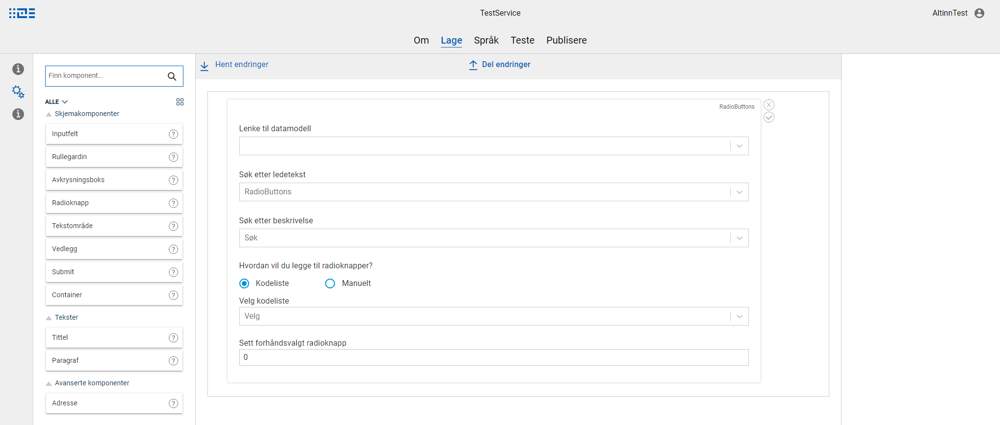

A code list is a pre-defined list of _codes_ and display texts that can be connected to a form component.
Code lists can come from common libraries, and can be defined for each app.

## Add/edit code list
In the top navigation meny, select _Modellering_ -> _Kodelister_. An overview of existing code lists will be shown.
To edit an existing code list, select it from the overview. To add a new code list, click _Lag ny kodeliste_. 

## Connect a code list to a form component
{}
NOTE: Currently, the only form components that support code lists are _Radio buttons_ and _Checkboxes_.
{}

1. Add a form component that supports code lists, and open the properties editor for the component. 
2. Select _Code list_ as option to add radio buttons.
3. Select a code list from the available options for the service.  
   Note that this must be a code list that is either defined for the service, or in a common library that the service has access to.
4. Save the changes by clicking the _checkmark_ icon to the right of the properties editor. 

When testing the service, the actual values from the code list will be loaded into the component. 

{}
NOTE: There is currently no language support for code lists.
{}
