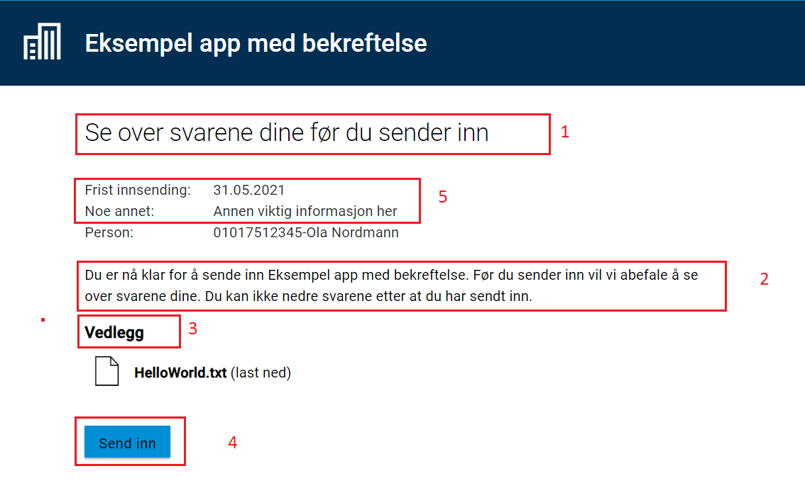

En applikasjon vil ha en prosess som brukeren av applikasjonen vil følge. 
Avhengig av hvilken type steg brukeren er i, vil forskjellige ting vises. 
Denne siden vil forklare hvordan visningen til de forskjellige stegene kan tilpasses.

## Data (tilsvarer utfyllingssteg i Altinn II)
I denne prosess-task-typen vises skjema som kan fylles ut.  
Skjema kan redigeres ved bruk av [UI editoren](../../ui-editor) eller ved å endre `FormLayout.json` direkte.

## Bekreftelse (Confirmation)
I denne prosess-task-typen vises noen standard-tekster, og bruker kan velge å *bekrefte* for å gå videre.

Tekstene kan overstyres, ved at man legger inn tekstnøkkel som hører til hver tekst i språkfilene for appen. Info
om hvordan dette gjøres finner du [her](../../tekster). Se under for oversikt over de forskjellige tekstnøklene som kan
overstyres.

I tillegg kan man legge inn statiske data som kan presenteres til sluttbruker, markert med *5* i bildet under. 



### Overstyre tekster

| Tekst nr. (se bilde over) | Tekstnøkkel         |
| ------------------------- | ------------------- |
| 1                         | confirm.title       |
| 2                         | confirm.body        |
| 3                         | confirm.attachments |
| 4                         | confirm.button_text |

Eksempel på overstyrte tekster i filen `resources.nb.json`:

```json
{
  "id": "confirm.title",
  "value": "Vennligst bekreft at du ønsker å sende inn"
},
{
  "id": "confirm.body",
  "value": "Du må kun trykke send inn om du er helt sikker på at du vil sende inn. <br/><br/>I det du trykker send inn kan du ikke gjøre endringer."
},
{
  "id": "confirm.attachments",
  "value": "Dokumenter med opplysninger"
},
{
  "id": "confirm.button_text",
  "value": "Lagre og fortsett"
}
```

Merk at i eksempelet over har vi brukt html-taggen `<br/>` for å lage linjeskift.
For lenke og utheving, [benytt markdown](../../tekster#formatering-av-tekster).

Dette resulterer i følgende visning:


