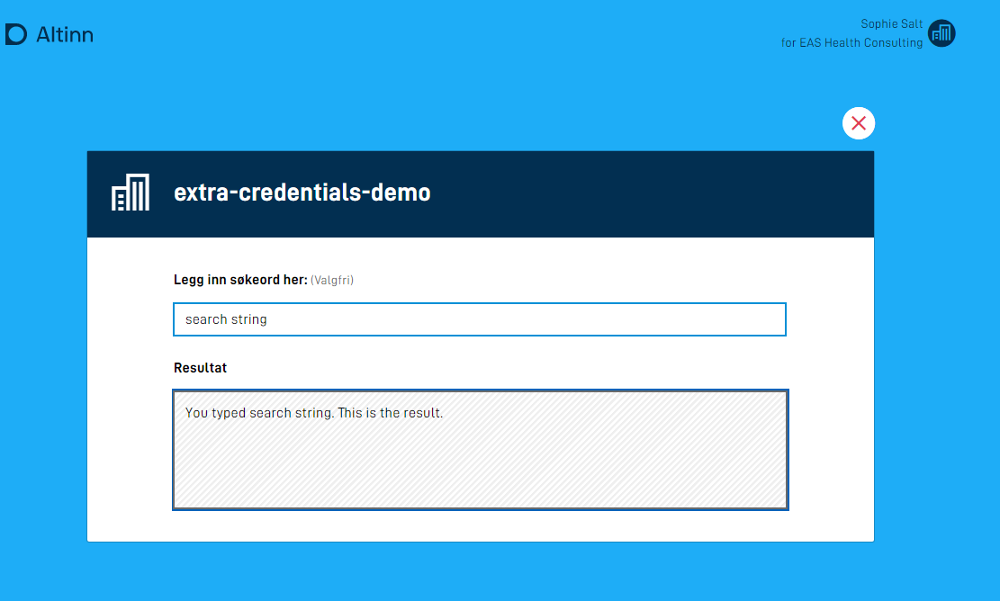
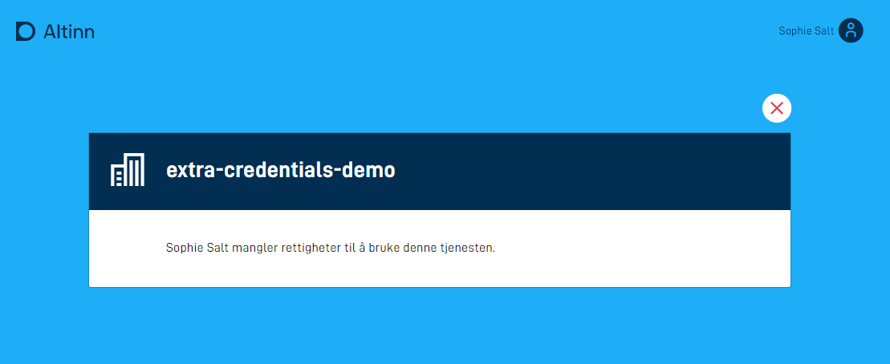
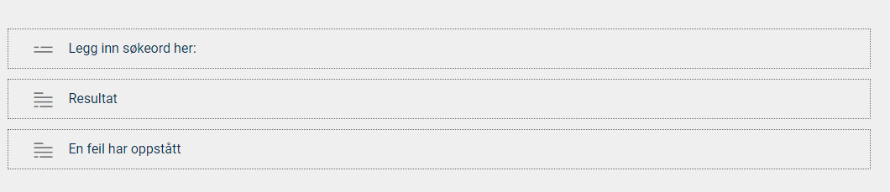

## Introduksjon til stateless applikasjoner

En stateless, eller tilstandsløs, applikasjon skiller ser fra standard applikasjoner ved at den ikke lagrer noe data,
verken skjemadata eller metadata om instanser av applikasjonen. 
Derfor passer stateless applikasjoner godt som innsynstjenester der en sluttbruker eller et system gjør et oppslag mot en eller annen ressurs
evt. presenterer data fra en tredjepart basert på hvem brukeren er.


## Konfigurasjon

{}

Dette er helt ny funksjonalitet. Oppsett må gjøres manuelt inntil videre.

**MERK:** for å benytte denne funksjonaliteten må man versjon >= 4.5.2 av nugetpakkene `Altinn.App.PlatformServices`, `Altinn.App.Common` og `Altinn.App.Api`.

{}

I applikasjonsmetadataen er det mulig styre oppførselen en applikasjonen har under oppstart. Om man ønsker at applikasjonen skal oppføre seg som en tilstandsløs applikasjon vil det nå være mulig.
For en slik applikasjon vil det ikke bli lagret noe data eller metadata, og applikasjonen vil heller ikke havne i meldingsboksen til sluttbruker. Dette tilsvarer en innsynstjeneste i Altinn 2.

Konfigurasjonen av dette gjøres i `applicationmetadata.json`. Eksempel:

```json{hl_lines=[31]}
{
  "id": "ttd/stateless-app-demo",
  "org": "ttd",
  "title": {
    "nb": "Stateless App Demo"
  },
  "dataTypes": [
    {
      "id": "ref-data-as-pdf",
      "allowedContentTypes": [
        "application/pdf"
      ],
      "maxCount": 0,
      "minCount": 0
    },
    {
      "id": "Stateless",
      "allowedContentTypes": [
        "application/xml"
      ],
      "appLogic": {
        "autoCreate": true,
        "classRef": "Altinn.App.Models.StatelessV1"
      },
      "taskId": "Task_1",
      "maxCount": 1,
      "minCount": 1
    }
  ],
  ...
  "onEntry": { "show": "stateless" } // legg til denne linjen
}

```
I feltet `onEntry.show` har man mulighet til nå å referere til et layout-set som man ønsker skal vises under oppstarten av applkasjonen. Les mer om layout-sets [her.](../../ux/ui-editor/multiple-layoutsets/#oppsett)

Layout-settet man referer til her blir så benyttet som visningen brukeren blir presentert for i det man navigerer til applikasjonen.

Konfigurasjonsfilen `layout-sets.json` kan opprettes dersom den ikke finnes fra før av. Den skal ligge i mappen `App/ui`.
I `layout-sets.json` legger man så inn det aktuelle settet man referer til fra `applicationmetadata.json`, eksempel:

```json
{
    "sets": [
      {
        "id": "stateless",
        "dataType": "Stateless"
      }
    ]
  }
```

I eksempelet over så referer layout-settet `stateless` til datamodellen `Stateless`. Eksempel app-struktur på en applikasjon som har satt opp på denne måten:

```text
├───App
    ├───config
    ├───logic
    ├───models
    │       Stateless.cs
    │       Stateless.metadata.json
    │       Stateless.schema.json
    │       Stateless.xsd
    ├───ui
        │   layout-sets.json
        │
        └───stateless
            |   RuleConfiguration.json
            │   RuleHandler.js
            │   Settings.json
            │
            └───layouts
                  FormLayout.json
```

`FormLayout.json` vil så kunne settes opp på samme måte som en vanlig applikasjon, og vil støtte samtlige komponenter som er mulig å sette opp i en vanlig app, med unntak av:
- Filopplaster
- Knapp 

App frontend vil så skjønne ut fra konfigurasjonen i `applicationmetadata.json` at den ikke skal instansiere, og hente ned de aktuelle layout-filene og den tilkoblede datamodellen og presentere dette til sluttbrukeren.

## Datapopulering

Når man benytter en stateless datatype så vil man kunne populere datamodellen i det app-frontend spør om skjemadataen.

Datapopuleringen skjer i to steg på det initielle kallet fra frontend (GET):
1. Prefill, les mer om dette [her.](../../data/prefill/)
2. Dataprossesering, les mer om dette [her.](../../logic/dataprocessing/)

På påfølgende oppdateringer på samme skjemadata (POST) så vil man ikke kjøre prefill en gang til, men kalkuleringen trigges. Dette muligjør manipulering av dataen basert på brukerens input selv i en stateless tilstand.

Eksempel på en kalkulering som populerer datamodellen nevnt i eksempelet over:

```c#
public async Task<bool> ProcessDataRead(Instance instance, Guid? dataId, object data)
{  
    if (instance.GetType() == typeof(StatelessV1))
    {
        StatelessV1 form = (StatelessV1) data;
        // Her kan du gjøre det du ønsker, f.eks et API-kall 
        // om tjenesten skal oppføre seg som en innsynstjeneste.
        form.Fornavn = "Test";
        form.Etternavn = "Testesten";
        return true
    }
    return false;
}
```

## Autorisasjon med tredjepartsløsninger

Tilgangsstyring for stateless applikasjoner kan løses med [standard app-autorisasjon](../authorisation) 
der man hved hjelp av Altinn-roller definerer hvem som har tilgang til å benytte tjenesten.
Dersom man har behov for ytteligere sikring av tjenesten kan man implementere logikk for autorisasjon av brukere med tredjepartløsninger.
Dette kan være API-er som er eksponert innenfor egen virksomhet eller åpne API fra andre tilbydere.

I eksempelet nedenfor benyttes Finanstilsynets API til å fastslå om virksomheten som repesenteres av en bruker i Altinn 
har tilstrekkelige lisenser til å benytte tjenesten.






Kildekoden til applikasjonen som eksempelet er basert på finnes [her](https://altinn.studio/repos/ttd/extra-credentials-demo). (Krever bruker i Altinn Studio.)

Videre i eksempelet vil betegnelsen *bruker* være synonymt med en virksomhet representert ved en person i Altinn.

1. **Utvid datamodellen med felter for autorisasjon**

    I tillegg til et felt for å ta input fra bruker og et felt for å vise fram resultatet,
    har vi i dette eksempelet et felt for å holde på infomasjon om hvorvidt brukeren er autentisert 
    og et felt for å holde på en dynamisk feilmelding.

    ```xml
    <xs:sequence>
        <xs:element name="searchString" type="xs:string" />
        <xs:element name="result" type="xs:string" />
        <xs:element name="userAuthorized" type="xs:boolean" />
        <xs:element name="errorMessage" type="xs:string" />
    </xs:sequence>
    ```

    *Hopp til steg 4 dersom applikasjonen kun skal benyttes via API.*
  
2. **Legg til felt for å vise feilmelding i brukergrensesnittet**
    
    I brukergrensesnittet til applikasjonen er det tre komponenter. 
    Et søkefelt for brukerinput, et tekstfelt dedikert til å vise fram søkeresultatet og en paragraf som er reservert for feilmeldinger.

    

    Komponentene er koblet til datamodell og tekstressurs på følgende måte i `FormLayout.json`

    ```json
    "layout": [
      {
        "id": "sokeBoks",
        "type": "Input",
        "textResourceBindings": {
          "title": "SearchString"
        },
        "dataModelBindings": {
          "simpleBinding": "searchString"
        },
        "required": false,
        "readOnly": false
      },
      {
        "id": "resultatBoks",
        "type": "TextArea",
        "textResourceBindings": {
          "title": "Result"
        },
        "dataModelBindings": {
          "simpleBinding": "result"
        },
        "required": false,
        "readOnly": true
      },
      {
        "id": "errorBoks",
        "type": "Paragraph",
        "textResourceBindings": {
          "title": "ErrorMessage"
        },
        "required": false,
        "readOnly": true
      }
    ]
    ```

3. **Legg inn dynamikkregler for å vise/skjule felter**
    
    Vi bruker dynamikkregler til å vise/skjule felter avhengig av om en bruker en autorisert eller ikke. 
    
    Det er lagt inn en dynamikkregel i `RuleHandler.js` som sjekker om et felt i datamodellen har verdien `false`. 
    Konfigurasjon av regler er beskrevet nærmere [her](../../logic/dynamic/#legg-tilrediger-funksjoner-for-beregninger-eller-visskjul).

    I `RuleConfiguration.json` ser man hvordan regelen benyttes.
    Dersom inputverdien fra datamodellen `userAuthorized` er false, så vises errorBoks-komponenten,
    mens det motsatte skjer med søke- og resultatfeltene, disse skjules. 

    Default oppførsel vil være det motsatte, altså at søk og resultat er synlig, mens error feltet er skjult.

    ```json
    {
      "data": {
        "ruleConnection": {},
        "conditionalRendering": {
          "e2dd8ff0-f8f1-11eb-b2bc-5b40a942c260": {
            "selectedFunction": "isFalse",
            "inputParams": {
              "value": "userAuthorized"
            },
            "selectedAction": "Show",
            "selectedFields": {
              "e2dd68e0-f8f1-11eb-b2bc-5b40a942c260": "errorBoks"
            }
          },
          "e2dd8ff0-f8f1-11eb-b2bc-5b40a942c261": {
            "selectedFunction": "isFalse",
            "inputParams": {
              "value": "userAuthorized"
            },
            "selectedAction": "Hide",
            "selectedFields": {
              "e2dd68e0-f8f1-11eb-b2bc-5b40a942c261": "sokeBoks",
              "e2dd68e0-f8f1-11eb-b2bc-5b40a942c262": "resultatBoks"
            }
          }
        }
      }
    }
    ```
4. **Legg til tekstressurser**

   I tillegg til navnet på tjenesten er det lagt inn tre tekstressurser. 
  
   Tekstressursen for feilmelding inneholder en placeholder for navnet på brukeren. 
   Variabelen `errorMessage` vil populeres i datamodellen når det registreres at en bruker ikke er autorisert til å bruke tjenesten.

    ```json
     {
      "id": "ErrorMessage",
      "value": "{0} mangler rettigheter til å bruke denne tjenesten.",
      "variables": [
        {
          "key": "errorMessage",
          "dataSource": "dataModel.lookup"
        }
      ]
    },
    {
      "id": "Result",
      "value": "Resultat"
    },
    {
      "id": "SearchString",
      "value": "Legg inn søkeord her:"
    },
    ```
5. **Implementér autorisasjonslogikk**

    Alt av dataprosessering for stateless applikasjoner ligger i filen `App\logic\DataProcessing\DataProcessingHandler.cs`, 
    og det er her autorisasjonslogikken skal plasseres. 
    
    Logikk for å slå opp data og autorisere brukeren ligger i metoden `ProcessDataRead`.
    Denne kalles hver gang en bruker åpner applikasjonen eller sendes inn noe input data.

    ```{cs, attr.source='.numberLines'}
     public async Task<bool> ProcessDataRead(Instance instance, Guid? dataId, object data)
     {
         lookup lookup = (lookup)data;
         
         // Check if user is authorized to use service
         Party party = await _register.GetParty(int.Parse(instance.InstanceOwner.PartyId)); 

         if (string.IsNullOrEmpty(party.OrgNumber) || !await _finanstilsynet.HasReqiuiredLicence(_settings.LicenseCode, party.OrgNumber))
         {
             lookup.userAuthorized = false;
             lookup.errorMessage = $"{party.Name}";
             return true;
         }         
          
         // logic for looking up data
         if (!string.IsNullOrEmpty(lookup.searchString))
         {
             lookup.result = $"You typed \"{lookup.searchString}\". This is the result.";
             return true;
         }

         return false;
     }
    ```

    Metoden starter med logikk for å hente ut skjemadataen slik at denne kan benyttes 
    videre i metoden.

    ```cs
    lookup lookup = (lookup)data 
    ```

    Videre kommer logikken for å sjekke om brukeren er autorisert.

    ```cs
    // Check if user is authorized to use service
    Party party = await _register.GetParty(int.Parse(instance.InstanceOwner.PartyId)) 

    if (string.IsNullOrEmpty(party.OrgNumber) || !await _finanstilsynet.HasReqiuiredLicence(_settings.LicenseCode, party.OrgNumber))
    {
        lookup.userAuthorized = false;
        lookup.errorMessage = $"{party.Name}";
        return true;
    }   
    ```

    For å vite hvem brukeren er, benyttes identifikatoren `instance.InstanceOwner.PartyId`, denne får vi som input til metoden.
    Vi slår opp i Altinn sitt register for å hente ut party-objektet som representerer brukeren. Dette kan inneholde en organisasjon eller en person.

    ```cs
    Party party = await _register.GetParty(int.Parse(instance.InstanceOwner.PartyId)) 
    ```

    Det gjøres to sjekker for å avgjøre om en bruker er autorisert eller ikke. 
    Først verifiseres det at party-objektet har definert et organisasjonsnummer,
    dersom dette ikke er tilfellet er brukeren en person, og dermed ikke autorisert.

    Den andre sjekken kaller `_finanstilsynet.HasReqiuiredLicence()`, en metode som slår opp i finanstilsynets API for å avgjøre om en organisasjonen har en gitt lisens.
    Implementasjonen av servicen er tilgjengelig [her](https://altinn.studio/repos/ttd/extra-credentials-demo/src/branch/master/App/services/FinanstilsynetService.cs).
    
    Dersom ingen av sjekkene er vellykkede populeres to felter i datamodellen; 
    - en indikator på at brukeren ikke er autorisert
    - en feilmelding, her kun navnet til brukeren
  
     og `true` returneres for å indikere at dataverdier har blitt oppdatert.
    

    ```cs
    lookup.userAuthorized = false;
    lookup.errorMessage = $"{party.Name}";
    return true;
    ```

    Helt til slutt kommer logikken for å vise fram et resultat basert på søkestrengen.
    
    ```cs
    // logic for looking up data
    if (!string.IsNullOrEmpty(lookup.searchString))
    {
        lookup.result = $"You typed \"{lookup.searchString}\". This is the result.";
        return true;
    }

    return false;
    ```

    `lookup.result` populeres med verdien av oppslaget, i dette tilfellet skriver vi bare søkestrenger tilbake til bruker.
    Igjen returneres `true` for å indikere at en dataverdi er blitt endret, og `false` dersom dette ikke er tilfellet.

