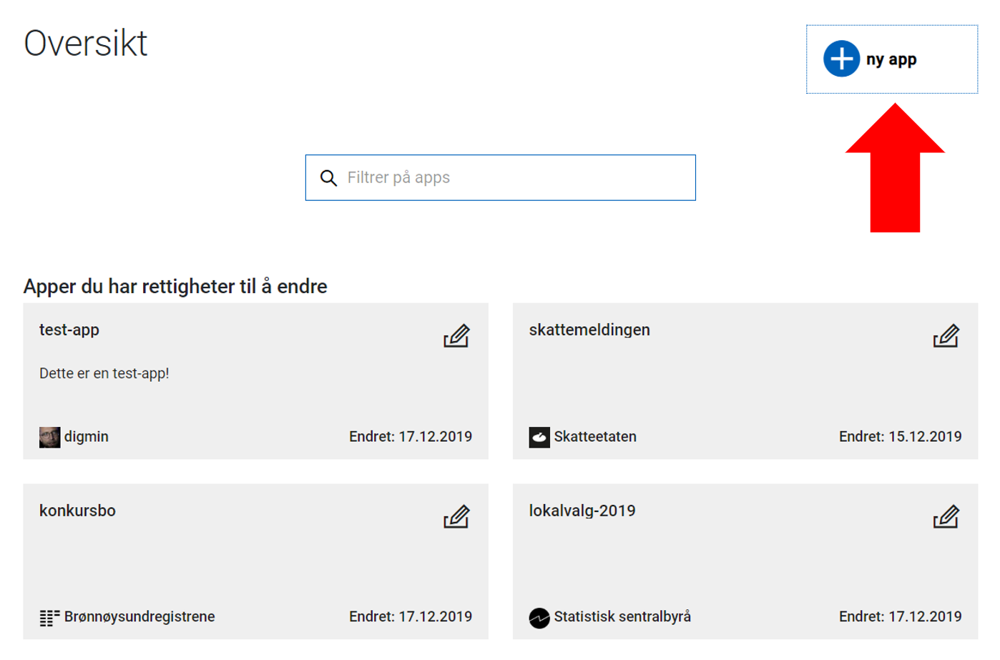

Altinn Studio brukes til å opprette applikasjoner (apps).
En app kan være alt fra enkle skjemaer til større applikasjoner med både API-er og UI, og alt derimellom. 

Du lager en ny app fra dashboardet i Altinn Studio.

1. Klikk på "**ny app**"-knappen i det øvre høyre hjørnet av dashboardet. 
2. Velg hvem som skal være **eier** av appen. Hvis du ikke har tilgang for noen organisasjoner, må du velge deg selv så du lager appen i din sandkasse.
3. Legg inn **navnet** på appen. Dette navnet brukes til å identifisere appen, og brukes også som navn på repository, og i URL-er og API-er.
   Navnet bør være kort og beskrivende som for eksempel "sykmelding" eller "lokalvalg-2019".  
    _Navnet kan **ikke** endres etter at appen er gått i produksjon._
4. Opprett appen ved å klikke "**Opprett**".

Når apppen er opprettet vil du videresendes til den nyopprettede appen.

