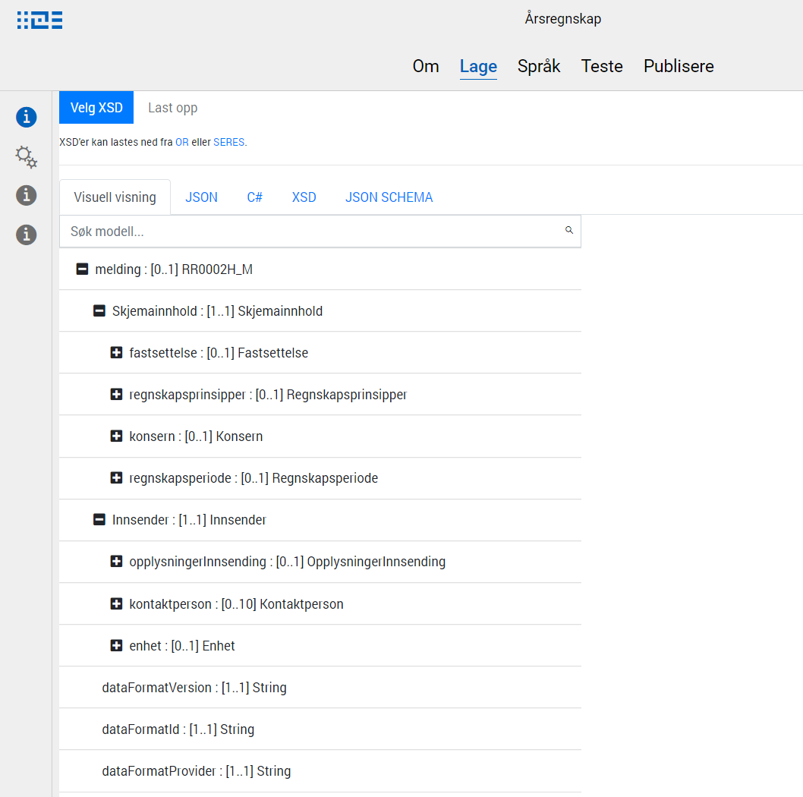

{}
Det er planlagt datamodelleringsfunksjonalitet inn i Altinn Studio. Den midlertidige funksjonaliteten er derfor svært begrenset.
{}

## Laste opp / vise datamodell
Datamodellen definerer hvilke data som kan sendes inn via en app, og hvilket format det skal sendes på. Per nå må datamodellen være definert som en XSD i et eksternt verktøy - gjerne [Seres Domeneklient](/docs/seres/brukerveiledninger/domeneklient/).

Det må lastes opp en datamodell for hver app.

1. Åpne appen fra dashboardet
2. Velg fanen Lage, og valget Datamodell i navigasjonsmenyen
3. Klikk på _Velg XSD_ og velg XSD-en i filvelgeren
4. Klikk _Last opp_

Datamodellen blir da parset, og alle nødvendige filer generert og lagret i app-repositoryet.
Disse filene kan vises ved å velge de ulike fanene på datamodellsiden.

