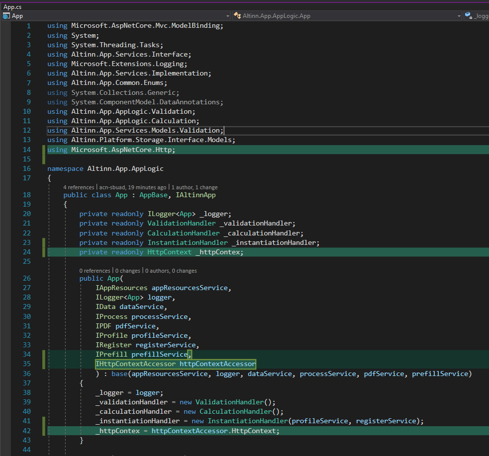

The various files that are used to define logic can be reached by opening the logic menu,
accessed from the UI editor via the _f(x)_-icon on the top right.


They can also be edited directly from the app repo, under the `App/logic` folder (for server-side app logic) or under the `App/ui` folder (for dynamics). This folder contains the following files by default:

```
- App /
  - logic /
    - Calculation /
      - CalculationHandler.cs
    - Validation /
      - ValidationHandler.cs
    - App.cs
    - InstantiationHandler.cs
```
More files can be added here as necessary.

A complete project with examples of server-side app logic can be found [here](https://dev.altinn.studio/repos/ttd/webdemo2).

{}
NOTE: The way to reference elements in the data model differs between OR and SERES type XSDs. For OR type XSDs `.value` is a necessary suffix in the reference. The example code below uses a mixture of the two types of data models.
{}

## Instansiering
Applikasjonslogikk knyttet til instansiering kan defineres i `InstantiationHandler.cs`. For en helt ny app vil det være to funksjoner implementert i denne klassen:

 - `RunInstantiationValidation` - lag egne sjekker for å avgjøre om en bruker/avgiver får lov til å instansiere.
 - `DataCreation` - lag tilpasset prefill data.

### Egendefinerte valideringsregler for instansiering
Som tidligere nevnt, kan sjekker for instansieres kan defineres i `RunInstantiationValidation`.
Tilgang til _Register_- og _Profile_-tjenester er inkludert i `InstantiationHandler.cs`-filen, som tillater å gjøre sjekker mot disse.

Valideringsregler for instansiering kan innebære å validere tidspunkt til spesifikke brukerrestriksjoner og komplekse sjekker som krever eksterne API-kall.

#### Kodeeksempler

##### Eksempel 1 - Insansiering kun tillatt før kl 15:00 på en gitt dag

```csharp
public async Task<InstantiationValidationResult> RunInstantiationValidation(Instance instance)
{
    DateTime now = DateTime.Now;
    if (now.Hour < 15)
    {
        return new InstantiationValidationResult()
        {
            Valid = false,
            Message = "ERROR: Instantiation not possible before 3PM."
        };
    }

    return null;
}
```

##### Eksempel 2 - Instansiering kun tillatt for applikasjonseier

Kodebasen som eksempelet er basert på er tilgjengelig [her.](https://altinn.studio/repos/ttd/example-app-1)
(krever innlogging i altinn.studio)

For å kunne begrense instansiering til en gitt entitet, i dette tilfellet applikasjonseier,
er man avhengig av å vite hvem som prøver å instansiere.

Bildet nedenfor viser hvordan http-kontektsten kan tilgjengeliggjøres for appen. 
Kodeendringen gjøres i `App.cs`.  Brukerdata (claims principals) kan hentes ut fra konteksten ved å kalle ```_httpContext.User```.



I `InstantiationHandler.cs` importeres _System.Security.Claims_  og konstruktøren til `RunInstantiationValidation` utvides som vist nedenfor.

```csharp
RunInstantiationValidation(Instance instance, ClaimsPrincipal user)
```

For å validere instansieringen kan man sjekke ett av to claims i konteksten.
Enten organisasjonsen trebokstavsforkortelse eller organisasjonsnummeret.
Eksempelet nedenfor bruker organisasjonsforkortelsen.
For å validere basert på organisasjonsnummer kan du følge eksempelet nedenfor,
og bytte ut *AltinnCoreClaimTypes&#46;Org* med *AltinnCoreClaimTypes.OrgNumber*.  
For å kunne bruke *AltinnCoreClaimTypes* må _AltinnCore.Authentication.Constants_ importeres i klassen.

```csharp
public async Task<InstantiationValidationResult> RunInstantiationValidation(Instance instance, ClaimsPrincipal user)
{
    InstantiationValidationResult result = new InstantiationValidationResult();

    string org = string.Empty;

    if (User.HasClaim(c => c.Type == AltinnCoreClaimTypes.Org))
    {
        Claim orgClaim = User.FindFirst(c => c.Type == AltinnCoreClaimTypes.Org);
        if (orgClaim != null)
        {
            org = orgClaim.Value;
        }
    }

    if (!string.IsNullOrWhiteSpace(org) && org.Equals("ttd"))
    {
        result.Valid = true;
    }
    else
    {
        result.Valid = false;
        result.Message = "Only ttd is allowed to instantiate this application.";
    }

    return await Task.FromResult(result);
}
```

</details>

### Custom prefill
This can be used to prefill any data, including data from `Register` and `Profile`, as well as data from external sources from API calls. 

An example that prefills a field `Person.FirstName` to the value `Test Testesen` is:

```csharp
public async Task DataCreation(Instance instance, object data)
{
    if (data.getType() == typeof(Skjema))
    {
      Skjema model = (Skjema)data;
      model.Person.FirstName = "Test Testesen";
    }
}
```

## Validation
Validations make sure that the users input is valid with respect to the data model, as well as any custom rules that are set up for the service.
Validations can be run _client-side_ (i.e. in the browser) and _server-side_. 

### Client-side validation
{}
NOTE: Configuration of client-side validations is currently not available. The documentation will be updated when new functionality is available.
{}

These validations are run automatically, and validates the users input against restrictions from the data model.
The following restrictions are currently supported:

- min value (number)
- max value (number)
- min length
- max length
- length
- pattern

In addition, validation on whether the field is required or not is supported. This is automatically connected to the data model, and no configuration is required.

### Server-side validation
The validations that are run on the server can be split into two categories:

- **Validations against the data model** - These are run automatically when the user tries to submit data. 
- **Custom validations** - These are written by the app developer, and are run when the user prepares to submit data to the app (or continue to the next step of the app).

### Adding custom validations 
Validations are written in C# code, in the file `ValidationHandler.cs` in the app template.
This file can be accessed and edited via the logic menu, by selecting _Rediger valideringer_, or directly in the app template under the `logic/Validation` folder.
Changes are then made in the `Validate`-method (empty method that is created when the app is created).

Form data can be accessed through the data model that is passed to the method by default. To add a validation error, use the `AddModelError`-method of the `validationResults` object that is passed
to the `Validate` method.

An example of a simple validation that checks that a field _FirstName_ does not contain the vaule _1337_, when the model root element is `Skjema` is shown below:

```csharp
public void Validate(object instance, ModelStateDictionary validationResults)
{
    
    if (instance.GetType() == typeof(Skjema))
    {
      // Cast instance data to model type
      Skjema model = (Skjema)instance;

      // Get value to test - FirstName
      string firstName = Skjema?.Person?.FirstName;

      // Check if FirstName exists, and contains the value "1337"
      if (firstName != null && firstName.Contains("1337"))
      {
        // Add validation error, with error message and list of affected fields (in this case Person.FirstName)
        validationResults.AddModelError(
          "Person.FirstName",
          "Error: First name cannot contain the value '1337'."
        );
      }
    }
}
```

See the comments in the code above for details on what the different parts of the code do. 

### Single field validations
{}
This functionality is currently disabled in Altinn Apps.
{}

If there is a need for immediate validation of a field (that is not covered by client-side validation against data model), it is possible to set up a field to trigger server-side validation. This is done by setting the property `triggerValidation` to `true` in the component definition in FormLayout.json.

```JSON
{
  "data": {
    "layout": [
      {
        "id": "3611fb2a-c06b-4fa7-a400-3f6c1ece64e1",
        "textResourceBindings": {
          "title": "25795.OppgavegiverNavnPreutfyltdatadef25795.Label"
        },
        "dataModelBindings": {
          "simpleBinding": "etatid"
        },
        "type": "Input",
        "triggerValidation": true, // <--- Add this field
      },
      {
        "id": "9ec368da-d6a9-4fbd-94d0-b4dfa8891981",
        "type": "Button",
        "textResourceBindings": {
          "title": "Button"
        },
        "dataModelBindings": {},
        "textResourceId": "Standard.Button.Button",
        "customType": "Standard"
      }
    ]
  }
}
```

It is then up to the app developer to write the code for validations in such a way that only the relevant errors are returned when a trigger field is specified,
while all validations are run f.ex. when the user is ready to submit data. 

<!--An example of such code is shown below.

```csharp
public void Validate(TestModel TestModel, RequestContext requestContext, ModelStateDictionary modelState)
{
    // Check if a trigger field is specified on the request context.
    // If a trigger field is specified, run validations inside if-block and then stop so that only relevant errors are returned.
    if (requestContext.ValidationTriggerField != null)
    {
        string triggerField = requestContext.ValidationTriggerField;
        // Check which field triggered validation, and run any relevant validations
        if (triggerField == "Person.FirstName")
        {
            ValidateFirstName(TestModel, modelState);
        }

        // Finish here, do not run any further validations
        return;
    }
    
    // If no trigger field is specified, run validations for all fields
    RunAllValidations(TestModel, requestContext, modelState);
}

private void RunAllValidations(TestModel TestModel, RequestContext requestContext, ModelStateDictionary modelState)
{
    // All validations for the form
    ValidateFirstName(TestModel, modelState);
}

private void ValidateFirstName(TestModel TestModel, ModelStateDictionary modelState)
{
    // Check if field FirstName exists and has value
    string firstName = TestModel?.Person?.FirstName;

    // Check if the field contains "1337"
    if (firstName != null && firstName.Contains("1337")) 
    {
        // If the field value contains "1337", add an error message using AddModelError-method.
        // The first argument is the error message key, which should be the data model path (without root node), if possible.
        // The second argument is the error message, which can be either a text, or a text key.
        modelState.AddModelError("Person.FirstName", "First name cannot contain 1337.");
    }
}
```-->

### Soft validation

{}
This functionality is currently disabled in Altinn Apps.
{}

Soft validations (or warnings) are validation messages that do not stop the user from proceeding to the next step. This validation type can be used for example to ask the user to verify input that might seem strange, but is not technically invalid. Soft validations are set up in the same way as other validations - the only difference is that the validation message must be prefixed by `*WARNING*`. 

<!-- An example is shown below:

```csharp
public void Validate(TestModel TestModel, RequestContext requestContext, ModelStateDictionary modelState)
{   
    // Validate first name
    ValidateFirstName(TestModel, modelState);
}

private void ValidateFirstName(TestModel TestModel, ModelStateDictionary modelState)
{
    // First, make sure that the field exists
    string firstName = TestModel?.Person?.FirstName;

    // Check if field contains "1337"
    if (firstName != null && firstName.Contains("1337")) 
    {
        // If the field value contains "1337", add an error message using AddModelError-method.
        // The first argument is the error message key, which should be the data model path (without root node), if possible.
        // The second argument is the error message, which can be either a text, or a text key.
        // When adding a soft validation, prefix the error message with *WARNING*
        modelState.AddModelError("Person.FirstName", "*WARNING*Are you sure your first name contains 1337?");
    }
}
```-->

## Calculation
Calculations are done server-side, and are based on input from the end user. Calculations do not have to be purely mathematical calcilations, but can also include populating fields based on other form data, api calls, etc.

 Calculations need to be coded in C# in the file `CalculationHandler.cs`. This file can be edited by clicking _Rediger kalkuleringer_ from the logic menu. The data model object is passed to the `Calculate`-method and can be manipulated directly. 

{}
IMPORTANT: Once a calculation is done, the app front-end needs to re-load the data in order to get the updated data. To do this, the `Calculate`-method must return the value `true` if any data has been updated. If this is not done, then the data will be updated on the server, but this will not be visible for the end user until they manually reload.
{}

Below is an example of code that replaces a given value (`12345678`) with another value (`22222222`) in a specified field:

```csharp
public bool Calculate(object data)
{
    if (data.GetType() == typeof(Skjema))
    {
        // Cast the data object to model type to access all fields
        Skjema model = (Skjema)data;

        // Get the existing value of a specified field, if it exists
        string tlf = 
            model?
            .OpplysningerOmArbeidstakerengrp8819?
            .OpplysningerOmArbeidstakerengrp8855?
            .OppgavegiverTelefonnummerdatadef27335?.value;

        // Check if the value exists and is equal to "12345678"
        if (tlf != null && tlf == "12345678")
        {
            // Replace the value in the field with a new value, "22222222"
            model
              .OpplysningerOmArbeidstakerengrp8819
              .OpplysningerOmArbeidstakerengrp8855
              .OppgavegiverTelefonnummerdatadef27335.value = "22222222";

            // Return true to trigger a re-loading of data 
            return true;
        }
    }

    // Return false if no changes have been made
    return false;
}
```


## Dynamics
Dynamics are events that happen on the client-side. These are split into two categories:

* Rules - explicitly set the value of a field, based on some condition or value input. 
  * For example calculations based on input from another field.
* Conditional rendering - Show/hide fields based on conditions.

All conditions and rules are written in javascript, in the file `RuleHandler.js`. The file can be reached through the logic menu, by clicking _Rediger dynamikk_. 

Once these conditions/methods are coded, they can be configured to be triggered for specific fields in the form.

{}
The code that defines rules/conditions should be set up so that it handles any possible error sources. For example, rules are set up to run as soon as input is received. If a rule is dependent on input from multiple fields, then it must be coded to handle cases when only one of the fields has received input. If a rule is not behaving as expected, take a look at the code for the rule and consider if there are any assumptions made that may need to be addressed. 
{}

### Add/edit methods for dynamics
The solution currently supports two types of methods:

- Rules for calculation/populating values in form fields
- Conditions for rendering (hide/show) of form fields

These are defined in the file `RuleHandler.js` as separate objects, `ruleHandlerObject` and `conditionalRuleHandlerObject`. In addition there are two corresponding _helper_ objects (`ruleHandlerHelper` and `conditionalRuleHandlerHelper`), that define which parameters should be set up when configuring the methods to trigger. In order for a dynamics method to be available, the actual method/action must be defined in the _object_ and the configuration parameters must be defined in the corresponding _helper_, and the names _must_ be as described above for the helpers and objects.

The structure of the _helper_ is as follows:

```javascript
var ruleHandlerHelper = {
  <name_of_rule>: () => {
    return {
      <input_param>: "<description>",
      <input_param>: "<description>",
      <input_param>: "<description>"
      ...
    };
  }
}
```

The structure of the _object_ containing the rule/conditional rendering definitions is as follows:

```javascript
var ruleHandlerObject = {
  <name_of_rule>: (<input_variable_name>) => {
    // Do something here
    // Values from input parameters defined in 
    // helper can be accessed through the object passed
    // into the rule, f.ex.
    // <input_variable_name>.<input_param>
  }
}
```

For example, to create a rule that returns the sum of two numbers, one would need the following:

```javascript
var ruleHandlerHelper = {
  sum: () => {
    return {
      field1: "Field 1 in sum",
      field2: "Field 2 in sum"
    };
  }
}

var ruleHandlerObject = {
  sum: (data) => {
    // Check if data is available
    if (!data) return;

    // Check if value from input fields are available
    // If not, use value 0 in sum
    data.field1 = data.field1 ? data.field1 : 0;
    data.field2 = data.field2 ? data.field2 : 0;

    // return the sum
    return data.field1 + data.field2;
  }
}
```

The objects and helpers are all generated automatically with some examples when the service is created, and can be added to or edited to create/change methods.

In the example below, the following methods are defined:

| Method name | Description | Parameters | Defined in object/helper |
| ----------- | ----------- | ---------- | ------------------------ |
| `sum`       | Returns the sum of the 2 provided values | `value1`, `value2` | `ruleHandlerObject`/`ruleHandlerHelper`|
| `fullName`  | Returns the full name based on the provided first and last names | `firstName`, `lastName` | `ruleHandlerObject`/`ruleHandlerHelper`|
| `lengthGreaterThan4`| Returns `true` if the provided value's length is greater than 4 | `value` | `conditionalRuleHandlerObject`/`conditionalRuleHandlerHelper`|

Note that _rules_ are run when there is a change in any of the defined input parameters. The rule definition needs to handle cases where the rule might crash because one or more parameters are missing, or if the rule should not produce a result until all input parameters are provided. An example of how this can be done is shown in the `sum` rule below, where the rule tests if the parameters are provided, and sets them to the value `0` if they are not provided, so that a sum can be calculated.

```
var ruleHandlerObject = {
  sum: (obj) => {
    obj.value1 = obj.value1 ? +obj.value1 : 0;
    obj.value2 = obj.value2 ? +obj.value2 : 0;
    return obj.value1 + obj.value2;
  },

  fullName: (obj) => {
    return obj.firstName + ' ' + obj.lastName;
  }
}
var ruleHandlerHelper = {
  sum: () => {
    return {
      value1: "Value 1",
      value2: "Value 2"
    }
  },

  fullName: () => {
    return {
      firstName: "First name",
      lastName: "Last name"
    };
  }
}

var conditionalRuleHandlerObject = {
  lengthBiggerThan4: (obj) => {
    if (obj.value == null) return false;
    return obj.value.length >= 4;
  }
}
var conditionalRuleHandlerHelper = {
  lengthBiggerThan4: () => {
    return {
      value: "value"
    }
  }
}
```

### Configuring dynamics for form components

1. Add any form components that are needed. For example, for the method `sum` defined above, 3 input values are required, so 3 form components have to be set up for the input, in addition to 1 field to display the result. 
2. Open the logic menu and select _Legg til tilkobling_ under _Regler_ (for calculation/population rules) or _Betingede redigeringstilkoblinger_ for conditional rendering.
3. Select rule from the list of available rules, ex. `sum` from the example above.
4. Configure the fields that will provide input to the method
  a. For calculation/population rules, use the same data model field as configured on the form component.
  b. For conditional rendering, select the component id from the list
5. Configure the field that will show the output/render conditionally
  a. For calculation/population rules, select the same data model field as configured on the form component that is to show the result.
  b. For conditional rendering, first select the action (hide/show) that will trigger if the selected method returns `true`. Then select the component id that will be conditionally rendered.
6. Save the configuration.
7. Test that it works by entering values in the defined input fields.

Existing configurations are visible in the logic menu, and can be edited/deleted.

### Example of using dynamics in a form
The scenario:

A service uses a form which has multiple input fields. One of these is a radio button group, with Yes/No options. Depending on the end users response (Yes or No), different content should be shown:

- Yes: A new input field should be shown, together with information on what to fill out in the field.
- No: An information text should be showm.

After creating the form in the UI editor, the following code is added from the logic menu, under "Rediger dynamikk":

```javascript
var conditionalRuleHandlerObject = {
  sjekkVirksomhetIDrift: (obj) => {
    return (obj.value && obj.value === "Ja");
  },

  sjekkVirksomhetIkkeIDrift: (obj) => {
    return (!obj.value || obj.value != "Ja");
  }
}

var conditionalRuleHandlerHelper = {
  sjekkVirksomhetIDrift: () => {
    return {
      value: "Verdi"
    }
  },
  sjekkVirksomhetIkkeIDrift: () => {
    return {
      value: "Verdi"
    }
  }
}
```

Here, two functions are created to check if the a given value is either "Ja" or "Nei". 

After adding this code, the configuration for using the functions is added. Starting with `sjekkVirksomhetIDrift`:


* First, we add the field that will provide the input.
  - This is the data model field that is also mapped to the radio button group we want to trigger the dynamics.
* Then we select the action (show/hide) we want to trigger, and which components we want to be affected
  - Here, we select *show*. This will hide the components until they are triggered to show.
  - We add the text components (header and paragraph for information text) and input component that should be _shown_ when the dynamic is triggered.

Then we do the same for `sjekkVirksomhetIkkeIDrift`. 

Finally, we run a manual test in Altinn Studio to check that everything works as expected. The results are shown in the GIF below. 


### Example with more complex dynamics

The scenario:
A form with two sets of radio buttons (yes/no), and a checkbox.

- When the form loads, only the first radio button group is visible. 
- If the user selects _Yes_ in the first radio button group, the second radio button group becomes visible.
- If the user selects _Yes_ in the second radio button group, the checkbox becomes visible.
- If the user goes back and selects _No_ in the first radio button group, only the first radio button group should be visible.

#### Alternative 1
This can be set up by creating two separate conditions for when to show the fields:

- One for the second radio button group:
  - Show when _Yes_ is selected in the first group
- One for the checkbox:
  - Show when _Yes_ is selected in _both_ the first and second radio button groups.

The code for this would be:
```javascript
var conditionalRuleHandlerObject = {
  showField2: (obj) => {
    if (obj && obj.field1 && obj.field1=== "yes") {
      return true;
    }
    return false;
  },

  showField3: (obj) => {
    if (obj && obj.field1 && obj.field1 === "yes"
      && obj.field2 && obj.field2 === "yes") {
        return true;
    }
    return false;
  }
}

var conditionalRuleHandlerHelper = {
  showField2: () => {
    return {
      field1: "Field 1"
    };
  },

  showField3: () => {
    return {
      field1: "Field 1",
      field2: "Field 2"
    };
  }
}
```

#### Alternative 2
This can also be set up by using the same condition for showing the field for both the second radio button group and the checkbox, and in addition adding a rule to clear the value from the second radio button group if the value of the first radio button group is set to _No_:

```javascript
var ruleHandlerObject = {
  clearField: (obj) => {
    if (obj && obj.checkValue === "no") {
      return "";
    }
    return obj.currentValue;
  }
}

var ruleHandlerHelper = {
  clearField: () =>  {
    return {
      checkValue: "check against this value",
      currentValue: "the current value"
    }
  }
}

var conditionalRuleHandlerObject = {
  showField: (obj) => {
    if (obj && obj.checkField && obj.checkField === "yes") {
      return true;
    }
    return false;
  }
}

var conditionalRuleHandlerHelper = {
  showField: () => {
    return {
      checkField: "check against this value"
    };
  }
}
```

## Auto-complete/intellisense

C#-files (which are used in calculations and server-side validations) are set up with support for auto-complete for the data model.
This means that suggestions for possible fields in the data model are displayed as you type. 

For javascript-files, a full language intellisense is available, which suggests possibilities defined by the javascript language,
and shows any syntax errors with a red underline.
Intellisense/autocomplete is automatically shown as you type, and can also be reached by the key combination `CTRL + SPACE`.


In order to get complete intellisense with C# support, the app must be edited locally using f.ex. Visual Studio Code.