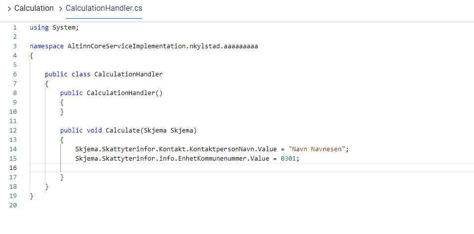

## Introduksjon

De forskjellige filene som brukes til å definere logikk, finner man i logikk-menyen,
som er tilgjengelig i UI-editoren via  _f(x)_-ikonet øverst til høyre.


De kan også redigeres direkte fra applikasjonsrepoet, under folderen `App/logic` (for serverside applikasjonslogikk) eller folderen `App/ui` (for dynamikk).
Denne folderen inneholder som standard følgende filer:

```C#
🗀 App/
  🗀 logic/
    🗀 Calculation/
      🗎 CalculationHandler.cs
    🗀 Print/
      🗎 PdfHandler.cs
    🗀 Validation/
      🗎 ValidationHandler.cs
    🗎 App.cs
    🗎 InstantiationHandler.cs
```

Flere filer kan legges til her når det er nødvendig.

Et komplett prosjekt med eksempler på serverside applikasjonslogikk ligger [her](https://dev.altinn.studio/repos/ttd/webdemo2).

{}
**MERK:** Måten man refererer til elementer i datamodellen er ulik mellom OR og SERES typer XSDer.
For OR XSDer er `.value` et nødvendig suffiks i referansen. Eksempelkoden under bruker en blanding av de to typene datamodeller.
{}


## Auto-complete/intellisense

Ved å redigere kildekoden i appene lokalt, i f.eks. Visual Studio Code, får man intellisense og autocomplete med på kjøpet. 
For C#-filene er det enkleste å jobbe med disse lokalt.

For javascript-filene er det også intellisense/autocomplete tilgjengelig om man ønsker å redigere filene direkte i Altinn Studio.
Dette kommer automatisk mens man skriver, og man kan også tvinge det frem ved å trykke `CTRL + SPACE`

