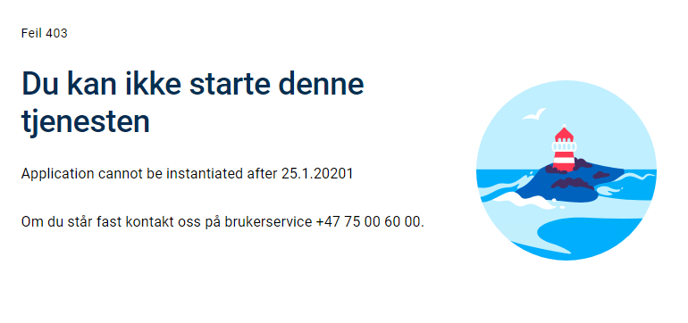

## Introduksjon

Applikasjonslogikk knyttet til instansiering kan defineres i `InstantiationHandler.cs`. For en helt ny app vil det være to funksjoner implementert i denne klassen:

 - `RunInstantiationValidation` - lag egne sjekker for å avgjøre om en bruker/avgiver får lov til å instansiere.
 - `DataCreation` - lag tilpasset prefill data.

## Egendefinerte valideringsregler for instansiering
Som tidligere nevnt, kan sjekker for instansiering defineres i `RunInstantiationValidation`.
Tilgang til _Register_- og _Profile_-tjenester er inkludert i `InstantiationHandler.cs`-filen, som tillater å gjøre sjekker mot disse.
Valideringsregler for instansiering kan innebære å validere tidspunkt til spesifikke brukerrestriksjoner og komplekse sjekker som krever eksterne API-kall.


### Eksempel 1 - Insansiering kun tillatt før kl 15:00 på en gitt dag

```C# {hl_lines=[4]}
public async Task<InstantiationValidationResult> RunInstantiationValidation(Instance instance)
{
    DateTime now = DateTime.Now;
    if (now.Hour < 15)
    {
        return new InstantiationValidationResult()
        {
            Valid = false,
            Message = "ERROR: Instantiation not possible before 3PM."
        };
    }

    return null;
}
```

### Eksempel 2 - Instansiering kun tillatt for applikasjonseier

Kodebasen som eksempelet er basert på er tilgjengelig [her](https://altinn.studio/repos/ttd/example-app-1).
(krever innlogging i altinn.studio)

For å kunne begrense instansiering til en gitt entitet, i dette tilfellet applikasjonseier,
er det to filer som må endres: `App.cs` og `InstantiationHandler.cs`. 


I `App.cs` tilgjengeliggjøres http-konteksten og 
brukerdata (claims principals) hentes ut fra konteksten ved å kalle ```_httpContext.User```.

For å validere instansieringen kan man sjekke ett av to claims i konteksten.
Enten organisasjonsen trebokstavsforkortelse eller organisasjonsnummeret.
Valideringen skjer i `InstantiationHandler.cs` og eksempelet nedenfor bruker organisasjonsforkortelsen. 

For å validere basert på organisasjonsnummer kan du følge eksempelet nedenfor,
og bytte ut *AltinnCoreClaimTypes&#46;Org* med *AltinnCoreClaimTypes.OrgNumber*.  
om må gjøres i denne file ser du nedenfor.


```C#
public async Task<InstantiationValidationResult> RunInstantiationValidation(Instance instance, ClaimsPrincipal user)
{
    var result = new InstantiationValidationResult();
    string org = string.Empty;

    if (user.HasClaim(c => c.Type == AltinnCoreClaimTypes.Org))
    {
        Claim orgClaim =
          user.FindFirst(c => c.Type == AltinnCoreClaimTypes.Org);
          
        if (orgClaim != null)
        {
            org = orgClaim.Value;
        }
    }

    if (!string.IsNullOrWhiteSpace(org) && org.Equals("ttd"))
    {
        result.Valid = true;
    }
    else
    {
        result.Valid = false;
        result.Message =
          "Only ttd is allowed to instantiate this application.";
    }

    return await Task.FromResult(result);
}
```
### Eksempel 3 - Instansiering kun tillatt mellom gitte datoer

For å kunne begrense instansiering til en gitt tidsrom, i dette eksempelet januar 2021,
er det én fil som må endres:`InstantiationHandler.cs`. 

Metoden `RunInstantiationValidation` vil kjøre hver gang noen prøver å instansiere applikasjonen, 
så her plasseres logikk for å verifiere at tidspunktet er innenfor den tillatte rammen.

```cs
public async Task<InstantiationValidationResult> RunInstantiationValidation(Instance instance)
{
    InstantiationValidationResult result = null;
    DateTime now = TimeZoneInfo.ConvertTime(DateTime.UtcNow, TimeZoneInfo.FindSystemTimeZoneById("Central European Standard Time"));
    if (now < new DateTime(2021, 01, 01))
    {
        result = new InstantiationValidationResult
        {
            Valid = false,
            Message = "Application cannot be instantiated before 1.1.2021"
        };
    }
    else if (now > new DateTime(2021, 01, 31))
    {
        result = new InstantiationValidationResult
        {
            Valid = false,
            Message = "Application cannot be instantiated after 25.1.2021"
        };
    }
    return await Task.FromResult(result);
}
```

Det er lagt inn logikk knyttet til datohåndtering for å forsikre oss om at det er norsk tid som gjelder
og som blir brukt i valideringen. 

```cs
DateTime now = TimeZoneInfo.ConvertTime(DateTime.UtcNow, TimeZoneInfo.FindSystemTimeZoneById("Central European Standard Time"));
```

Videre gjøres det en enkel sjekk for å se om nåværende tidspunkt er innenfor rammene

```cs
(now < new DateTime(2021, 01, 01)
```

Dersom man ikke oppfyller kravene blir returobjektet populert med et _InstantiationValidationResult_ objekt som inneholder to felter: 
_Valid_: en boolean som benyttes for å si om instansieringen er gyldig eller ikke
_Message_: en string som kan inneholde en feilmelding dersom det ikke er gyldig


```cs
 result = new InstantiationValidationResult
        {
            Valid = false,
            Message = "Application cannot be instantiated before 1.1.2021"
        };
```

I tillegg har man muligheten til å legge benytte property 
_ValidParties_: en liste med de partiene som kan instansiere applikasjonen.

Resultatet av en feilet validering er vist nedenfor: 





