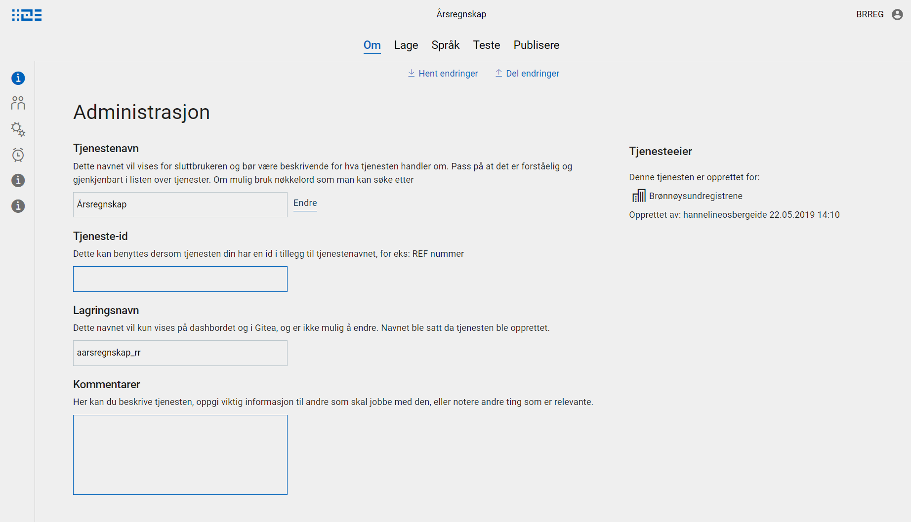
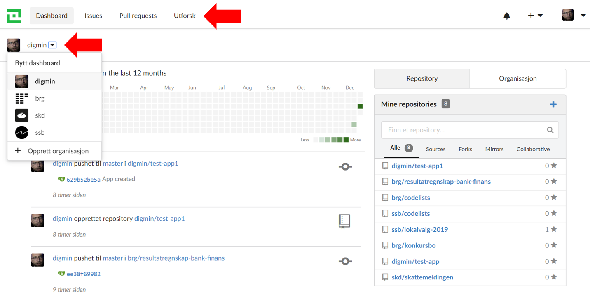
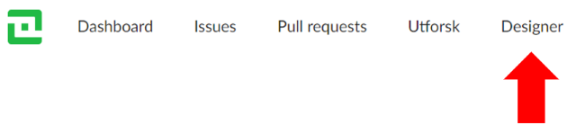

Som bruker av Altinn Studio kan du bruke ulike verktøy, avhengig av kompetanse, preferanser og kompleksiteten på det du skal utvikle.
Hvordan du navigerer er ulikt mellom verktøyene.


## Designer

Designer er verktøyet du starer i etter å ha logget inn på https://altinn.studio.
Det er et verktøy for å opprette, konfigurere og deploye apper.

### Navigere til en app
Alle apper du har tilgang til å endre på vises på dashboardet.
Gå til appen ved å klikke på appen. Dersom du ikke har en lokal klone av appen, vil du bli bedt om å opprette det.

Hvis du ønsker å gå til app-repositoryet når du er inne i en app i Designer, er det en lenke i menyen som ligger i profilmenyen øverst til høyre.


### Redigere en app

Det er to navigasjonsmenyer - en toppmeny og en venstremeny.  
I **toppmenyen** kan du navigere mellom ulike funksjonelle områder av applikasjonen.
I **venstremenyen** kan du navigere innad i området.



- _Om_
  - Om appen
- _Lage_
  - Datamodell
  - UI-Editor
  - Tilgangsstyring
- _Språk_
  - Tekster
- Deploy

## Repos
Repos er verktøyet der appene er lagret som Git repositoryer, og kan bli funnet på https://altinn.studio/repos.

### Hovedmeny


Hovedmenyen øverst inneholder disse elementene:

- Altinn-logoen - tilbake til Altinn Studio-dashboardet.
- Dashboard - Lister ut dine aktiviteter og de repositoryene og organisasjonene du har tilgang til. Du kan også se dashboard for den enkelte organisasjonen.
- Issues - Lister ut åpne og lukkede issues som er relevant for deg.
- Pull requests - Lister ut åpne og lukkede pull requests som er relevant for deg.
- Utforsk - Gir deg tilgang til å se alle repositoryer, brukere og organisasjoner


### Navigere innad i et repository
Når du har navigert til et repository dukker det opp et nytt sett menyvalg som er relevant for repositoryet.


- Kode - innholdet, alle filer appen består av
- Issues - "saker" for repositoryet
- Pull Requests - for repositoryet
- Releases - opprettet for repositoryet
- Aktivitet - hva har skjedd i repositoryet

Hvis du vil til Designer for det aktuelle repositoryet, er det et valg for dette i toppmenyen:



## Code
Selv om vi har støtte for å redigere kode og konfigurasjonsfiler direkte i Altinn Studio Repos, er det ofte mer behagelig å gjøre det lokalt på din maskin.

For å gjøre dette må du laste ned og installere et koderedigeringsverktøy.  
Vi anbefaler [Visual Studio Code](https://code.visualstudio.com/Download), men det er fritt fram hvilket verktøy du velger.

### Finne adressen til et repo

URL-en til et gitt app repository er strukturert slik, så bytt ut owner og repo-navn:  
`https://altinn.studio/repos/owner/repo.git`.

Du kan finne URL-en ved å navigere til repositoryet. Klikk ikonet til høyre for å kopiere.


Du kan også finne samme URL i en popup i Designer hvis du klikker på "Clone"-knappen.


### Klone koden
Etter at du har åpnet Visual Studio Code, åpne den [integrerte terminalen](https://code.visualstudio.com/docs/editor/integrated-terminal) (ctrl + ø) og skriv klone-kommandoen.
Husk å få med riktig organisasjon og repo-navn.

```sh
git clone https://altinn.studio/repos/owner/repo
```

Om du ikke er kjent med Visual Studio Code eller Git arbeidsflyt, er det god dokumentasjon her:

https://code.visualstudio.com/docs/getstarted/introvideos
https://code.visualstudio.com/docs/editor/versioncontrol#_git-support