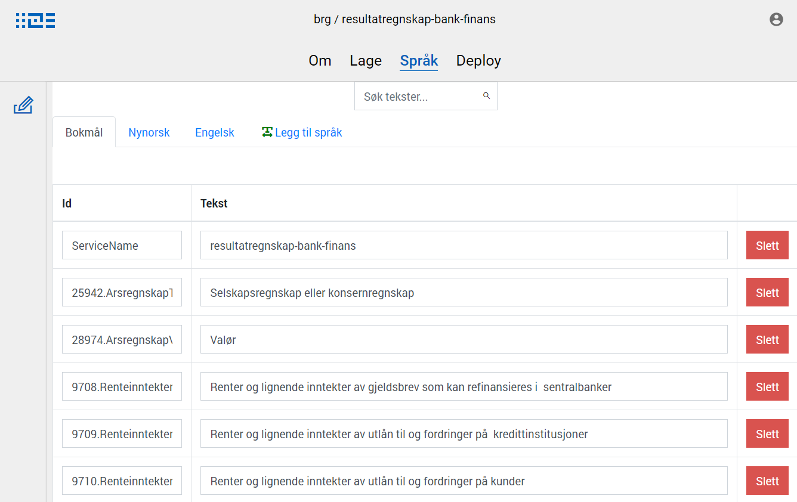

## Text resources

Texts are stored in resource files in the app. Texts can come from common libraries, from the data model, or be added manually.
These texts are available when editing form UI component properties, and selected texts will be shown to the users.

## Add/edit texts for an app

In the top navigation menu, select _Språk_ to go to the text editing page. 
An overview of the texts that are already available for the app is shown.

On this page, existing texts can be changed and new texts can be added.
Add a new text by clicking _Ny tekst_, and enter the text and a unique identifier for the text. 

Save any changes by clicking _Lagre tekster_.



For editing a lot of texts, a developer can also edit the texts as JSON directly in Altinn Studio Repos,
or locally in an editor after cloning the repo.


### Variables in text

Variables can be used in a text by following the notation shown below.
Supported data sources include: dataModel.

```json
{
  "id": "text.Label",
  "value": "Hello, {0}! Here is a second variable {1}.",
  "variables": [
    {
      "key": "[datamodelField]",
      "dataSource": "dataModel.[dataModelName]"
    },
    {
      "key": "[datamodelField]",
      "dataSource": "dataModel.[dataModelName]"
    }
  ]
}
```

The order of the variables should match the parameters in the text. It is recommended that the variables
are static throughout the lifecycle of an instance. This can be ensured using prefill
to populate the value in the data model or assigning during instantiation.

## Adding helptexts
Help texts are small text snippets that provide a brief explaination of what the users are supposed to fill in to the fields that they describe.

The language-keys that point to the help text is defined in the form layout json file.

In your repo under the folder `Resources` there is a `FormLayout.json`-file. The contents might be:

```json
{
  "data": {
    "layout": [
      {
        "id": "616071dc-90b1-4ce5-8d18-492844828a41",
        "type": "Header",
        "componentType": 0,
        "textResourceBindings": {
          "title": "ServiceName"
        },
        "dataModelBindings": {}
      },
      {
        "id": "fac3c047-efe1-49da-8189-da7c536a4edd",
        "type": "Input",
        "componentType": 2,
        "textResourceBindings": {
          "title": "21771.RapporteringsenhetNavndatadef21771.Label",
          "description": "21771.RapporteringsenhetNavndatadef21771.Label"
        },
        "dataModelBindings": {
          "simpleBinding": "generellInformasjongrp2581.avgiftspliktiggrp50.rapporteringsenhetNavndatadef21771.value"
        },
        "required": true,
        "readOnly": false
      },
      {
        "id": "08d707a9-2475-4d23-bf76-f209fb434ec2",
        "type": "TextArea",
        "componentType": 7,
        "textResourceBindings": {
          "title": "19684.OmsetningsoppgaverTilleggsopplysningerdatadef19684.Label",
          "description": "19684.OmsetningsoppgaverTilleggsopplysningerdatadef19684.Label",
        },
        "dataModelBindings": {
          "simpleBinding": "avgiftspostergrp2577.posteneIOppgavengrp5639.tilleggsopplysningergrp197.omsetningsoppgaverTilleggsopplysningerdatadef19684.value"
        },
        "required": false,
        "readOnly": false
      },
      {
        "id": "bd6589b6-e2ab-49ba-b39a-dd3f8b63e5de",
        "type": "Button",
        "componentType": 9,
        "textResourceBindings": {
          "title": "Send inn"
        },
        "dataModelBindings": {},
        "textResourceId": "Standard.Button.Button",
        "customType": "Standard"
      }
    ]
  }
}
```

If you would like one of these components to have a help text you will need to

1. Insert a key into text resources, under the tab "Language"
   - Remember to fill out all the fields, it will not let you save if you have fields that are empty.
2. Open the `FormLayout.json`-file
3. Insert a new text resource binding with the key "help" and the value to be the name of the Language resource.

Example of how it looks after adding help text:

```json
{
  "data": {
    "layout": [
      {
        "id": "616071dc-90b1-4ce5-8d18-492844828a41",
        "type": "Header",
        "componentType": 0,
        "textResourceBindings": {
          "title": "ServiceName"
        },
        "dataModelBindings": {}
      },
      {
        "id": "fac3c047-efe1-49da-8189-da7c536a4edd",
        "type": "Input",
        "componentType": 2,
        "textResourceBindings": {
          "title": "21771.RapporteringsenhetNavndatadef21771.Label",
          "description": "21771.RapporteringsenhetNavndatadef21771.Label"
        },
        "dataModelBindings": {
          "simpleBinding": "generellInformasjongrp2581.avgiftspliktiggrp50.rapporteringsenhetNavndatadef21771.value"
        },
        "required": true,
        "readOnly": false
      },
      {
        "id": "08d707a9-2475-4d23-bf76-f209fb434ec2",
        "type": "TextArea",
        "componentType": 7,
        "textResourceBindings": {
          "title": "19684.OmsetningsoppgaverTilleggsopplysningerdatadef19684.Label",
          "description": "19684.OmsetningsoppgaverTilleggsopplysningerdatadef19684.Label",
          "help": "Skjema.TilleggsOpplysninger.Hjelpetext"
        },
        "dataModelBindings": {
          "simpleBinding": "avgiftspostergrp2577.posteneIOppgavengrp5639.tilleggsopplysningergrp197.omsetningsoppgaverTilleggsopplysningerdatadef19684.value"
        },
        "required": false,
        "readOnly": false
      },
      {
        "id": "bd6589b6-e2ab-49ba-b39a-dd3f8b63e5de",
        "type": "Button",
        "componentType": 9,
        "textResourceBindings": {
          "title": "Send inn"
        },
        "dataModelBindings": {},
        "textResourceId": "Standard.Button.Button",
        "customType": "Standard"
      }
    ]
  }
}
```