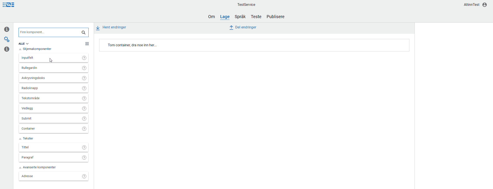

## Create a form using the UI editor

The GUI editor is available via the "Lage" option in the top navigation menu. 

## Form components
Form components can be dragged into the working surface in the middle from the menu on the left-hand side.
The form components can be rearranged by dragging/dropping them on the working surface.

When hovering over a component, or after selecting a component by clicking on it, two icons are visible- a _trash_-icon for deleting the component and a _pencil_-icon for editing properties on the component. 

See the [overview of form components](https://docs.altinn.studio/teknologi/altinnstudio/solutions/altinn-studio/functional/build-app/ui-designer/components/) for more details on the different components that are available.

## Editing the properties on a component
Each component has a set of properties that can be edited, for example texts, connection to data model, etc. In order to edit the properties on a component, hover over or click on the component. A _pencil_-icon will then be visible to the right of the component. Click on this icon to open the properties editor for the component. 

Save any changes by clicking the _checkmark_-icon to the right of the properties editor. Discard any changes by clicking the _X_-icon to the right of the properties editor.

{}
NOTE: The form components are currently being developed. As such, not all form components have a complete/updated properties editor.
{}

See the [overview of form components](https://docs.altinn.studio/teknologi/altinnstudio/solutions/altinn-studio/functional/build-app/ui-designer/components/) for information on which properties are available to edit.
