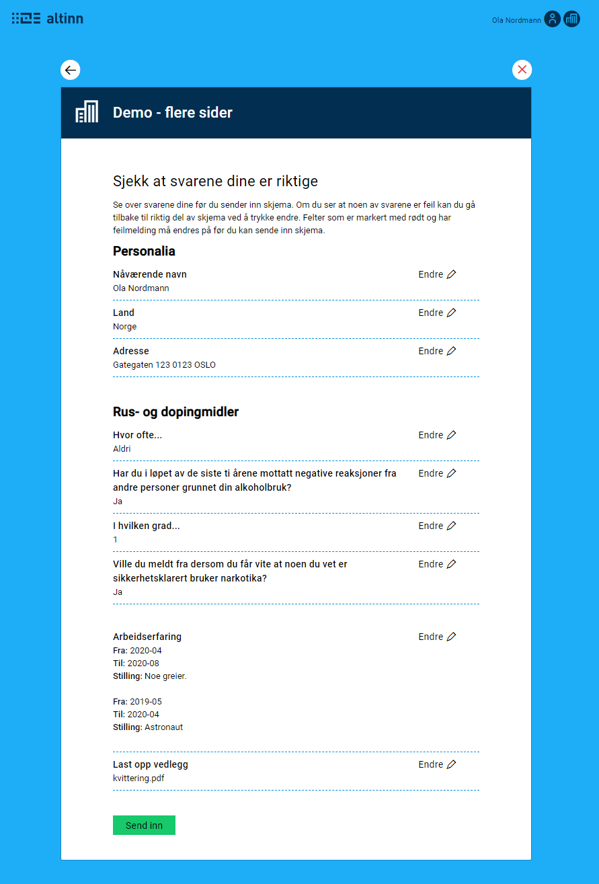

{}
Dette er helt ny funksjonalitet. Oppsett må gjøres manuelt inntil videre. Støtte for oppsett via Altinn Studio kommer snart.
{}

## Oppsett
Visning av oppsummering settes opp på samme måte som øvrige skjema-komponenter i et skjema.
Man kan velge å ha oppsummeringen på en egen side, eller på samme side som andre skjema-komponenter.

Oppsummerings-komponenten er meget enkel, og refererer til _komponent_ som skal oppsummeres, og _siden_ denne ligger på. Eksempel:

```json {hl_lines=[4]}
{
    "id": "summary-1",
    "type": "Summary",
    "componentRef": "<komponent-id>",
    "pageRef": "<side komponenten er definert på>"
},
```

Komponenten viser oppsummering av data fra den spesifiserte komponenten. I tillegg får sluttbruker mulighet
til å gå tilbake til den aktuelle komponenten/siden for å gjøre endringer. 

Visningen er litt forskjellig avhengig av hva slags skjemakomponent oppsummeringen refererer til.

Merk: PDF-generering støtter ikke oppsummering side, så må den ekskluderes ved å endre `layout/ui/Settings.json`
```json
"pages": 
      { 
        "excludeFromPdf": [ "navn-til-oppsummering-side" ] 
      }
```
### Enkel skjemakomponent
Dette er skjemakomponenter som kun er knyttet til 1 felt i datamodellen. F.eks. Input, Dropdown, Checkbox/Radio, osv.


Oppsummeringen viser ledeteksten til skjemakomponenten, og tilknyttet data. Dersom det er en aktiv feilmelding
knyttet til skjemakomponenten, vil dette også vises.


### Adressekomponent
Denne komponenten har flere felter som inngår. Visningen er lik som for en enkel skjemakomponent, 
slik at feltene blir slått sammen til en enkel tekst. 


### Filvedlegg
Oppsummeringsvisningen for filvedlegg viser en liste over de vedleggene som er lastet opp for den aktuelle
komponenten.


### Repeterende grupper


### Grupper i grupper
Oppsummering støttes også for repeterende grupper _inne i_ repeterende grupper. Vi støtter kun ett nivå av 
grupper i grupper. I dette tilfellet vises oppsummeringen av hvert innslag av gruppen på øverst nivå som en
egen [kategori](#kategorier), og gruppen på nederste nivå vises på samme måte som vanlige repeterende
grupper.


## Kategorier
Det er mulig å gruppere oppsummeringene i forskjellige kategorier, for å gjøre en ev. oppsummeringsside
mer oversiktlig. Dette gjøres ved å bruke den eksisterende _gruppe_-komponenten, uten å sette den opp
som en repeterende gruppe. 

Feltene i oppsummeringen vises da med en tittel, som settes i `title`-feltet for `textResourceBindings` for 
gruppe-komponenten. Se eksempel under.


```json
{
  "id": "personalia-group",
  "type": "Group",
  "textResourceBindings": {
    "title": "Personalia"
  },
  "children": [
    "summary-1",
    "summary-2",
    "summary-3"
  ]
},
{
  "id": "summary-1",
  "type": "Summary",
  "componentRef": "d566c79c-3e3e-445b-be25-a404508f6607",
  "pageRef": "personalia"
},
{
  "id": "summary-2",
  "type": "Summary",
  "componentRef": "22a60bf0-d5b7-4b45-9ac9-c266b6ad3716",
  "pageRef": "personalia"
},
{
  "id": "summary-3",
  "type": "Summary",
  "componentRef": "d497737b-67b2-4e03-87a9-43f58579c938",
  "pageRef": "personalia"
},
```

## Eksempel på oppsummeringsside
Under er et eksempel på en oppsummeringsside, med oppsett i layout-filen. Da oppsummeringen settes opp
i layout-filene på samme måte som andre komponenter, kan man også ha med andre skjemakomponenter som tekster
ved behov.



```json
{
  "$schema":  "https://altinncdn.no/schemas/json/layout/layout.schema.v1.json",
  "data": {
    "layout": [
      {
        "id": "send-in-text",
        "type": "Paragraph",
        "componentType": 1,
        "textResourceBindings": {
          "title": "finish"
        },
        "dataModelBindings": {}
      },
      {
        "id": "personalia-group",
        "type": "Group",
        "textResourceBindings": {
          "title": "Personalia"
        },
        "children": [
          "summary-1",
          "summary-2",
          "summary-3"
        ]
      },
      {
        "id": "summary-1",
        "type": "Summary",
        "componentRef": "d566c79c-3e3e-445b-be25-a404508f6607",
        "pageRef": "personalia"
      },
      {
        "id": "summary-2",
        "type": "Summary",
        "componentRef": "22a60bf0-d5b7-4b45-9ac9-c266b6ad3716",
        "pageRef": "personalia"
      },
      {
        "id": "summary-3",
        "type": "Summary",
        "componentRef": "d497737b-67b2-4e03-87a9-43f58579c938",
        "pageRef": "personalia"
      },
      {
        "id": "drugs-group",
        "type": "Group",
        "textResourceBindings": {
          "title": "Rus- og dopingmidler"
        },
        "children": [
          "summary-4",
          "summary-5",
          "summary-6",
          "summary-7"
        ]
      },
      {
        "id": "summary-4",
        "type": "Summary",
        "componentRef": "064c0033-8996-4825-85fc-2a19fe654400",
        "pageRef": "drugs"
      },
      {
        "id": "summary-5",
        "type": "Summary",
        "componentRef": "7f22e523-3f6d-4371-a5dd-233dc41af824",
        "pageRef": "drugs"
      },
      {
        "id": "summary-6",
        "type": "Summary",
        "componentRef": "18a7c709-ae2f-48b3-b6f6-bd631f5d8d56",
        "pageRef": "drugs"
      },
      {
        "id": "summary-7",
        "type": "Summary",
        "componentRef": "b7417cf9-f806-4835-a3d1-424c8d094d5f",
        "pageRef": "drugs"
      },
      {
        "id": "summary-group-1",
        "type": "Summary",
        "componentRef": "arbeidserfaring-group",
        "pageRef": "work"
      },
      {
        "id": "summary-8",
        "type": "Summary",
        "componentRef": "25f720db-5784-4c95-a530-43f0bf523466",
        "pageRef": "attachment"
      },
      {
        "id": "312afa87-c2a9-4ef1-a681-26cc47462878",
        "type": "Button",
        "componentType": 9,
        "textResourceBindings": {
          "title": "Send inn"
        },
        "dataModelBindings": {},
        "textResourceId": "Standard.Button.Button",
        "customType": "Standard"
      }
    ]
  }
}
```