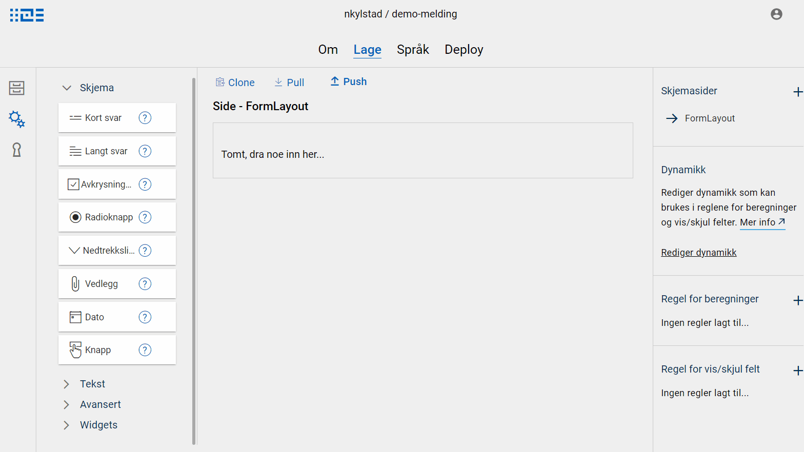

## Hva er en widget?
En widget er en kompleks komponent, sammensatt av en eller flere enkle skjemakomponenter - de skjemakomponentene som er tilgjengelige
for bruk i Altinn Studio i dag. En widget er et verktøy i Altinn Studio som gjør det lettere å lage og gjenbruke layouts. 

## Hvordan bruke widgets
Widgets er tilgjengelige i venstre-menyen i skjemaeditoren i Altinn Studio. Den kan dras inn i skjemasiden på samme måte som andre skjemakomponenter.
Når en widget dras inn i skjema i Altinn Studio, legges de skjemakomponentene som er definert som del av widget'en til i layouten, sammen med ev. 
standard oppsett som knytning til datamodell, tekster, osv. Når en widget er dratt inn i skjema, vil man kun se de skjemakomponentene som den er laget av.
Disse kan redigeres som normalt i skjemaeditoren.
Dersom det er tekster definert for widget'en, disse legges til i ressursfilene for tekster automatisk.

### Eksempel: Meldings-widget

## Tilgjengelige widgets

### Standard widgets
Vi vil etter hvert kunne tilby en samling av forskjellige widgets, disse vil dukke opp automatisk i venstre-menyen i skjemaeditoren i Altinn Studio.
Listen oppdateres etter hvert som nye widgets legges til. Per nå. er følgende widgets tilgjengelig:

| Navn | Beskrivelse | Skjermbilde | 
| ---- | ----------- | ----------- | 
| Melding | Inneholder komponentene som utgjør en standard melding: <ul> <li>tittel <li>meldingstekst <li>vedlegg <li>navigasjonsknapp</ul>  Tekstene er satt opp med referanse til felt i standard melding datamodell. Se [her](../../message) for mer info om meldinger. |  | 

### Egendefinerte widgets
I tillegg til standard widgets som kommer opp automatisk i Altinn Studio, er det også mulig å definere sine egne widgets. En widget består av 3 deler:

- Komponenter: Dette er liste over komponentene som skal inngå, inkl. definisjon av disse komponentene. Dette settes opp på samme måte som i layout-filene, man kan f.eks. kopiere ut komponenter direkte fra en layout-fil.
- Visnings-navn: Dette er teksten som vises i Altinn Studio, i menyen der widget'en ligger.
- Tekstressurser: Dette er valgfritt, og er en liste over tekstressurser på de språk som man ønsker å ha med. Nyttig om komponentene f.eks. skal ha noen standard tekster de bruker.

Se [oppsett for meldings-widget](https://altinncdn.no/altinn-apps/widgets/message.json) for et konkret eksempel. Det fins også en [widget-mal](https://altinncdn.no/altinn-apps/widgets/widgetTemplate.json) som kan lastes ned for å komme i gang.