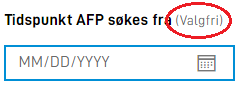

{}

Dette er helt ny funksjonalitet. Oppsett må gjøres manuelt direkte i form layout inntill videre.

**MERK:** Denne funksjonaliteten krever app-frontend versjon 3. Se [denne lenken](https://docs.altinn.studio/teknologi/altinnstudio/changelog/app-frontend/3/breaking-changes/).

{}

## Indikere at felt er valgfritt

Det er mulig å styre om et felt er markert som valgfritt eller ikke. Normal oppførsel er at felt som er valgfrie blir markert som valgfrie.




Normal oppførsel kan overstyres ved hjelp av innstillinger knyttet til feltbeskrivelsen. Dette gjøres via `labelSettings` på en komponent i form layout.

```json
{
  {
    "id": "input-felt-1",
    "type": "Input",
    ... 
    "labelSettings": {
      "optionalIndicator": false
    }
  }
}
```

Ved å sette `optionalIndicator` til `false` vil teksten, som indikerer at feltet er valgfritt, ikke bli vist. Det er ikke mulig å tvinge visning av *Valgfri* teksten på et felt som er obligatorisk. Denne innstillingen styrer ikke feltets faktiske egenskaper.
