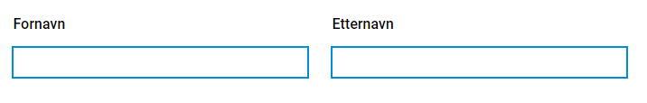

{}

Dette er helt ny funksjonalitet. Oppsett må gjøres manuelt inntil videre. Støtte for oppsett via Altinn Studio kommer snart.

**MERK:** for å benytte denne funksjonaliteten må man ha app-frontend versjon 3. Se [denne lenken](https://docs.altinn.studio/teknologi/altinnstudio/changelog/app-frontend/3/breaking-changes/) om endringer som må til i appen.

{}

## Sidestilte komponenter

Det er mulig å sidestille komponenter i skjema. Denne funksjonaliteten baserer seg på grid systemet til [Material-UI](https://material-ui.com/components/grid/), og vil også være kjent om man er kjent med grid-systemet til boostrap.
Grid systemet baserer seg på en oppbygning av containere i 12 deler, hvor man så kan tildele barn (items) av en grid-container en gitt andel av denne bredden. Material-UI tilbyr også muligheten til å dynamisk endre hvor stor andel av skjermen man ønsker å oppta basert på hvilken skjermstørrelse sluttbrukeren har.
Følgende størrelser med tilhørende breakpoints er definert:

- **xs**: 0px
- **sm**: 600px
- **md**: 1024px
- **lg**: 1440px
- **xl**: 1920px

For å sidestille komponenter horisontalt må man gjøre noen små endringer i formlayout. Det er definert en egen property `grid` som man kan fylle inn bredde ønsket på de ulik størrelsene. Her er et eksempel hvor to input-felt har blitt satt til å ta halve skjermen (enkelte props er fjernet for lesbarhet):

```json
 {
     {
        "id": "input-felt-1",
        "type": "Input",
        ... 
        "grid": {
          "xs": 6,
        }
      },
      {
        "id": "input-felt-2",
        "type": "Input",
        ...
        "grid": {
          "xs": 6
        }
      }
}

```

I komponentene over er størrelsen satt til 6 (altså halv bredde) for størrelse `xs`. Siden `xs` er den minste størrelsen tilgjengelig vil dette gjelde fra størrelse `xs` og opp, altså fra `xs` til `xl`.
Oppsettet over vil gi følgende resultat:



Siden man har 12 inndelinger tilgjengelig i sidebredden er det opp til apputvikler å tildele hvor stor andel komponenten skal ha. Om man ønsker at en komponent skal ta 2/12, en annen 6/12 og siste 4/12 så er det mulig.
Det er viktig å tenke på brukeropplevelsen når man gjør slike endringer, og sidestilling av komponenter bør gjøres med omhu. Komponenter med lengre tekster og beskrivelser blir også fort små og uoversiktelige om disse sidestilles. Skal det benyttes lengre tekster og beskrivelser anbefales det at disse benytter full bredde av skjema.

Om man i eksemepelet over hadde ønsket at komponentene skulle ta hele bredden frem til skjermen ble større enn 960px så kunne man satt opp følgende layout:

```json
 {
     {
        "id": "input-felt-1",
        "type": "Input",
        ... 
        "grid": {
          "xs": 12,
          "sm": 12,
          "md": 6
        }
      },
      {
        "id": "input-felt-2",
        "type": "Input",
        ...
        "grid": {
          "xs": 12,
          "sm": 12,
          "md": 6
        }
      }
}

```

Da ville komponentene først legge seg sidestilt i det sluttbruker faktisk sitter på en skjerm som oppfyller kravet stilt.

### InnerGrid

Utover det å sette bredde på `grid` i komponenten har vi også lagt til mulighet til å styre `innerGrid`. Å overstyre denne bredden vil typisk være for caser hvor man ønsker at teksten til en komponent skal oppta en større bredde enn input-feltet.
Du kan tenke på komponenten på denne måten:
```html
<Grid id="grid"> 
    <div>
        Komponentens tekster
    </div>
    <Grid id="innerGrid"> 
        Komponentens input
    </Grid>
</Grid>
```

Her vil det da være mulig å styre bredden til både ytterste grid og den innerste griden. Eksempel:

```json
{
     {
        "id": "input-felt-1",
        "type": "Input",
        ... 
        "grid": {
          "xs": 12,
          "innerGrid": {
              "xs": 6
          }
        }
      }
}

```

Her har man satt at komponent griden skal ta hele bredden, mens man begrenser komponentens input til å kun ta halve bredden.
InnerGrid vil kunne styres for komponentene:
- Kort svar (Input)
- Langt svar (TextArea)
- Filopplaster (FileUpload)
- Nedtrekksliste (Dropdown)
- Datovelger (Datepicker)


Eksempelet over vil gi følgende output:


