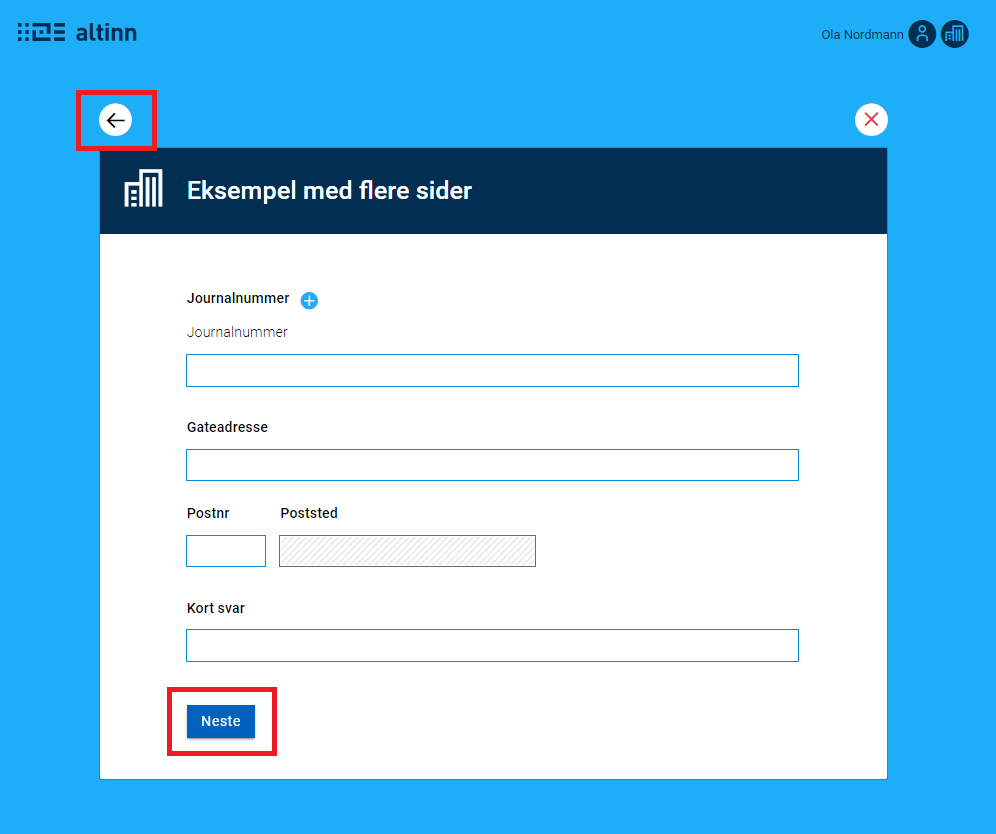
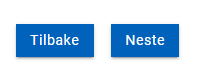

{}
Oppsett av flere sider kan gjøres enten manuelt (som beskrevet under) eller direkte i skjema-editoren i Altinn Studio.
Merk at siste side sluttbruker var innom nå caches slik at man kommer tilbake til denne siden når appen lastes inn på nytt.
{}

## Oppsett
For å få funksjonalitet for flere sider i skjema, **må** nuget-versjon til pakkene app'en bruker oppgraderes til versjon `1.2.0-alpha` _eller nyere_. Se instrukser for hvordan det gjøres [her](../../update).

Flere sider i skjema (innenfor samme prosess-task) støttes ved å dele opp dagens layout-fil `App/ui/FormLayout.json` i en fil per side. Filene må legges i en mappe `App/ui/layouts`. Hver layout-fil må bruke samme format som den eksisterende `FormLayout.json` filen.  F.eks.:

```
|- App/
  |- ui/
    |- layouts/
      |- side1.json
      |- side2.json
      |- side3.json
```

Anbefalt fremgangsmåte så lenge det er behov for å sette det opp manuelt, er å bruke ui-editoren i Altinn Studio for å legge inn alle komponentene inn i `FormLayout.json`, for å så kopiere de ut i sine respektive layout-filer, en for hver side man ønsker. `FormLayout.json` kan enten få nytt navn under `layouts`-mappen, eller slettes. 

_Merk: `FormLayout.json` må enten flyttes (evt med nytt navn) inn i `layouts`-mappen, eller slettes. Dersom man har den gamle `FormLayout.json`-filen under `App/ui`-mappen som tidligere, vil kun denne brukes og alle filer under `App/ui/layouts`-mappen ignoreres._ 

## Navigering mellom sider

Navigering videre til neste side skjer via en navigerings-knapp. Denne må legges til manuelt i hver layout-fil hvor man ønsker navigering fremover. Navigering tilbake til forrige side gjøres via tilbake-pil i venstre hjørnet. Denne knappen vises alltid så lenge det er en side å gå tilbake til, og er ikke en del av layout-filen. Se bilde under.



### Legge til knapp for navigering
Knapp for navigering legges inn i alle layout-filer der det er behov. Om man ønsker at den skal dukke opp nederst på siden, må den legges inn nederst i layout-filen. Eksempel vises under

```
{
  "id": "nav-page2",
  "type": "NavigationButtons",
  "textResourceBindings": {
    "next": "next",
    "back": "back"
  },
  "dataModelBindings": {}
}
```

Det er også mulighet for å vise en `tilbake`-knapp sammen med `neste`-knappen, ved å legge til parameteren `"showBackButton": true` på komponenten. 



| Parameter | Beskrivelse |
| ----------- | ----------- |
| id | Unik ID, tilsvarende som for alle andre skjemakomponenter.|
| type | Må være `"NavigationButtons"` |
| textResourceBindings | Setter man parametre `next` (og evt. `back`) her, vil man kunne overstyre med egne tekster som vises på knappen(e). Se eksempel over.|
| showBackButton | Valgfri. Gjør at 2 knapper (tilbake/neste) vises i stedet for bare en (neste).|

### Rekkefølge
Standard rekkefølge for sidene er alfabetisk. Utover det kan man navngi hver side som man ønsker, det er da filnavnet som gjelder her. For å sikre at sidene kommer i ønsket rekkefølge kan man f.eks. sette en prefix med tall foran sidenavnet i filnavn. F.eks:

```
|- App/
  |- ui/
    |- layouts/
      |- 1.firstPage.json
      |- 2.secondPage.json
      |- 3.aFinalPage.json
```

Det er også mulig å styre rekkefølgen på sidene ved hjelp av `Settings.json` under `App/ui/`. Dette gjøres på følgende vis:

```
{
  "pages": {
    "order": ["side2", "side1"]
  }
}
```

Her vil sidene da vises i rekkefølgen spesifisert i `pages.order`. Om denne array'en ikke settes i repo så vil man bruke alfabetisk rekkefølge som utgangspunkt for rekkefølgen på sidene.

{}
Funksjonalitet for å kunne dynamisk bestemme hvilken side som er neste er ikke noe som støttes i denne versionen av funksjonaliteten.
{}

### Validering ved sidebytte
Det er mulig å trigge validering i det brukeren prøver å bevege seg til neste side. Dette kan gjøres ved å legge til strengen `validatePage` i `triggers` på navigasjons-knapp komponenten. Eksempel:

```
{
  "id": "7cbc1c00-4c8c-42b6-bcef-12b3c4c45373",
  "type": "NavigationButtons",
  "componentType": "NavigationButtons",
  "textResourceBindings": {
    "next": "Neste",
    "back": "Tilbake"
  },
  "triggers": ["validatePage"],
  "dataModelBindings": {},
  "showBackButton": true
 }
```

Ved å legge til `validatePage` i triggers vil app-frontend kjøre valideringene på den aktuelle siden i det brukeren navigerer til neste side. Om det er feilmeldinger på siden vil brukeren bli hindret i å gå videre før dette er rettet opp. Om `validatePage` er lagt til som en trigger vil også id'en på siden som trigger valideringen sendes ved som en header `LayoutId` til valideringene som kjøres på serversiden. Dette muliggjør å skreddersy backend-valideringene basert på hvilken side brukeren trigger valideringen fra.

Det er også mulig å trigge validering på alle sider ved å legge til `validateAllPages` i `triggers`. 
