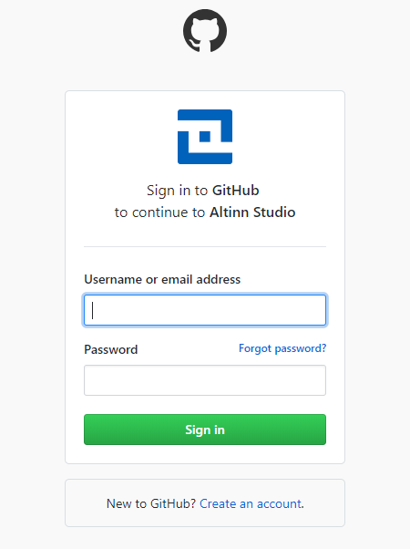
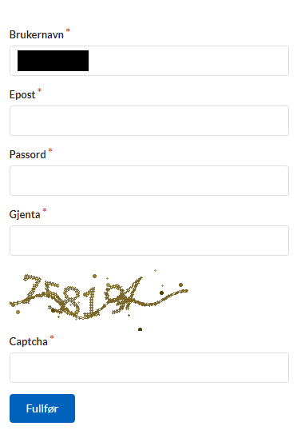

{}
Brukerveiledningene for Altinn Studio er foreløpig kun tilgjengelig på engelsk.
{}

## Lag en bruker i Altinn Studio
Din Altinn Studio bruker er personlig for deg og kan knyttes til en eller flere organisasjoner for å samarbeide med andre og få tilgang til eksisterende apper. 

### Lag bruker med github brukernavn

- Choose to log in at [altinn.studio](https://altinn.studio).
På “Logg in”-siden, klikk på knappen “Har du en du en Github konto? Registrer deg med den her”.

- Logg in i Github hvis du ikke allerede er det.

- Godkjenn at Altinn Studio bruker din Github konto for å logge inn.

- Lage en Altinn Studio bruker ved å fylle ut brukernavn, epostadresse, passord, en captcha og klikk på “Fullfør”. Brukeren vil bli koblet til din Github-bruker og du er klar for å begynne arbeide med din første applikasjon. 

### Lag en bruker med epostadresse (uten Github)

- På “Logg inn”-siden, klikk på knappen “Behov for konto? Registrer deg nå.”

- Lage en Altinn Studio bruker ved å fylle ut brukernavn, epostadresse, passord, en captcha og klikk på “Fullfør”. Du er nå klar for å begynne arbeide med din første applikasjon. 

## Bli del av en organisasjon
Organisasjoner i Altinn studio er det samme som tjenesteeiere i Altinn. De eier applikasjonene og gjør det mulig for flere innen samme organisasjon å sammarbeide i utviklingsarbeidet.

For å bli del av en organisasjon tar du kontakt med administratoren for organisasjonen du arbeider for som legger deg til. Hvis du er usikker på hvem som er administrator eller ikke vet om organisasjonen din finns kan du spørre Altinn servicedesk om hjelp.

## Opprette en organisasjon?
Det er Altinn som oppretter organisasjoner i Altinn studio. For å kunne få en organisasjon i Altinn studio må du ha en avtale med Altinn. 

Send en mail til [Altinn Servicedesk](mailto:tjenesteeier@altinn.no) med navn på organisasjonen og hvem som skal være administrator for å opprette en ny organisasjon. Det vil kunne ta noen dager å opprette organisasjonen og du vil få en mail så fort det er gjort.