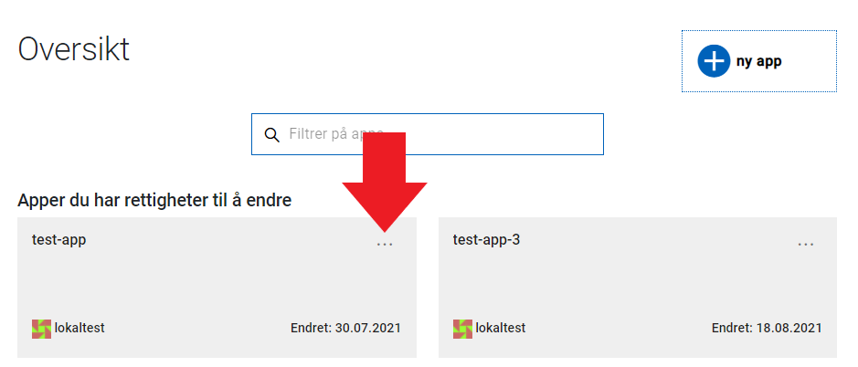
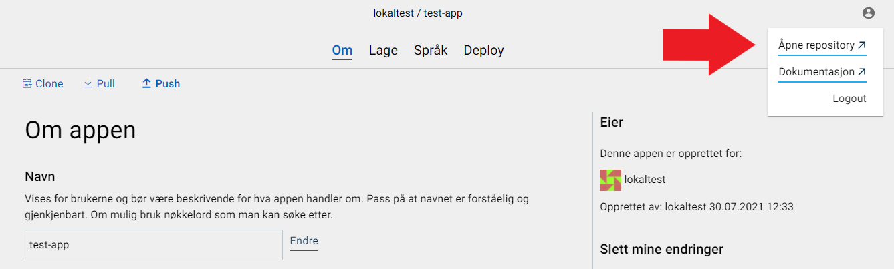
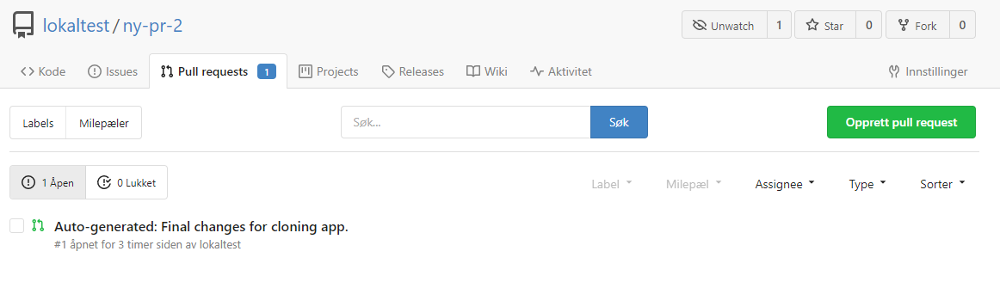
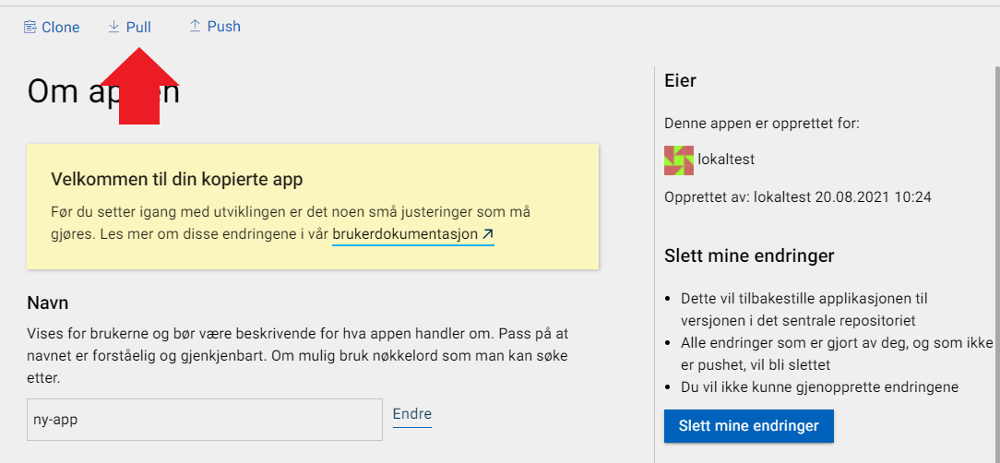

I Altinn Studio har man mulighet til å lage en kopi av en eksisterende applikasjon innad i en organisasjon. Dette gjøres fra dashboardet.
Merk: for å ha mulighet til å lage en kopi i en org må du ha rettigheter til å opprette nye repositories. Medlemmer av teamene "**Owners**" og "**Developers**" har disse rettighetene.
Dersom du mangler skrivetilgang må du ta kontakt med personen som har administratorrettigheter for din organisasjon.

1. Klikk på "..."-ikonet i det øvre høyre hjørnet av app oversikten til applikasjonen du ønsker kopiere. 
2. Velg "Lag kopi" fra menyen.
3. Legg inn **navnet** du ønsker den nye applikasjonen skal ha. Dette navnet brukes til å identifisere appen, og brukes også som navn på repository, og i URL-er og API-er.
   Navnet bør være kort og beskrivende som for eksempel "sykmelding" eller "lokalvalg-2019". 
    _Navnet kan **ikke** endres etter at appen er publisert._
4. Opprett kopien ved å klikke "**Lag kopi**".
5. Når applikasjonen har blitt kopiert vil du bli sendt til din nye applikasjon.
6. For at den kopierte applikasjonen skal være klar til å brukes trengs det en liten endring i koden. Denne endringen har automatisk blitt lagt inn som en pull request mot repositoriet ditt. For å navigere til repo klikk på profil-ikonet i høyre hjørne og velg "Åpne repository". 
7. Naviger så til fanen "**Pull requests**" og se at det ligger klar en pull request med navnet "Auto-generated: Final changes for cloning app.". 

8. Klikk deg inn på denne og se over at endringene stemmer overens med det nye navnet på applikasjonen din.
9. Om alt ser greit ut så kan endringen merges ved å klikke på "**Merge pull request**".
10. Siste steget som trengs er nå å pulle endringene dine til studio. Naviger så til fanen med den ny appen din og klikk "**Pull**" for å hente endringene du nettopp merget. 
11. Viola! Du er nå klar til å utvikle på den kopierte appen.
