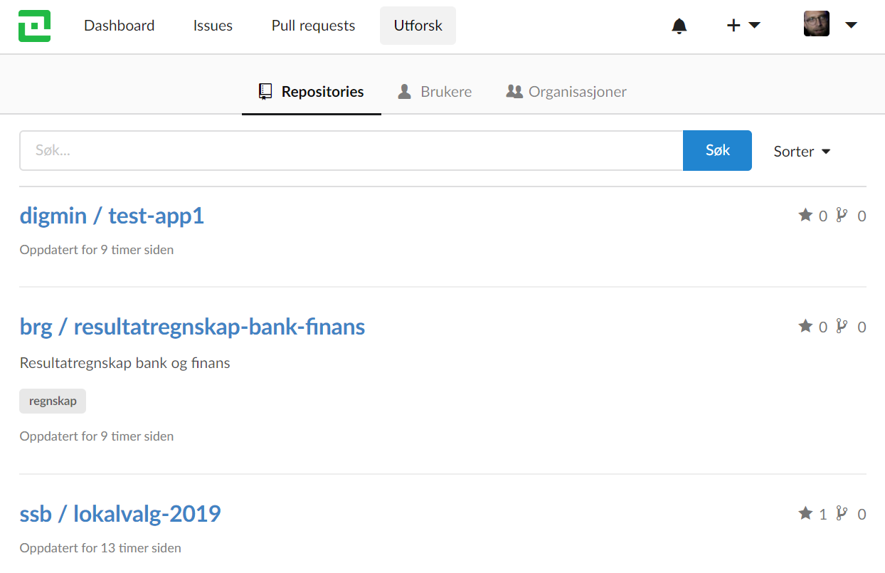
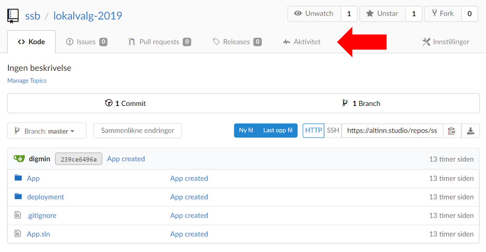

Repos er verktøyet der appene er lagret som Git repositoryer, og kan bli funnet på https://altinn.studio/repos.

## Hovedmeny

Hovedmenyen øverst inneholder disse elementene:

- Altinn-logoen - tilbake til Altinn Studio-dashboardet.
- Dashboard - Lister ut dine aktiviteter og de repositoryene og organisasjonene du har tilgang til. Du kan også se dashboard for den enkelte organisasjonen.
- Issues - Lister ut åpne og lukkede issues som er relevant for deg.
- Pull requests - Lister ut åpne og lukkede pull requests som er relevant for deg.
- Utforsk - Gir deg tilgang til å se alle repositoryer, brukere og organisasjoner

## Navigere innad i et repository
Når du har navigert til et repository dukker det opp et nytt sett menyvalg som er relevant for repositoryet.

- Kode - innholdet, alle filer appen består av
- Issues - "saker" for repositoryet
- Pull Requests - for repositoryet
- Releases - opprettet for repositoryet
- Aktivitet - hva har skjedd i repositoryet

Hvis du vil til Designer for det aktuelle repositoryet, er det et valg for dette i toppmenyen:

