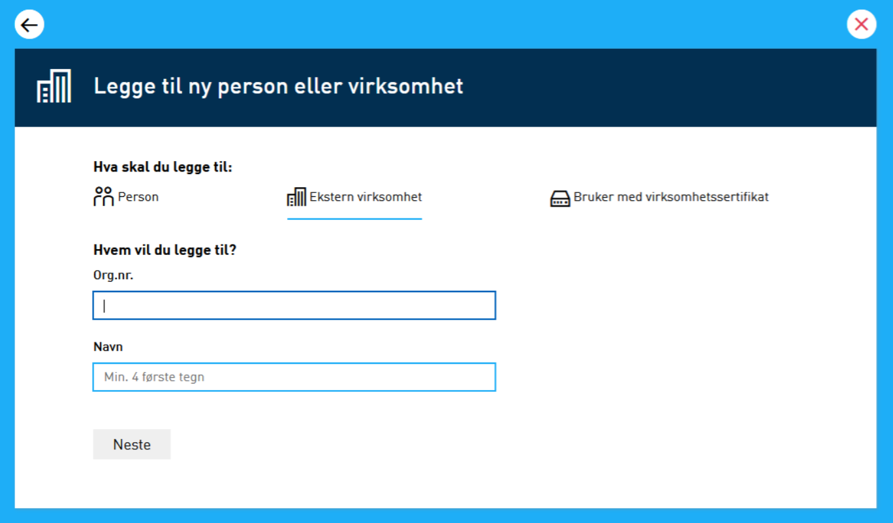
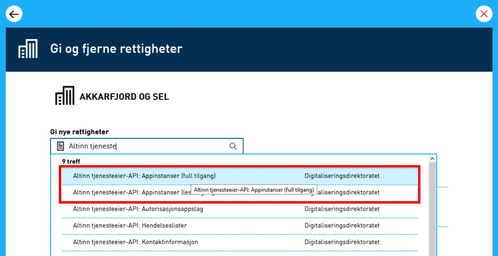
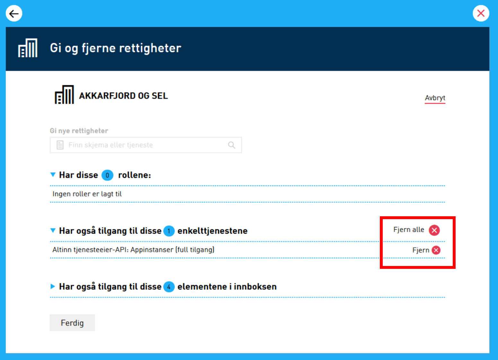
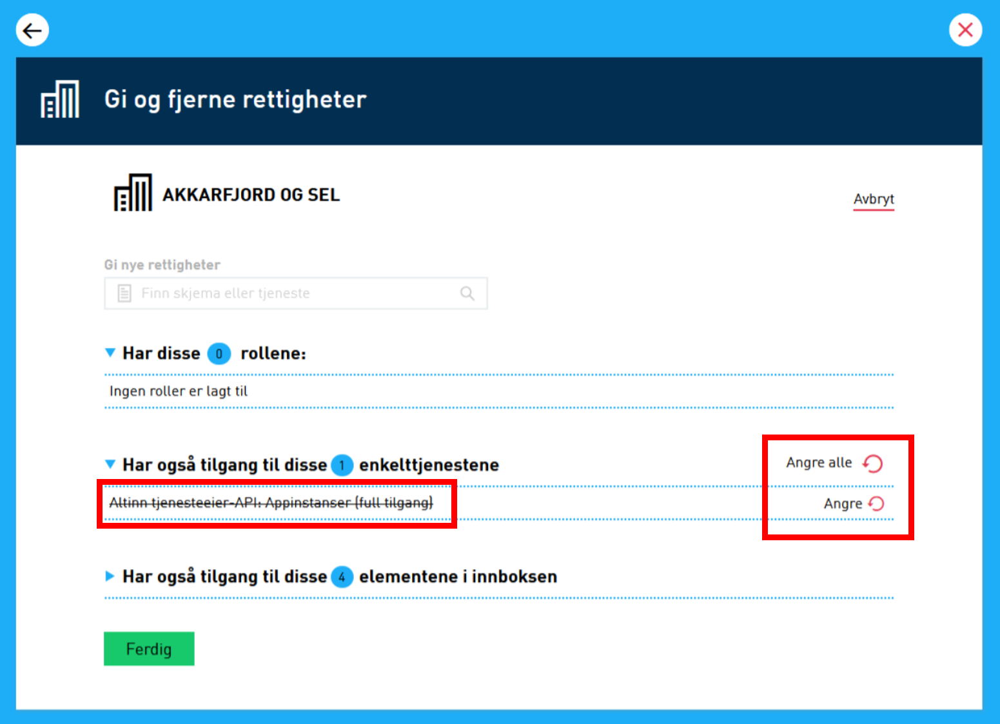
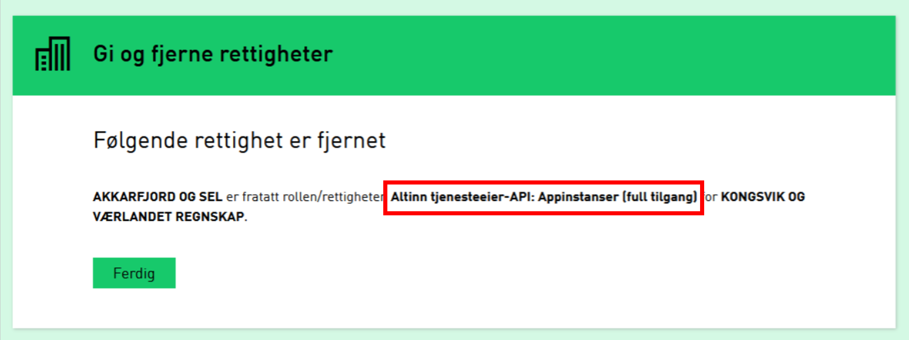

Enkelte tjenesteeiere ønsker at en underleverandør skal kunne agere på vegne av dem, f.eks. leverandører av fagsystemer.
For å få til det, så må disse API-tilgangene delegeres til leverandøren ved bruk av Altinn.

Det er tjenesteeiers ansvar å selv fjerne delegeringene om behovet for tilgang hos leverandør forsvinner.

## Delegering av API-tilganger til leverandør

Som en bruker som er nøkkelrolleinnehaver for tjenesteeier (typisk daglig leder aka DAGL), åpne "Andre med rettigheter til virksomheten".




Så må de nødvendige rettighetene gis.

- **Altinn tjenesteeier-API: Appinstanser (full tilgang)** - gir tilgang til [scopes](#scopes) for både read og write.
- **Altinn tjenesteeier-API: Appinstanser (lesetilgang)** - gir kun tilgang til read.




## Fjerning av delegering

Delegeringer som er gjort kan også fjernes.
Om en leverandør ikke lenger har behov for API-tilganger så er det tjenesteeier sitt ansvar å fjerne disse.








## Scopes

Delegering gir tilgang til disse scopene for leverandør:

```js
altinn:serviceowner/instances.read
altinn:serviceowner/instances.write
```
