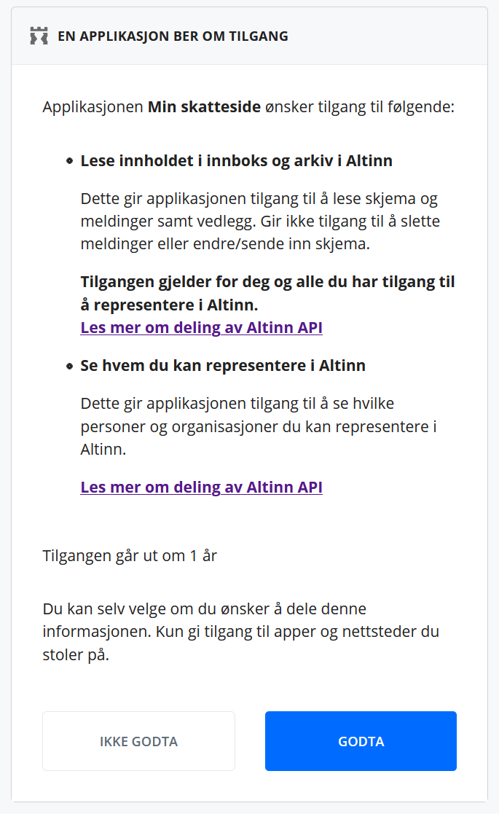
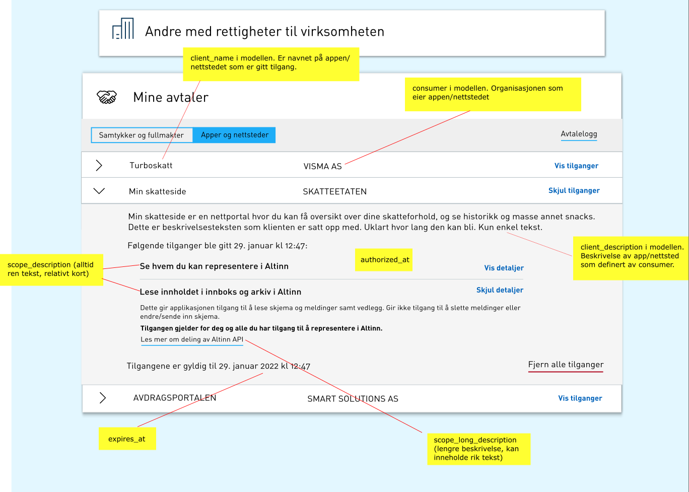

Systemer for sluttbrukere kan autentisere brukere via ID-porten. Dette for å kunne benytte  API fra applikasjoner kjørende i Altinn Apps og enkelte
platform funksjoner i Altinn Platform på vegne av sluttbruker.

Det er i hoveddsak to typer systemer hvor dette er aktuellt. Dette er webbaserte løsninger og tykke klienter.

Felles for begge løsninger er at sluttbruker vil logge inn via nettleser i ID-porten med den autentiseringsmekanismen de ønsker. 
Dette er for eksempel:

* Min-ID
* BankID på mobil
* BankId

Systemet må forespøre et sett med scopes i ID-porten som sluttbruker må akseptere at systemet kan utføre på vegne av sluttbruker.

Det er disse scopene som tildels avgrenser hva systemet kan utføre på vegne av sluttbruker. 

Scopene som er definert for Altinn er:

* altinn:instances.meta - Se oversikt over i innboks og arkiv i Altinn
* altinn:instances.read - Lese innholdet i innboks og arkiv i Altinn for alle elementer sluttbruker er autorisert for
* altinn:instances.write - Fylle ut, signere og sende inn skjema i Altinn for alle elementer sluttbruker er autorisert for
* altinn:lookup - Benytte innsynstjenester i Altinn
* altinn:reportees - Se hvem du kan representere i Altinn

Bildet nedenfor viser hvordan sluttbruker må bekrefte tilgangen.

For detaljer om scope og opplisting av alle scopes tilgjengelig se [dokumentasjon fra ID-porten](https://docs.digdir.no/oidc_protocol_scope.html).

Når pålogging er gjennomført vil systemet ha tilgang til et ID-token, refresh token og et access token.

Dette access tokenet har begrenset levetid, men kan fornyes med ved hjelp av refresh token.

## Web baserte systemer

Web baserte systemer består av løsninger med en webbasert frontend samt serverside kode

[Se detaljer hos ID-porten](https://docs.digdir.no/oidc_guide_idporten.html)

## Tykke klienter

Med tykke klienter mener vi applikasjoner som installeres og kjøres lokalt på en datamaskin. Eksempler på dette er Microsoft .Net WPF eller Winforms.

Disse må benytte seg av 

[Se detaljer hos ID porten](https://docs.digdir.no/oidc_auth_sbs.html)

## Veksling av access token til Altinn token

Access tokenet som utstedes fra ID-porten må veksles inn i et Altinn token før det kan benyttes på Altinns API'er.

Dette Altinn tokenet vil ha samme levetid som access tokenet. 

Flytdiagrammet nedenfor viser hvordan flyten går.

<object data="eus_login_process_updated.svg" type="image/svg+xml" style="width: 100%;"></object>

Se detaljer for [Altinns API dokumentasjon](https://docs.altinn.studio/teknologi/altinnstudio/altinn-api/platform-api/swagger/authentication/#/Authentication/get_exchange__tokenProvider_).

## Håndtering av tilganger for systemer

Sluttbrukere har i Altinn mulighet til å få oversikt over alle systemer og hvilke tilganger de har. 

På denne måten kan man trekke langvarige tilganger. Systemet vil da bli avvist neste gang det prøver å refresehe access token.

Et system som har fått tilgang til et token fra ID-porten vil kunne utføre handlinger 

Skjermbildet nedenfor viser hvordan dette vil bli i Altinn. (ikke satt i produksjon enda)

