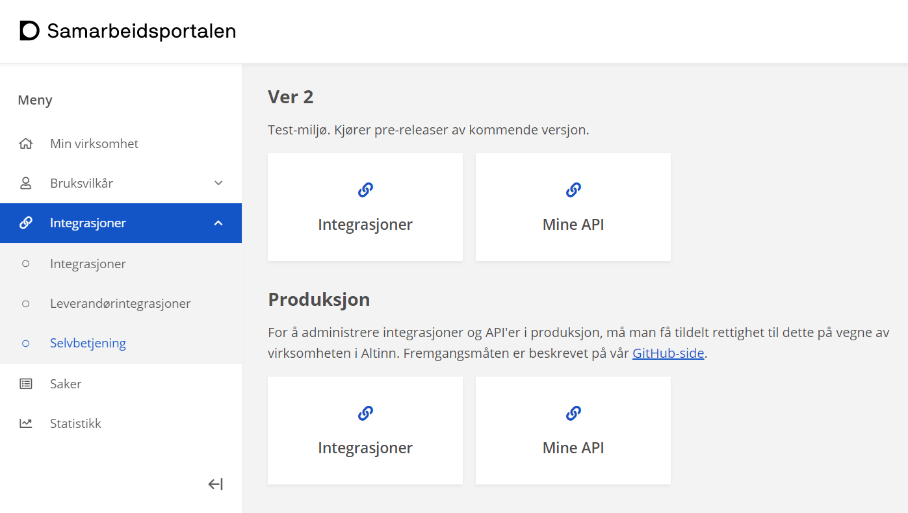

## Samarbeidsportalen

I [Min profil](https://minside-samarbeid.digdir.no) i [Samarbeidsportalen](https://samarbeid.digdir.no/)
så har du tilgang til selvbetjening for [Maskinporten](https://samarbeid.digdir.no/maskinporten/maskinporten/25), og der kan du opprette nye integrasjoner (klienter).


TT02 er testmiljø for apper i Altinn, og det er koblet mot Ver 2-miljøet i Maskinporten.




## Tilgang som tjenesteeier

For å kunne hente data fra Storage i Altinn 3 via API som tjenesteeier, så må man opprette en klient i Maskinporten, med nødvendige scopes.

Følgende scopes er opprettet av Altinn, og delegert til tjenesteeier. Disse scopene behøves for å benytte APIene relatert til instanser som tjenesteeier:

```js
altinn:serviceowner/instances.read
altinn:serviceowner/instances.write
```

Klienter med *write* scope kan bl.a. instansiere apper på vegne av bruker via appens eget API, laste opp data, oppdatere metadata og prosess-status.
Klienter med *read* scope kan kun lese data, metadata og events.

I de fleste tilfeller så vile en klient for tjenesteeier ha behov for begge scopene.

Oppretting av klient kan gjøres via API eller i Samarbeidsportalen.

```http
POST https://integrasjon.difi.no/clients/
{
    "integration_type": "maskinporten",
    "client_name": "DIHE testklient for instanser",
    "client_type": "CONFIDENTIAL",
    "description": "Klient for å hente data fra mine apper",
    "scopes": [ "altinn:serviceowner/instances.read", "altinn:serviceowner/instances.write" ],
    "token_reference": "SELF_CONTAINED"
}
```

 i samarbeidsportalen")

## Mer informasjon

- For mer informasjon, se [dokumentasjon for API-konsument](https://docs.digdir.no/maskinporten_guide_apikonsument.html#prosedyre-for-api-konsument) fra Maskinporten.
- Se også [scenario for autentication](https://docs.altinn.studio/teknologi/altinnstudio/altinn-api/scenarios/authentication/) for enda flere detaljer (på engelsk).
