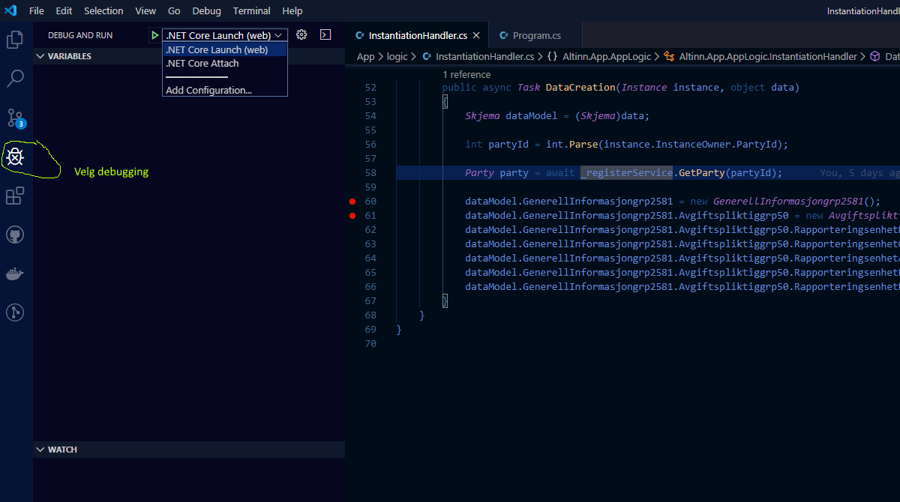
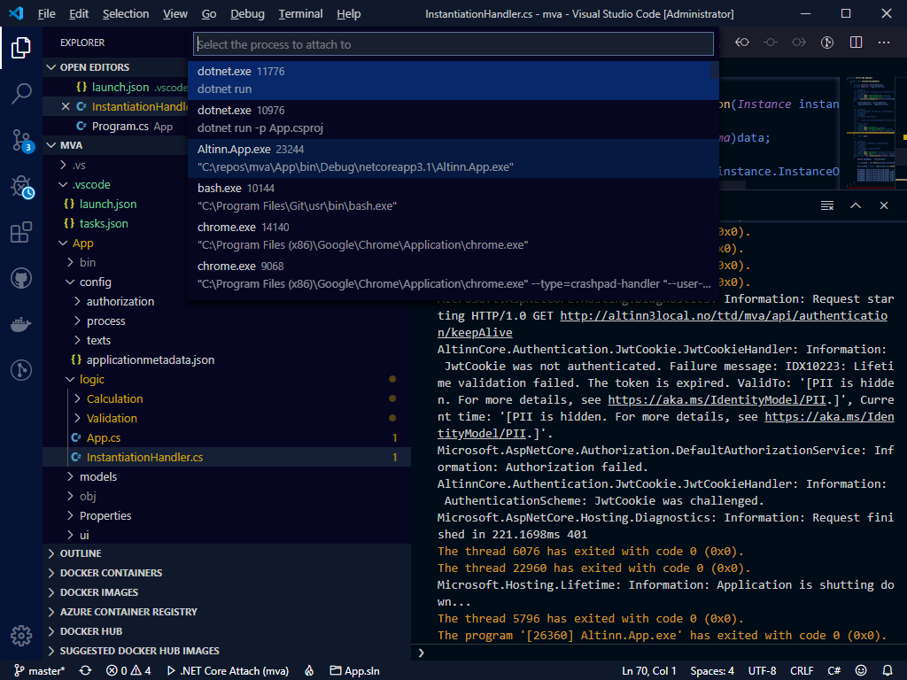
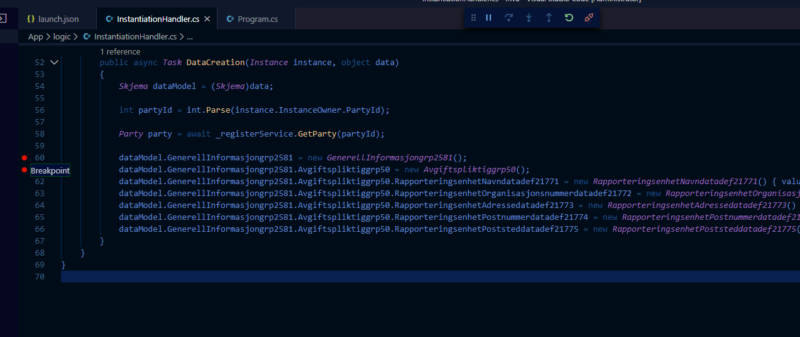
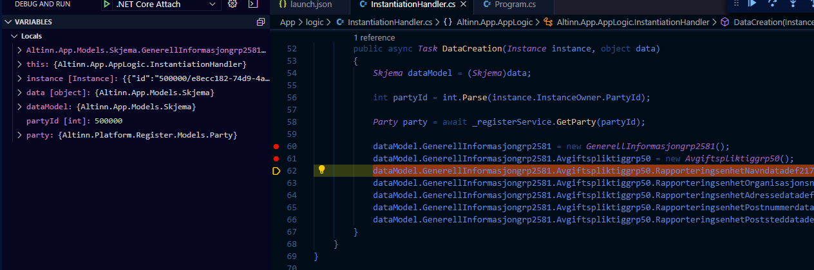

Følgende beskrivelse forutsetter at du har clonet applikasjonen fra Altinn Studio Repositories og har filene liggende på lokal harddisk. 

## Debugging i Visual Studio Code

For å debugge applikasjonen lokalt må du åpne applikasjonsprosjektet i Visual Studio Code.
Velg åpne folder og bla deg frem til hvor repostoriet er lagret på din maskin.

Velg debugging knappen til venstre i vertikal meny. 

Det er to måter å starte debugging av en applikasjon lokalt:

### Starte appen fra Visual Studio Code (.NET Core Launch)

Denne metoden er den enkleste. Her vil Visual Studio Code starte applikasjonen og koble seg til i en og samme prosess

Velg .NET Core Launch og trykk på den grønne "play" knappen.

Applikasjonen vil da starte og han vil spørre om du skal starte en browser. Velg bare close.

Åpne et browservindu og gå til http://altinn3local.no (forutsetter at du har startet lokal utviklingsplattform).

### Starte appen fra commando vindu

Dette forutsetter at du har startet applikasjonen allerede. 
Gå til folderen hvor applikasjonen ligger og kjør kommando for å starte dotnet prosessen.

I Visual Studio Code ha åpnet folderen med applikasjonsprosjektet. Attach deg til prosessen som heter Altinn.App.exe

## Legg til Breakpoints og analysere kode

Sett breakpoints i code der du vil at debugger skal stoppe 

Der debugger stopper kan du analysere lokale verdier på objekter for å finne ut hvordan kode fungerer og eventuelt finne feil.

Les mer om debugging i Visual Studio Code i [dokumentasjonen til code](https://code.visualstudio.com/docs/editor/debugging).
