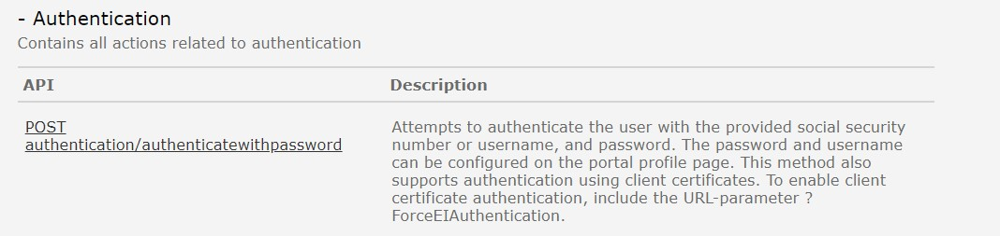
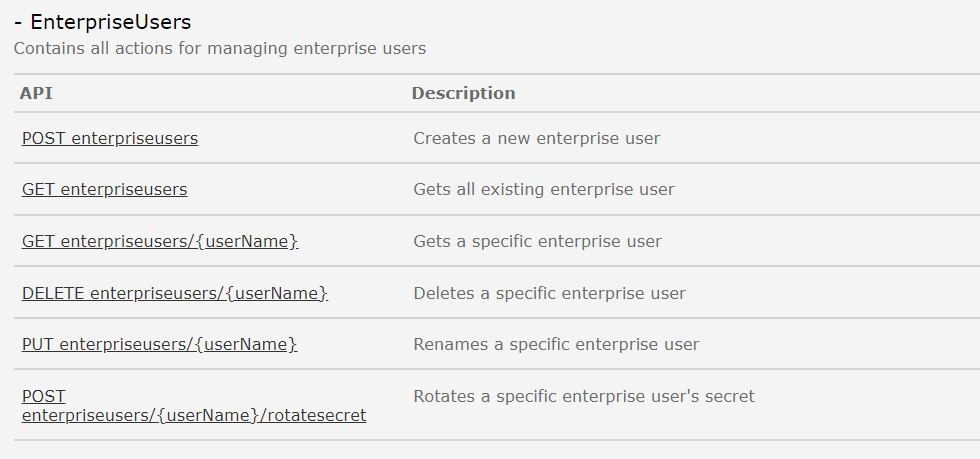

# Siden er under konstruksjon

## Authentication
Tjenesten benyttes for autentisere brukere med SNN/brukernavn og Altinn-passord. 

### Hva skjer med tjenestene?
Pålogging med Altinn-passord fases ut med Altinn 2. Fra Altinn 3 tilbys pålogging av brukere via maskinporten eller IDporten

#### Hvilke konsekvenser har dette for konsumenter
Alle konsumenter må ta i bruk nye autentiseringsmekanismer for sine brukere i overgangen til Altinn 3 API.

#### Tjenester og API i Altinn 3 som erstatter eksisterende API-tjeneste
Personer autentiseres ved hjelp av [ID-porten](https://docs.altinn.studio/api/authentication/id-porten/)
Virksomhetsbrukere autentiserers ved hjelp av [virksomhetsbrukere](https://docs.altinn.studio/api/authentication/enterpriseuser/) via [Maskinporten](https://docs.altinn.studio/api/authentication/maskinporten/).

Se [Authentication API](https://docs.altinn.studio/api/authentication/) for overordnet informasjon om API autentisering. 

## EnterpriseUsers
Tjenesten benyttes for å opprette og vedlikeholde [virksomhetsbruker](https://altinn.github.io/docs/api/rest/kom-i-gang/virksomhetsbrukere/). 

### Hva skjer med tjenestene?
EnterpriseUsers (Virksomhetsbruker) vil i Altinn 3 erstattes av konseptet "systembruker" som er under utvikling. 

Det antas at dagens EnterpriseUsers konverteres til nye systembrukere i Altinn 3

*Ny funksjonalitet og API blir utviklet i 2025 i Altinn 3.*
- Se beskrivelse av den nye tjenesten her: *lenke kommer senere*
- se beskrivelse av de nye APIene: *lenke kommer senere*

#### Hvilke konsekvenser har dette for konsumenter
Beskrives senere.

#### Tjenester og API i Altinn 3 som erstatter eksisterende API-tjeneste
Beskrives senere. 
