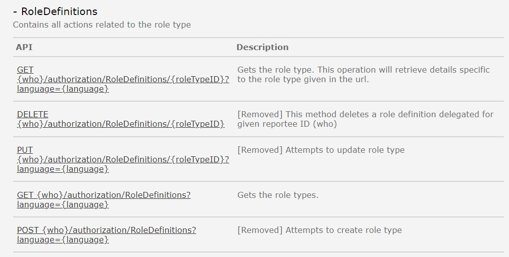
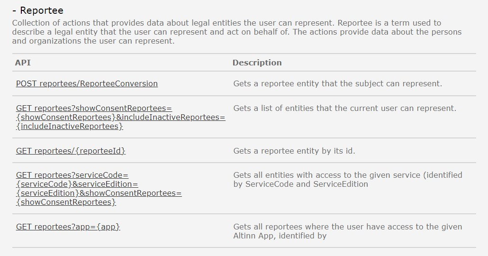
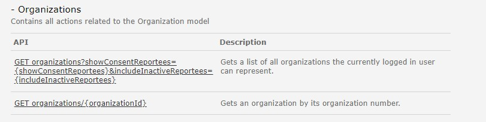
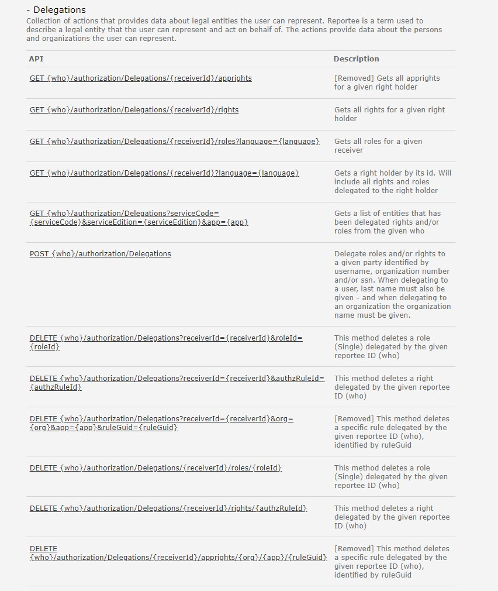
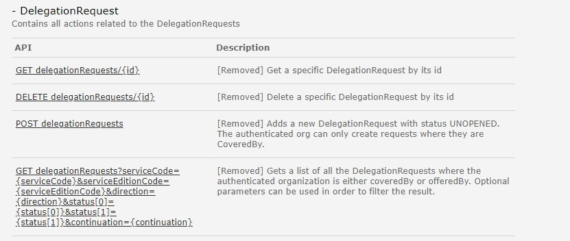
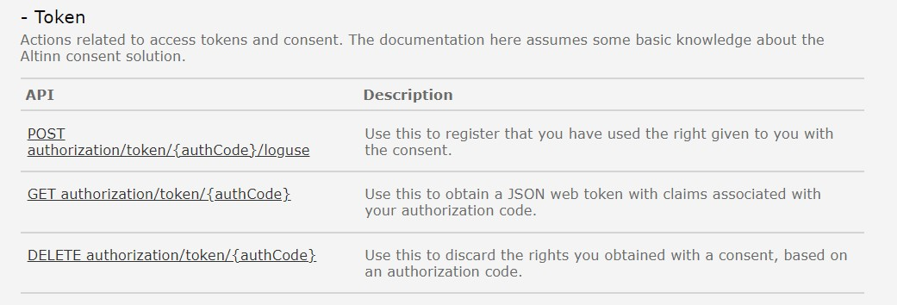
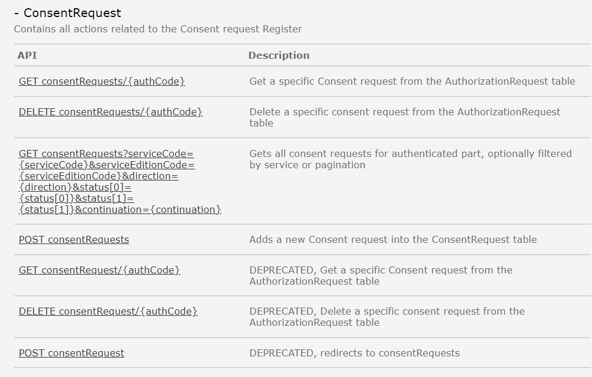

# Siden er under konstruksjon

## RoleDefinitions
API tilbyr operasjoner for å slå opp informasjon om roller i Altinn 2. 

### Hva skjer med tjenesten?
I forbindelse med overgang til Altinn 3 erstattes dagens Altinn roller med nye fullmaktsgrupper, se [mer informasjon her](https://docs.altinn.studio/authorization/modules/accessgroups/type-accessgroups/).
Det blir utviklet nye API for å hente ut informasjon om de nye fullmaktsgruppene i Altinn 3. 

Roledefinition-API i Altinn 2 vil ikke inneholde informasjon om fullmaktsgruppene i Altinn 3. 

*Funksjonalitet og API forventes levert Q4 2023 i Altinn 3 i forbindelse med roadmap-issue [Nye fullmaktsgrupper for virksomheter](https://github.com/digdir/roadmap/issues/208) og [Ny brukerflate for tilgangsstyring for virksomheter](https://github.com/digdir/roadmap/issues/244).*
- Se beskrivelse av den nye tjenesten [her](https://docs.altinn.studio/authorization/modules/accessgroups/)
- se beskrivelse av de nye APIene [her](https://docs.altinn.studio/authorization/api/)

#### Hvilke konsekvenser har dette for konsumenter
Sluttbrukersystem må ta i bruk nye API for å hente ut informasjon (metadata) om fullmaktsgruppene

#### Tjenester og API i Altinn 3 som erstatter eksisterende API-tjeneste
Beskrives senere. 

## Rights
API tilbyr tjenester for å opprette og administrere enkeltrettigheter mellom bruker og avgiver

Denne tjenesten erstattes av Accessmanagement komponenten i Altinn 3.

I en overgangsfase vil det være mulig for sluttbrukersystem å bruke Altinn 2 API for å opprette/administrere enkeltrettigheter for både tjenester som kjører på Altinn 2 og Altinn 3 plattformen. 
Tilsvarende vil nye API i Altinn 3 for sluttbrukersystem kunne opprette/administrere enkeltrettigheter for både tjenester som kjører på Altinn 2 og Altinn 3 plattformen.

*Funksjonalitet og API forventes levert Q1-Q4 2024 i Altinn 3 i forbindelse med roadmap-issue [Klargjøre Altinn 3 for migrering av lenketjenester](https://github.com/digdir/roadmap/issues/190).*
- Se beskrivelse av den nye tjenesten [her](https://docs.altinn.studio/authorization/modules/accessmanagement/)
- se beskrivelse av de nye APIene [her](https://docs.altinn.studio/authorization/api/)
  
#### Hvilke konsekvenser har dette for konsumenter
I løpet av 2025 vil alle tjenester være flyttet fra Altinn 2 til Altinn 3. 

Før juni 2026 må sluttbrukersystem ha tatt i bruk nye API som tilbys i Altinn 3. 

#### Tjenester og API i Altinn 3 som erstatter eksisterende API-tjeneste
Beskrives senere. 

## Roles
API tilbyr tjenester for å hente ut informasjon om og slette roller en bruker har.

### Hva skjer med tjenesten?
I forbindelse med overgang til Altinn 3 erstattes dagens Altinn roller med nye fullmaktsgrupper, se [mer informasjon her](https://docs.altinn.studio/authorization/modules/accessgroups/type-accessgroups/).

Det blir utviklet nye API for å hente ut informasjon om hvilke fullmaktsgrupper en bruker har fått i Altinn 3. 
Det er ikke endelig bestemt hva som vil skje med ROLES API i Altinn 2 når de nye tilgangsgruppene innføres. 

*Funksjonalitet og API forventes levert Q4 2024 i Altinn 3 i forbindelse med roadmap-issue [Nye fullmaktsgrupper for virksomheter](https://github.com/digdir/roadmap/issues/208) og [Ny brukerflate for tilgangsstyring for virksomheter](https://github.com/digdir/roadmap/issues/244).*
- Se beskrivelse av den nye tjenesten [her](https://docs.altinn.studio/authorization/modules/accessgroups/)
- Se beskrivelse av de nye APIene [her](https://docs.altinn.studio/authorization/api/)

#### Hvilke konsekvenser har dette for konsumenter
Beskrives senere. 

#### Tjenester og API i Altinn 3 som erstatter eksisterende API-tjeneste
Beskrives senere. 

## Reportee
API tilbyr tjenester for å hente ut hvilke avgivere en bruker kan representere. 

### Hva skjer med tjenesten?
Denne tjenesten erstattes av Accessmanagement komponenten i Altinn 3.

I en overgangsfase så vil sluttbrukersystem kunne spørre både eksisterende API i Altinn 2 og nye API i Altinn 3 for å hente ut liste over alle avgivere en bruker kan opptre på vegne av,
uavhengig av om tjeneste- eller rolle/fullmaktsdelegeringen er registert i Altinn 2 eller Altinn 3. 

*Funksjonalitet og API forventes levert Q1-Q4 2023 i Altinn 3 i forbindelse med roadmap-isssue [Klargjøre Altinn 3 for migrering av lenketjenester](https://github.com/digdir/roadmap/issues/190)*
- Se beskrivelse av den nye tjenesten [her](https://docs.altinn.studio/authorization/modules/accessmanagement/)
- se beskrivelse av de nye APIene [her](https://docs.altinn.studio/authorization/api/)
  
#### Hvilke konsekvenser har dette for konsumenter
I løpet av 2025 vil alle tjenester være flyttet fra Altinn 2 til Altinn 3. 

Før juni 2026 må sluttbrukersystem ha tatt i bruk nye API som tilbys i Altinn 3.

#### Tjenester og API i Altinn 3 som erstatter eksisterende API-tjeneste
Beskrives senere. 

## Organizations
API tilbyr tjeneste for å hente ut liste over organisasjoner en annen organisasjon kan representere

### Hva skjer med tjenesten?
Denne tjenesten erstattes av Accessmanagement komponenten i Altinn 3.

Det er foreløpig ikke avklart hva som skjer med denne tjenesten. 

*Funksjonalitet og API forventes levert Q1-Q4 2023 i Altinn 3 i forbindelse med roadmap-isssue [Klargjøre Altinn 3 for migrering av lenketjenester](https://github.com/digdir/roadmap/issues/190)*
- Se beskrivelse av den nye tjenesten [her](https://docs.altinn.studio/authorization/modules/accessmanagement/)
- se beskrivelse av de nye APIene [her](https://docs.altinn.studio/authorization/api/)
  
#### Hvilke konsekvenser har dette for konsumenter
I løpet av 2025 vil alle tjenester være flyttet fra Altinn 2 til Altinn 3. 

Før juni 2026 må sluttbrukersystem ha tatt i bruk nye API som tilbys i Altinn 3.

#### Tjenester og API i Altinn 3 som erstatter eksisterende API-tjeneste
Beskrives senere.

## Delegations
API tilbyr tjenester for å hente ut hvilke avgivere en bruker kan representere og administrasjon av enkeltrettigheter og roller. 

### Hva skjer med tjenesten?
Denne tjenesten erstattes av Accessmanagement komponenten i Altinn 3.

I en overgangsfase så vil sluttbrukersystem kunne spørre både eksisterende API i Altinn 2 og nye API i Altinn 3 uavhengig av om tjeneste- eller rolle/fullmaktsdelegeringen er registert i Altinn 2 eller Altinn 3. 

*Funksjonalitet og API forventes levert Q1-Q4 2023 i Altinn 3 i forbindelse med roadmap-isssue [Klargjøre Altinn 3 for migrering av lenketjenester](https://github.com/digdir/roadmap/issues/190)*
- Se beskrivelse av den nye tjenesten [her](https://docs.altinn.studio/authorization/modules/accessmanagement/)
- se beskrivelse av de nye APIene [her](https://docs.altinn.studio/authorization/api/)
  
#### Hvilke konsekvenser har dette for konsumenter
I løpet av 2025 vil alle tjenester være flyttet fra Altinn 2 til Altinn 3. 

Før juni 2026 må sluttbrukersystem ha tatt i bruk nye API som tilbys i Altinn 3.

#### Tjenester og API i Altinn 3 som erstatter eksisterende API-tjeneste
Beskrives senere. 

## DelegationRequest
API tilbyr tjenester for opprette og hente ut informasjon om rettighetesforespørsler. 

Denne tjenesten erstattes med Accessmanagement komponenten i Altinn 3 og det blir utviklet nye API for å registrere rettighetsforespørsler. 

{}
I dag er det mulig å lage èn forespørsel som kan be om få få tilgang til flere tjenester samtidig. Dette blir endret, og fra Altinn 3 er det kun mulig å opprette forespørsler på èn og èn tjeneste/ressurs.
{}
Det vil i Altinn 3 være støtte for  å lage forespørsler både til rettigheter til tjeneste samt til å kunne og be om å få fullmaktsgrupper fra en angitt avgiver. 

*Funksjonalitet og API forventes levert Q1-Q4 2023 i Altinn 3 i forbindelse med roadmap-issue [Klargjøre Altinn 3 for migrering av lenketjenester](https://github.com/digdir/roadmap/issues/190).*
- Se beskrivelse av den nye tjenesten [her](https://docs.altinn.studio/authorization/modules/accessmanagement/)
- se beskrivelse av de nye APIene [her](https://docs.altinn.studio/authorization/api/)

#### Hvilke konsekvenser har dette for tjenesteier
Beskrives senere. 

#### Tjenester og API i Altinn 3 som erstatter eksisterende API-tjeneste
Beskrives senere. 

# Samtykketjeneste
Tilbyr API tjenester for å opprette og bruke samtykker i [Samtykketjenesten](http://localhost:1313/docs/utviklingsguider/samtykke/)

Det er foreløpig uklart hvilken ny løsning som blir valgt for samtykketjenesten. 

*Funksjonalitet og API forventes levert Q1-Q4 2023 i Altinn 3 i forbindelse med roadmap-issue [Klargjøre Altinn 3 for migrering av Samtykketjenester](https://github.com/digdir/roadmap/issues/260).*
- Se beskrivelse av den nye tjenesten her: informasjon kommer senere. 
- se beskrivelse av de nye APIene her: informasjon kommer senere. 

## Token
Tjenesten tilbyr operasjoner knyttet til access tokens og logging av bruk av samtykketjenesten

#### Hvilke konsekvenser har dette for konsumenter
Beskrives senere.

#### Tjenester og API i Altinn 3 som erstatter eksisterende API-tjeneste
Beskrives senere. 

## ConsentRequest
Tjenesten tilbyr operasjoner for å be om samtykke. 

#### Hvilke konsekvenser har dette for konsumenter
Beskrives senere.

#### Tjenester og API i Altinn 3 som erstatter eksisterende API-tjeneste
Beskrives senere. 

