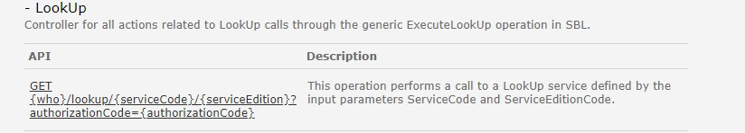

# Siden er under konstruksjon

## LookUp
API tilbyr tjeneste for oppslag i datakilder som ligger utenfor Altinn 2. 

### Hva skjer med tjenestene?
Lookup tjenester i Altinn 2 vil etterhvert flyttes over til Altinn 3 av tjenesteeierne. 

For sluttbrukersystem som skal integrere seg mot innsynstjenester som flyttes så anbefaler vi at dere tar kontakt med tjenesteeier for mer informasjon. 
Generell informasjon om de nye apiene for å sende inn skjema i Altinn 3 finner dere [her](https://docs.altinn.studio/api/guides/endusersystems/)

#### Hvilke konsekvenser har dette for konsumenter
Beskrives senere.

#### Tjenester og API i Altinn 3 som erstatter eksisterende API-tjeneste
Beskrives senere. 
