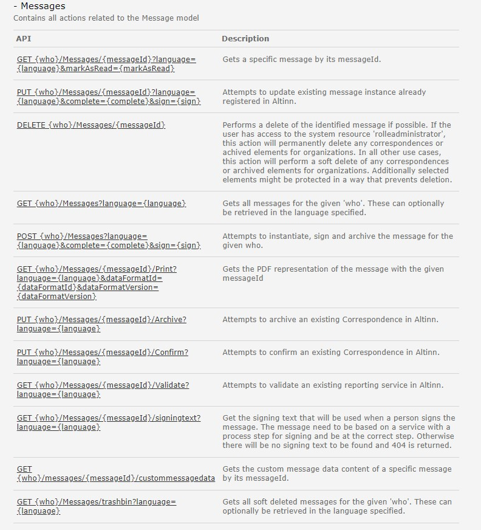
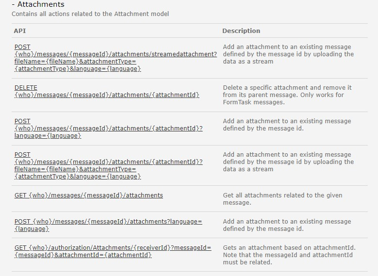
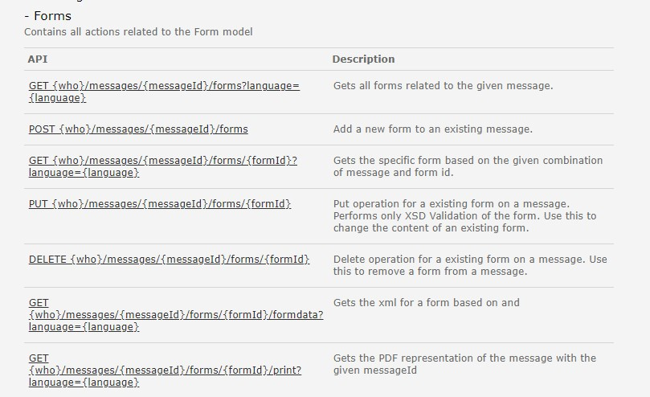

# Siden er under konstruksjon

Følgende tjenester i REST API for sluttbrukersystem tilbyr funksjonalitet for meldingsboks: 
## Message

## Attachement

## Forms

  

**Følende REST-api tjenester finnes i dag knyttet til meldingsboks i Altinn 2:**
Se [her](https://altinn.github.io/docs/api/rest/meldinger/) for dokumentasjon av eksisterende tjenester. 

- Arkivere - Operasjoner for å arkivere meldinger
- Bekrefte - Operasjoner for å bekrefte mottak av meldinger
- Hente - Operasjoner for å lese i meldingsboks og arkiv
- Oppdatere - Operasjoner for å oppdatere elementer i meldingsboksen.
- Sende inn - Operasjoner for å sende inn meldinger
- Signere - Operasjoner for å signere innsending
- Slette - Operasjoner for å slette meldinger, underskjema og vedlegg
- Validere - Operasjoner for å validere skjemasett
- Betale - Oerasjoner for å sende bruker til betaling knyttet til melding

### Hva skjer med tjenestene?
For skjematjenester som allerede er flyttet til Altinn 3: Det er i dag ikke mulig å hente ut informasjon om skjemainstanser eller utføre operasjoner på disse fra Altinn 2 APIene. 
For sluttbrukersystem som skal integrere seg mot skjema som er allerede flyttet så anbefaler vi at dere tar kontakt med tjenesteeier for mer informasjon. 
Generell informasjon om de nye apiene for å sende inn skjema i Altinn 3 finner dere [her](https://docs.altinn.studio/api/guides/endusersystems/)

Det vil bli utviklet **ny arbeidsflate** for meldingsboks i Altinn. Dette arbeidet er i en oppstartsfase og fremdrift kan følges [her](https://github.com/orgs/digdir/projects/8/views/28). 

I forbindelse med modernisering av Altinn 2 så blir det også utviklet en ny tjeneste foreløpig kalt **Dialogporten**. Mer informasjon om dialogporten kan du finne [her](https://digdir.github.io/dialogporten/)". 
Dialogporten har som hensikt å bli en felles nasjonal arbeidsflate/meldingsboks for både API- og GUI-konsumenter av offentlige tjenester.  

*Ny funksjonalitet og API blir utviklet i 2025 i Altinn 3.*
- Se beskrivelse av den nye tjenesten her: *lenke kommer senere*
- se beskrivelse av de nye APIene: *lenke kommer senere*

#### Hvilke konsekvenser har dette for konsumenter
Beskrives senere.

#### Tjenester og API i Altinn 3 som erstatter eksisterende API-tjeneste
Beskrives senere. 
