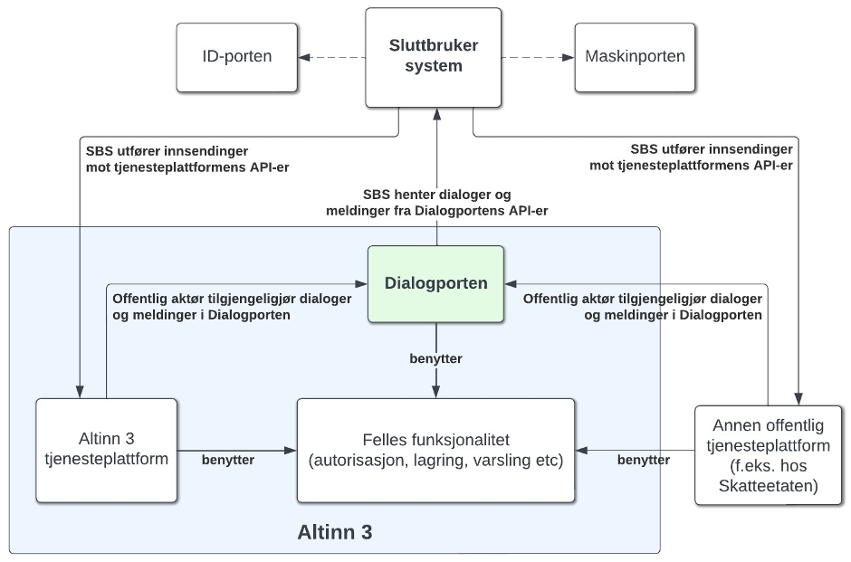

## Hvilke eksisterende API-er berøres av endringene?
Følgende tjenester i REST API for sluttbrukersystem tilbyr funksjonalitet for meldingsboks: 
### Message

### Attachement

### Forms

  

**Følende REST-api tjenester finnes i dag knyttet til meldingsboks i Altinn 2:**
Se [her](https://altinn.github.io/docs/api/rest/meldinger/) for dokumentasjon av eksisterende tjenester. 

- Arkivere - Operasjoner for å arkivere meldinger
- Bekrefte - Operasjoner for å bekrefte mottak av meldinger
- Hente - Operasjoner for å lese i meldingsboks og arkiv
- Oppdatere - Operasjoner for å oppdatere elementer i meldingsboksen.
- Sende inn - Operasjoner for å sende inn meldinger
- Signere - Operasjoner for å signere innsending
- Slette - Operasjoner for å slette meldinger, underskjema og vedlegg
- Validere - Operasjoner for å validere skjemasett
- Betale - Oerasjoner for å sende bruker til betaling knyttet til melding

## Hva skjer med tjenestene?
I Altinn 3 vil modellen for tjenester-APIer endres, og i stedet for at det finnes et felles API for alle skrive-operasjoner, f.eks. det å sende inn, oppdatere eller signere et skjema, vil hver enkelt tjeneste (nå kalt "app") tilby endepunkter for denne kommunikasjonen. 

For skjematjenester som allerede er flyttet til Altinn 3 er det ikke mulig å hente ut informasjon om skjemainstanser eller utføre operasjoner på disse fra Altinn 2 APIene. 
For sluttbrukersystem som skal integrere seg mot skjema som er allerede flyttet, anbefaler vi at dere tar kontakt med tjenesteeier for mer informasjon. 

* [Se generell informasjon om de nye API-ene for å sende inn skjema i Altinn 3](https://docs.altinn.studio/api/guides/endusersystems/)

## Ny tjeneste for å finne meldinger og skjema (dialoger)

**Dialogporten** er et nytt produkt i Altinn 3 som vil tilby erstatninger dagens lese-API-er som sluttbrukersystemer (fagsystemer, portal-løsninger, app-er etc) kan benytte for å finne og hente meldinger og dialoger fra det offentlige. Sammen med Altinn Events vil dette være løsningen tilby en mer effektiv, fleksibel og tjenesteplattform-uavhengig måte å holde oversikt over pågående og gjennomført kommunikasjon med det offentlige. 

**Arbeidsflaten** er et sluttbrukersystem utviklet av Digdir som vil utgjøre en felles web-basert front-end for Dialogporten, som vil erstatte dagens "innboks" og "arkiv"-visning i den innloggende delen av Altinn.no-portalen. 

Begge disse løsningen er under utvikling, og vil bli tilgjengelige for test i 2024.

{}Teknisk dokumentasjon for intergrasjoner mot Dialogporten (både sluttbruker-API og tjenesteeier-API) er under utarbeidelse og vil bli tilgjengeliggjort på [Altinn Docs](https://docs.altinn.studio/api/){}

* [Se roadmap til Dialogporten](https://github.com/orgs/digdir/projects/8/views/25)
* [Se roadmap til Arbeidsflate](https://github.com/orgs/digdir/projects/8/views/28)
* [Se konsept- og løsningsbeskrivelse for Dialogporten](https://digdir.github.io/dialogporten)

## Hvilke konsekvenser har dette for konsumenter?
Konsumenter som i dag benytter Message-API-et (herunder Attachments og Forms), samt tilsvarende SOAP-API-er, må migrere til å benytte Dialogporten for å kunne søke etter og hente ut metadata/status på enkelt-dialoger og meldinger, og ta i bruk den enkelte apps API-er for skriveoperasjoner. SOAP-API-er vil i sin helt fases ut i Altinn 3.

## Tjenester og API i Altinn 3 som erstatter eksisterende API-tjeneste

Dialogportens API-er vil erstatte API-ene beskrevet under. Merk at Instances-API-et i Altinn Platform vil fortsatt eksistere; alle instanser for apper realisert på Altinn 3 tjenesteplattform vil være tilgjengelige der. Dialogporten vil også inneholde informasjon om disse, i tillegg til informasjon om dialoger realisert på andre tjenesteplattformer, samt meldinger sendt gjennom [Altinn 3 Correspondence](https://docs.altinn.studio/correspondence/) 

* [Les mer om Altinn 3 Platform Instances API](https://docs.altinn.studio/api/storage/instances/)
* [Se OpenAPI-spesifikasjon til Dialogporten](https://altinn-dev-api.azure-api.net/dialogporten/swagger/index.html). 

### [GET-operasjoner på for «Meldingsboks» i REST](https://altinn.github.io/docs/api/rest/meldinger/hente/)
* Søke-API tilbys gjennom [GET /api/v1/enduser/dialogs](https://altinn-dev-api.azure-api.net/dialogporten/swagger/index.html#/Enduser/GetDialogList)
* "Message"-modellen erstattes av "Dialog"-modellen, se f.eks. [GET /api/v1/enduser/dialogs/{dialogId}](https://altinn-dev-api.azure-api.net/dialogporten/swagger/index.html#/Enduser/GetDialog)
* Underskjema og vedlegg realiseres gjennom dialogelementer, se f.eks. [GET /api/v1/enduser/dialogs/{dialogId}/elements](https://altinn-dev-api.azure-api.net/dialogporten/swagger/index.html#/Enduser/GetDialogElementList)

### [/ArchiveExternal/ReporteeArchiveExternal​](https://altinn.github.io/docs/api/api-migration/soap/arkiv/#archiveexternalreporteearchiveexternal)
* Det blir ikke egne endepunkter/ID-er for arkiverte skjema - tilstand på en dialog gjenspeiles i feltet "status", som det kan filtreres på

### [/ServiceEngineExternal/ReporteeElementListExternal](https://altinn.github.io/docs/api/api-migration/soap/serviceengine/#serviceengineexternalreporteeelementlistexternal)
* Erstattes av søke-API.

### [/ServiceEngineExternal/CorrespondenceExternal](https://altinn.github.io/docs/api/api-migration/soap/serviceengine/#serviceengineexternalcorrespondenceexternal)
* Kun `GetCorrespondenceForEndUserSystems`.
* Meldingstjenesten vil få egne nye API-er. Les mer om [Altinn 3 Correspondence](https://docs.altinn.studio/correspondence/)
* Meldinger sendt gjennom Altinn 3 Correspondence vil kunne finnes gjennom Dialogporten API

### [/IntermediaryExternal/IntermediaryInbound](https://altinn.github.io/docs/api/api-migration/soap/intermediary/#intermediaryexternalintermediaryinbound)
* Kun `GetAltinnSubmissionStatus`, indirekte gjennom at informasjon om status kan av tjenesteeier settes på dialogen
* Kvitteringer hentet gjennom `GetReceipt`/`GetReceiptList` vil kunne tilgjengeliggjøres som dialogelementer

### ServiceEngineExternal/WorkflowServiceExternal​
* Kun `GetAvailableActions`, gjennom at «handlinger» er definert på dialogen. `DoSigningBasic` vil f.eks. kunne defineres som en «handling»

## API-er som ikke erstattes av Dialogporten
* Alt foruten "Hente"-operasjoner på for [«Meldingsboks» i REST](https://altinn.github.io/docs/api/rest/meldinger/)
  * SBS-er benytter «handlinger» som er definert og kaller disse
  * Mekanismer knyttet til sletting er under utarbeidelse. Gjelder også `DeleteReporteeElement` i SOAP.
* Skrive-operasjoner på `/IntermediaryExternal/​`
  * Denne mekanismen utgår i Altinn 3 – hver enkelt app eksponerer API-er for innsending. Disse blir tilgjengeliggjort som «handlinger» i Dialogporten.
* `/ServiceEngineExternal/*`
  * Alt som ikke ble nevnt i forrige avsnitt. Mange operasjoner, f.eks. `GetPrefillData`, vil kunne erstattes med «handlinger» og/eller dialogelementer som er definert på dialogen.
