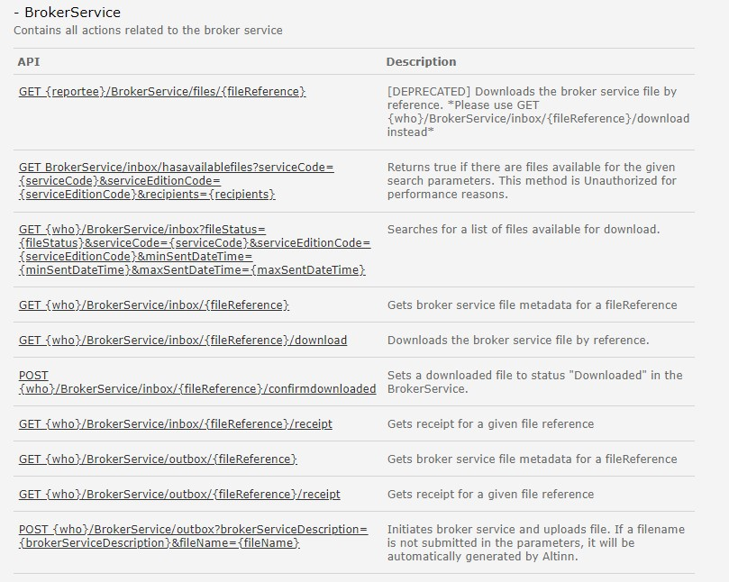

# Siden er under konstruksjon

## BrokerService
API tilbyr operasjoner for å slå opp informasjon om brukers profil

### Hva skjer med tjenesten?
Tjenesten benyttes for å opprette/hente/sende Brokerservice. 
Denne erstattes av nye REST api for Brokerservice i Altinn 3. 

*Funksjonalitet og API forventes levert Q1 2024 i Altinn 3.*
- Se beskrivelse av den nye tjenesten her: *lenke kommer senere*
- se beskrivelse av de nye APIene her: *lenke kommer senere*

#### Hvilke konsekvenser har dette for konsumenter
Beskrives senere. 

#### Tjenester og API i Altinn 3 som erstatter eksisterende API-tjeneste
Beskrives senere. 