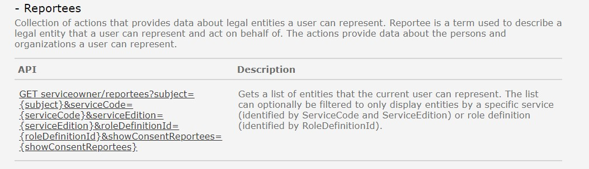
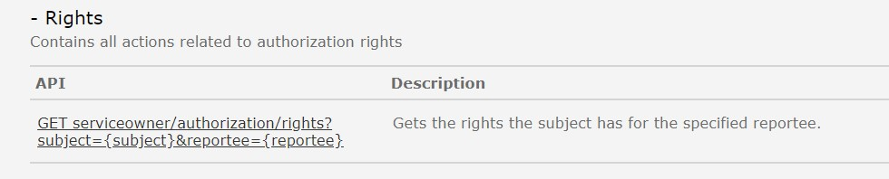
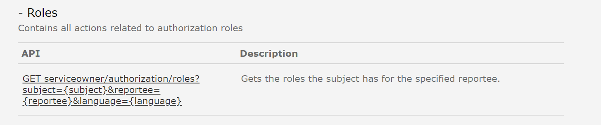
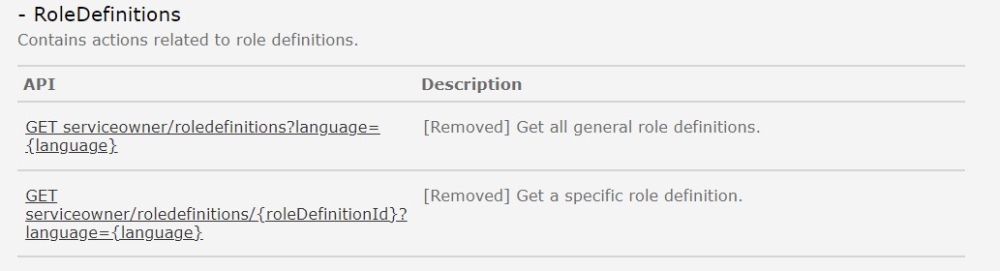
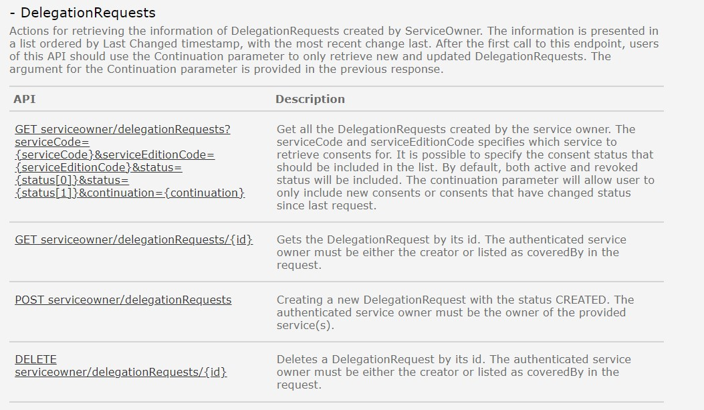
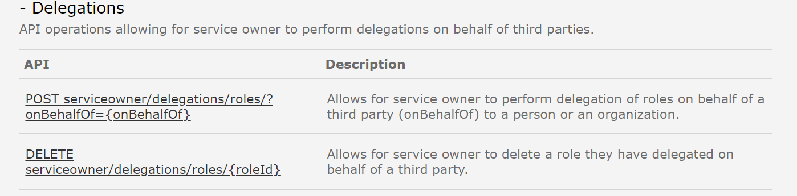
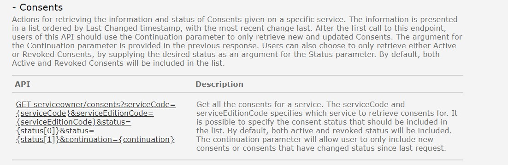

Eksisterende REST API i Altinn 2 er dokumentert [her](https://www.altinn.no/api/serviceowner/help)

## Reportees
Tjenesten benyttes for å hente ut liste over hvilke avgivere en bruker kan opptre på vegne av. 

### Hva skjer med tjenesten?
Denne tjenesten erstattes av Accessmanagement komponenten i Altinn 3.
I Altinn 3 vil tjenesteeier kun få ut liste over avgivere som gitt bruker kan opptre på vegne av i kontekst av deres egne tjenester. 

I en overgangsfase så vil tjenesteeier kunne spørre både eksisterende API i Altinn 2 og nye API i Altinn 3 for å hente ut liste over alle avgivere en bruker kan opptre på vegne av, uavhengig av om tjeneste- eller rolle/fullmaktsdelegeringen er registert i Altinn 2 eller Altinn 3. 

*Funksjonalitet og API forventes levert Q1-Q4 2023 i Altinn 3 i forbindelse med roadmap-isssue [Klargjøre Altinn 3 for migrering av lenketjenester](https://github.com/digdir/roadmap/issues/190)*
- Se beskrivelse av den nye tjenesten [her](https://docs.altinn.studio/authorization/modules/accessmanagement/)
- se beskrivelse av de nye APIene [her](https://docs.altinn.studio/authorization/api/)
  
#### Hvilke konsekvenser har dette for konsumenter
Dette API slås av så fort trafikken er flyttet til nye API i Altinn 3. 
Antatt siste frist for å ta Altinn 2 API i bruk er Q1 2025. 

#### Tjenester og API i Altinn 3 som erstatter eksisterende API-tjeneste
Beskrives senere. 

## Rights
Tjenesten benyttes til å hente ut hvilke enkeltrettigheter en bruker har på vegne av en avgiver. 

### Hva skjer med tjenesten?
Denne tjenesten erstattes av Accessmanagement komponenten i Altinn 3.
I Altinn 3 vil tjenesteeier kun få ut informasjon om rettigheter knyttet til tjenester de selv eier. 

Det vil ikke være muligheter å hente ut informasjon om rettigheter knyttet til Altinn 3 ressurser fra Altinn 2 API. 
Tilsvarende vil det ikke være mulig å hente ut informasjon om rettigheter knyttet til Altinn 2 tjenester fra Altinn 3 API. 

*Funksjonalitet og API forventes levert Q1-Q4 2023 i Altinn 3 i forbindelse med roadmap-issue [Klargjøre Altinn 3 for migrering av lenketjenester](https://github.com/digdir/roadmap/issues/190).*
- Se beskrivelse av den nye tjenesten [her](https://docs.altinn.studio/authorization/modules/accessmanagement/)
- se beskrivelse av de nye APIene [her](https://docs.altinn.studio/authorization/api/)

  
#### Hvilke konsekvenser har dette for konsumenter
Før tjeneste migreres fra Altinn 2 til Altinn 3 så må tjenesteeier ha tatt det nye APIer i Altinn 3 i bruk.
Antatt siste frist for å ha flyttet lenketjenester til Altinn 3 er Q1 2023. 

#### Tjenester og API i Altinn 3 som erstatter eksisterende API-tjeneste
Beskrives senere. 

## AppRights
Dette APIet er slått av i Altinn 2 og kan ikke lenger benyttes. 

## Roles
Tjenesten benyttes for å hente ut hvilke roller en bruker har for en gitt avgiver. 

### Hva skjer med tjenesten?
I forbindelse med overgang til Altinn 3 erstattes dagens Altinn roller med nye fullmaktsgrupper, se [mer informasjon her](https://docs.altinn.studio/authorization/modules/accessgroups/type-accessgroups/).

Det blir utviklet nye API for å hente ut informasjon om hvilke fullmaktsgrupper en bruker har fått i Altinn 3. 
I Altinn 3 vil tjenesteeier kun få tilgang til informasjon om brukers fullmaktsgrupper på vegne av en avgiver hvis denne fullmaktsgruppen er benyttet på deres tjeenster. 

Det er ikke endelig bestemt hva som vil skje med ROLES API i Altinn 2 når de nye tilgangsgruppene innføres. 

*Funksjonalitet og API forventes levert Q4 2023 i Altinn 3 i forbindelse med roadmap-issue [Nye fullmaktsgrupper for virksomheter](https://github.com/digdir/roadmap/issues/208) og [Ny brukerflate for tilgangsstyring for virksomheter](https://github.com/digdir/roadmap/issues/244).*
- Se beskrivelse av den nye tjenesten [her](https://docs.altinn.studio/authorization/modules/accessgroups/)
- Se beskrivelse av de nye APIene [her](https://docs.altinn.studio/authorization/api/)

#### Hvilke konsekvenser har dette for konsumenter
Vi antar at tjenesteeiere som henter ut rolleinformasjon om brukere i Altinn 2 må forvente å ta i bruk nye API i Altinn 3 når nye fullmaktsgrupper innføres. 

#### Tjenester og API i Altinn 3 som erstatter eksisterende API-tjeneste
Beskrives senere

## RoleDefinitions
Tjenesten benyttes for å hente ut rolledefinisjoner for roller i Altinn 2. 

### Hva skjer med tjenesten?
I forbindelse med overgang til Altinn 3 erstattes dagens Altinn roller med nye fullmaktsgrupper, se [mer informasjon her](https://docs.altinn.studio/authorization/modules/accessgroups/type-accessgroups/).
Det blir utviklet nye API for å hente ut informasjon om de nye fullmaktsgruppene i Altinn 3. 

Roledefinition-API i Altinn 2 vil ikke inneholde informasjon om fullmaktsgruppene i Altinn 3. 

*Funksjonalitet og API forventes levert Q4 2023 i Altinn 3 i forbindelse med roadmap-issue [Nye fullmaktsgrupper for virksomheter](https://github.com/digdir/roadmap/issues/208) og [Ny brukerflate for tilgangsstyring for virksomheter](https://github.com/digdir/roadmap/issues/244).*
- Se beskrivelse av den nye tjenesten [her](https://docs.altinn.studio/authorization/modules/accessgroups/)
- se beskrivelse av de nye APIene [her](https://docs.altinn.studio/authorization/api/)

#### Hvilke konsekvenser har dette for konsumenter
Tjenesteeiere må ta i bruk nye API for å hente ut informasjon (metadata) om fullmaktsgruppene
#### Tjenester og API i Altinn 3 som erstatter eksisterende API-tjeneste
Beskrives senere

## SrrRight
Tjenesten benyttes av tjenesteeier for å oppdatere regler i Tjenesteeierstyrt rettighetsregister (SRR). 

### Hva skjer med tjenesten?
Denne tjenesten erstattes med Resourceowner Rights Register (RRR) i Altinn 3 og det blir utviklet nye API for å oppdatere/hente ut informasjon om reglene. 

SrrRight API i Altinn 2 vil ikke inneholde informasjon om regler i RRR i Altinn 3. 

*Funksjonalitet og API forventes levert Q1-Q4 2023 i Altinn 3 i forbindelse med roadmap-issue [Klargjøre Altinn 3 for migrering av lenketjenester](https://github.com/digdir/roadmap/issues/190).*
- Se beskrivelse av den nye tjenesten [her](https://docs.altinn.studio/authorization/modules/accessmanagement/)
- se beskrivelse av de nye APIene [her](https://docs.altinn.studio/authorization/api/)

#### Hvilke konsekvenser har dette for tjenesteeier
Tjenesteeiere må ta i bruk nye API for å oppdatere/hente ut informasjon om reglene registert i RRR før de flytter sine tjenester fra Altinn 2 til Altinn 3.   

#### Tjenester og API i Altinn 3 som erstatter eksisterende API-tjeneste
Beskrives senere. 

## DelegationRequests
TJenesten benyttes av tjenesteeier for å registrere forespørsel fra en bruker om å få tilgang til en eller flere bestemte rettigheter(dvs rettighet til en bestemt tjenste/ressurs).  

### Hva skjer med tjenesten?
Denne tjenesten erstattes med Accessmanagement komponenten i Altinn 3 og det blir utviklet nye API for å registrere rettighetsforespørsler. 

{}
I dag er det mulig å lage èn forespørsel som kan be om få få tilgang til flere tjenester samtidig. Dette blir endret, og fra Altinn 3 er det kun mulig å opprette forespørsler på èn og èn tjeneste/ressurs.
{}
Det vil i Altinn 3 være støtte for  å lage forespørsler både til rettigheter til tjeneste samt til å kunne og be om å få fullmaktsgrupper fra en angitt avgiver. 

*Funksjonalitet og API forventes levert Q1-Q4 2023 i Altinn 3 i forbindelse med roadmap-issue [Klargjøre Altinn 3 for migrering av lenketjenester](https://github.com/digdir/roadmap/issues/190).*
- Se beskrivelse av den nye tjenesten [her](https://docs.altinn.studio/authorization/modules/accessmanagement/)
- se beskrivelse av de nye APIene [her](https://docs.altinn.studio/authorization/api/)

#### Hvilke konsekvenser har dette for tjenesteier
Tjenesteeiere som benytter DelegationRequest API må ha tatt i bruk nye API i Altinn 3 før de flytter tjeneste fra Altinn 2 til Altinn 3. 
For tjenesteeiere som benytter lenketjenester så disse tjenestene være flyttet før Q1 2025.  

#### Tjenester og API i Altinn 3 som erstatter eksisterende API-tjeneste
Beskrives senere. 

## Delegations
Tjenesten benyttes i dag av Skatteetaten for å administrere tilgang til skattetjenester for brukere som ikke har eID. 

### Hva skjer med tjenesten?
Denne tjenesten erstattes av Accessmanagement komponenten i Altinn 3.
Foreløpig konklusjon er at det utvikles nytt API som tjenesteeier må ta i bruk når aktuelle tjenester flyttes eller nye tilgangsgrupper etableres og tas i bruk. 

*Funksjonalitet og API forventes levert Q1-Q4 2023 i Altinn 3 i forbindelse med roadmap-issue [Klargjøre Altinn 3 for migrering av lenketjenester](https://github.com/digdir/roadmap/issues/190).*
- Se beskrivelse av den nye tjenesten [her](https://docs.altinn.studio/authorization/modules/accessmanagement/)
- se beskrivelse av de nye APIene [her](https://docs.altinn.studio/authorization/api/)

#### Hvilke konsekvenser har dette for konsumenter
Tjenesteeier må ta i bruk nye API før de flytter tjenester som er avhengig av dette APIet fra Altinn 2 til Altinn 3

#### Tjenester og API i Altinn 3 som erstatter eksisterende API-tjeneste
Beskrives senere. 

## Consents
Tjenesten benyttes i dag av tjenesteeier for å slå opp informasjon om samtykker gitt i forbindelse med deres samtykketjeneste. 

### Hva skjer med tjenesten?
Det er foreløpig uklart hvilken løsning som blir valgt for samtykketjenesten. 

*Funksjonalitet og API forventes levert Q1-Q4 2023 i Altinn 3 i forbindelse med roadmap-issue [Klargjøre Altinn 3 for migrering av Samtykketjenester](https://github.com/digdir/roadmap/issues/260).*
- Se beskrivelse av den nye tjenesten her: informasjon kommer senere. 
- se beskrivelse av de nye APIene her: informasjon kommer senere. 
#### Hvilke konsekvenser har dette for konsumenter
Beskrives senere. 

#### Tjenester og API i Altinn 3 som erstatter eksisterende API-tjeneste
Beskrives senere. 