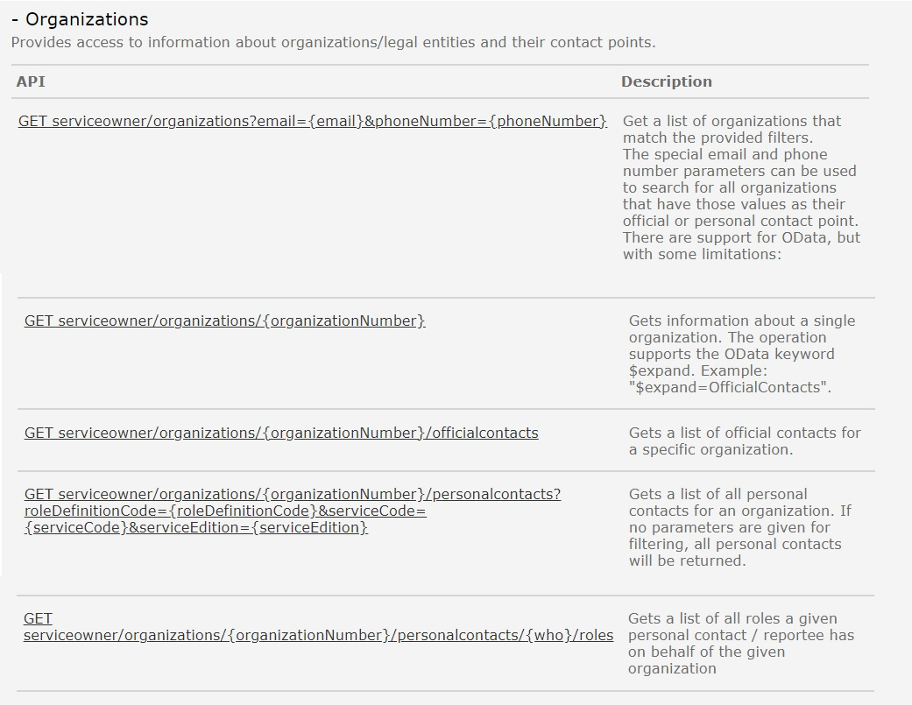

Eksisterende REST API i Altinn 2 er dokumentert [her](https://www.altinn.no/api/serviceowner/help)

## Organizations
Tjenesten benyttes til å hente ut hvilke kontaktinformasjon om virksomheter. 

### Hva skjer med tjenesten?
Denne erstattes av ny for å hente ut informasjon om virksomheters kontaktinformasjon i Altinn 3.

*Funksjonalitet og API forventes utviklet i 2025 i Altinn 3.*

#### Hvilke konsekvenser har dette for konsumenter
Beskrives senere. 

#### Tjenester og API i Altinn 3 som erstatter eksisterende API-tjeneste
Beskrives senere. 