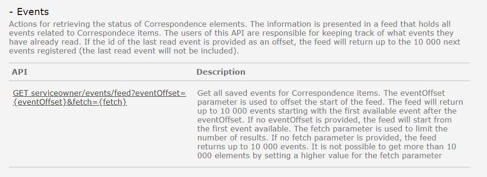

Eksisterende REST API i Altinn 2 er dokumentert [her](https://www.altinn.no/api/serviceowner/help)

## Events
Tjenesten benyttes til å sjekke status på Correpondence i Altinn 2. 

### Hva skjer med tjenesten?
Tjeneste for å sende meldinger/digital post vil bli utviklet på nytt i Altinn 3.
Da vil det også tilbys nye API-tjenester for å sjekke status på meldinger som er sendt. 

*Ny funksjonalitet og API blir utviklet i løpet av 2024 i Altinn 3.*
- Se beskrivelse av den nye tjenesten her: *lenke kommer senere*

#### Hvilke konsekvenser har dette for konsumenter
Beskrives senere. 

#### Tjenester og API i Altinn 3 som erstatter eksisterende API-tjeneste
Beskrives senere. 