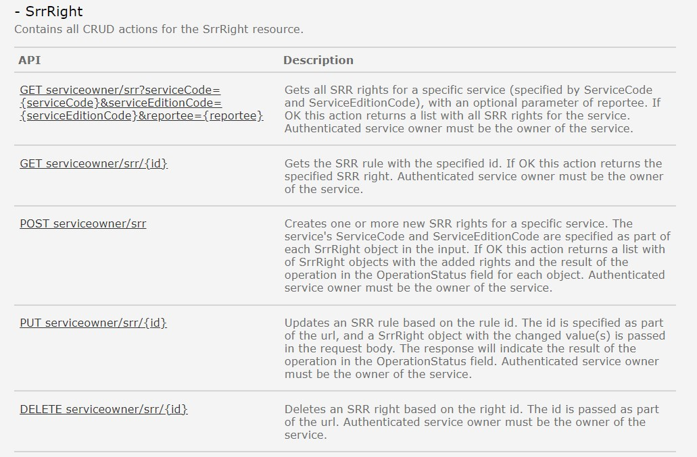

Eksisterende REST API i Altinn 2 er dokumentert [her](https://www.altinn.no/api/serviceowner/help)

## SrrRight
Tjenesten benyttes av tjenesteeier for å oppdatere regler i Tjenesteeierstyrt rettighetsregister (SRR). 

### Hva skjer med tjenesten?
Denne tjenesten erstattes med Resourceowner Rights Register (RRR) i Altinn 3 og det blir utviklet nye API for å oppdatere/hente ut informasjon om reglene. 

SrrRight API i Altinn 2 vil ikke inneholde informasjon om regler i RRR i Altinn 3. 

*Funksjonalitet og API forventes levert Q1-Q4 2023 i Altinn 3 i forbindelse med roadmap-issue [Klargjøre Altinn 3 for migrering av lenketjenester](https://github.com/digdir/roadmap/issues/190).*
- Se beskrivelse av den nye tjenesten [her](https://docs.altinn.studio/authorization/modules/accessmanagement/)
- se beskrivelse av de nye APIene [her](https://docs.altinn.studio/authorization/api/)

#### Hvilke konsekvenser har dette for tjenesteeier
Tjenesteeiere må ta i bruk nye API for å oppdatere/hente ut informasjon om reglene registert i RRR før de flytter sine tjenester fra Altinn 2 til Altinn 3.   

#### Tjenester og API i Altinn 3 som erstatter eksisterende API-tjeneste
Beskrives senere. 
