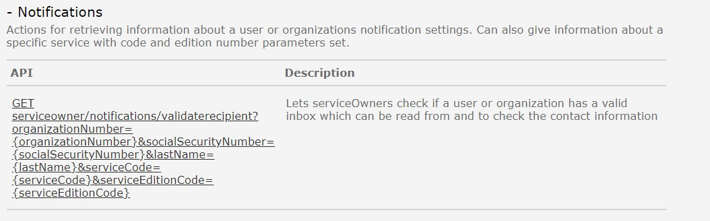

Eksisterende REST API i Altinn 2 er dokumentert [her](https://www.altinn.no/api/serviceowner/help)

## Notifications
Tjenesten benyttes til å validere mottaker av melding og varsel, se [beskrivelse av tjenesten](https://altinn.github.io/docs/api/tjenesteeiere/rest/kontaktinformasjon/). 

### Hva skjer med tjenesten?
Denne tjenesten erstattes av ny tjenester i Altinn 3.

Funksjonalitet og API blir utviklet i løpet av 2024 i Altinn 3.

Se beskrivelse av den nye tjenesten [her](https://docs.altinn.studio/notifications/). 

#### Hvilke konsekvenser har dette for konsumenter
Beskrives senere. 

#### Tjenester og API i Altinn 3 som erstatter eksisterende API-tjeneste
Beskrives senere. 