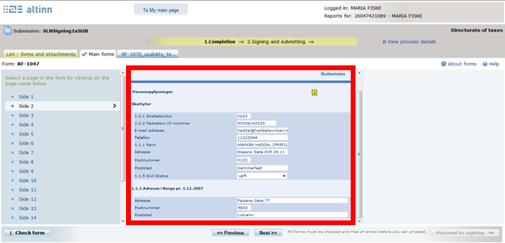
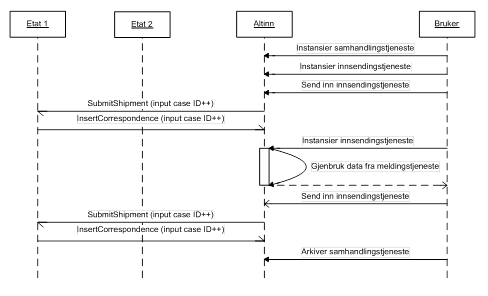
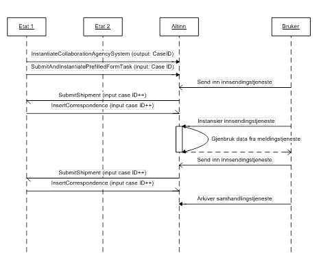

## Innsendingstjenester

Innsendingstjenester utvikles i tjenesteutviklingsløsningen (TUL) i Altinn, og er en definert innsending av spesifikke skjema/skjemasett med eller uten vedlegg. Fylles ut i Altinn portalen eller i integrert sluttbrukersystem, signeres og sendes inn. Påbegynte og innsendte innsendingstjenester kan oppbevares i sluttbrukers meldingsboks i Altinn.

Svardata sendes tjenesteeier. Tjenesteeier kan også legge skjemaet klart i den enkeltes brukers arbeidsliste og varsle om frister og lignende.

For tjenesteeiere omhandler "Innsendingstjenester" følgende:

- innsending av prefilldata
- innsending av abonnementsdata
- mottak av ferdig utfylte innsendinger fra Altinn
- uthenting av innsendte data fra tjenesteeiers eget arkiv
- uthenting av kvittering for status på innsending

### Innsending av prefilldata

Tjenesteeier kan sende inn prefilldata for en tjeneste i Altinn, og dataene benyttes ved preutfylling. Preutfylling innebærer at en gitt tjeneste (skjema/skjemasett) ved aktivisering i Altinn blir forhåndsutfylt med data mottatt fra tjenesteeiere og nasjonale registre. Prefilldata kan sendes i sanntid eller satsvis (batch).

Det finnes fem typer data ifbm. preutfylling:

1. **Sende inn preutfylte skjemasett**
 - Tjenesteeier kan sende inn ett eller flere preutfylte skjemasett for en gitt tjeneste versjon, eller rapporteringsplikt for lagring i database.
 - Benyttes når en avgiver eller abonnementsrutine aktiviserer tilknyttet tjeneste i portalen.
 - Skjemasettet kan inneholde identifiserende felter, for å kunne ha forskjellige preutfylte skjemasett ved rapportering flere ganger i året. Se eget punkt nedenfor om Identifiserende felter for mer info.
 - Kan sendes i sanntid eller satsvis. Ved overføring i sanntid overføres en liste av preutfylte skjemasett asynkront, og kvittering returneres.
 - Kvittering for info om status på asynkron innsending kan hentes ut vha. web service kall, se avsnitt Receipt (9.3). Referanse angitt ved innsending benyttes som nøkkel.
2. **Identifiserende felter**
 - Verdier som legges på et preutfylt skjemasett, for å gjøre skjemasettet unikt
 - Verdiene kan være "hva som helst", men typisk noe som kan knyttes til det preutfylte skjemasettet, f.eks. "rapport X", "periode Y" (2 verdier).
 - Preutfylte skjemasett uten identifiserende felter benyttes ved aktivisering av tjenester i Altinn portal, og/eller sammen med abonnement.
 - Preutfylte skjemasett med identifiserende felter benyttes kun sammen med abonnement.
3. **Direkte aktivisering av ett preutfylt skjemasett**
 - Tjenesteeier kan sende inn ett preutfylt skjemasett som øyeblikkelig blir tilgjengeliggjort i avgivers arbeidsliste i portalen
 - Med eller uten varsel etter tilgjengeliggjøring i arbeidslisten.
 - Det preutfylte skjemasettet kan lagres til database for senere bruk, som beskrevet i punkt 1.
 - Kan kun sendes i sanntid, synkront.
 - Man vil kunne angi om det instansiert og preutfylt skjema skal knyttes til en samhandlingstjeneste ved å angi referansen i den valgfrie parameteren caseId i operasjonen.
4. **Sende inn feltbasert preutfyllingsdata**
 - Tjenesteeier kan sende inn feltnavn og feltverdi for felter som benyttes i skjemaer.
 - Ingen direkte knytning til tjeneste eller skjema, dvs. feltet kan finnes på flere tjenester for samme avgiver.
 - Benyttes når avgiver aktiviserer tjeneste som inneholder feltet i portalen.
 - Kan kun sendes inn satsvis.
 - Kvittering for status på batch-innsending kan hentes ut vha. web service kall, se avsnitt Receipt (9.3). Referanse angitt i xml ved innsending benyttes som nøkkel.
5. **Preutfyllingsdata fra nasjonale registre**
 - Data fra nasjonale registre som f.eks. Folkeregistre og Enhetsregisteret sendes inn til Altinn.
 - Register data knyttes til felter når tjeneste opprettes i Tjenesteutviklingsløsningen (TUL).
 - Benyttes når avgiver aktiviserer tjeneste som inneholder feltet



Da det er flere kilder for preutfyllingsdata blir preutfyllingsdataene benyttet i følgende rekkefølge for å hindre uønskede overskrivelser:

1. **Preutfylt skjemasett.**  
   Hentes fra Altinn databasen dersom det finnes for gitt tjeneste og avgiver.
2. **Feltbasert preutfylling.**  
   Felter som finnes for gitt avgiver og aktivisert skjema hentes fra Altinn databasen. Overskriver evt. Preutfylt skjemasett.
3. **Preutfyllingsdata fra nasjonale registre.**  
   Data fra nasjonale registre er feltbasert og overskriver alle andre preutfyllingsdata typer.

For satsvis overføring kan data hentes fra tjenesteeiers system, eller tjenesteeier kan levere data på et definert Altinn område.

Tjenesten må være opprettet i TUL og eksportert til SBL, for at preutfyllingsdata for den gitte tjenesten skal kunne mottas.

For flere detaljer rundt kontrakten for SubmitPrefilledFormTasks og SubmitAndInstantiatePrefilledFormTask vennligst se henholdsvis kapittel 9.6.2 og 9.6.1, Tjenestekatalog og WSDL.

**Tjenester og tjenesteoperasjoner som inngår i beskrevet funksjonalitet:**

Tjeneste | Operasjon                             | Type
-------- | ------------------------------------- | -----------
Prefill  | SubmitPrefilledFormTasks              | Basic/WS/EC
Prefill  | SubmitAndInstantiatePrefilledFormTask | Basic/WS/EC
Receipt  | GetReceipt                            | Basic/WS/EC

**Batch grensesnitt som inngår i beskrevet funksjonalitet:**

| Batch | Operasjon | Type|
|--------|--------|--------|
|Preutfylling| XML |FTP/SFTP|

### Innsending av abonnementsdata

Tjenesteeiere kan opprette abonnement på innsendingstjenester som aktiverer og tilgjengeliggjør innsendingstjenesten i den gitte avgivers arbeidsliste. Kan sendes i sanntid eller satsvis (batch).

Ved overføring i sanntid overføres en liste med abonnement, dvs. ett eller flere asynkron overføringer.

For satsvis overføring kan data hentes fra tjenesteeiers system, eller tjenesteeier kan levere data på et definert Altinnområde.

Tjenesten må være opprettet i TUL og eksportert til SBL, for at et abonnement for den gitte tjenesten skal kunne mottas.

Man kan opprettet følgende abonnementstyper:

- Engangsaktivering
- For en gitt periode/periodisk rapporteringsplikt
- I et gitt intervall
- På gitte tidspunkter med gitte frister

Et abonnement kan være tilknyttet identifiserende felter for å kunne koble et abonnement til et bestemt preutfylt skjemasett for den gitte avgiver. Det preutfylte skjemasettet med de samme identifiserende feltene må finnes i Altinn databasen før abonnementet aktiviseres. Se eget punkt om Identifiserende felter for mer info.

Mottatte abonnementsdata lagres til databasen.

Ved innsending av abonnementsdata vil man kunne angi om skjema skal knyttes til en samhandlingstjeneste ved å angi referansen i den valgfrie parameteren CaseId i SubmitSubscription.

Kvittering for info om status på innsending kan hentes ut vha. web service kall, se avsnitt Receipt (9.3). Referanse angitt ved innsending via web service/batch grensesnitt (xml) benyttes som nøkkel.

En rutinejobb i Altinn vil med jevne mellom gå igjennom abonnementsdatabasen for å finne abonnement/innsendingstjenester som er klare for instansiering, dvs. den vil aktivisere alle abonnement hvor startdato er mindre enn, eller lik, dagens dato. Startdato er satt av tjenesteeier, og neste aktiviseringsdato kalkuleres automatisk av rutinejobben i Altinn ut fra gitte parametre satt av tjenesteeier. Se parameter detaljer i avsnittet SubmitSubscription (web service) (9.7.1) eller Abonnement (batch) (10.3).

For flere detaljer rundt kontrakten for SubmitSubscription vennligst se kapittel 9.7.1, Tjenestekatalog og WSDL.

**Tjenester og tjenesteoperasjoner som inngår i beskrevet funksjonalitet:**

|Tjeneste|Operasjon|Type|
|--------|--------|--------|
|Subscription|Basic/SubmitSubscription/EC|Basic/WS/EC|
|Receipt|GetReceipt|Basic/WS/EC|

**Batch grensesnitt som inngår i beskrevet funksjonalitet:**

|Batch|Overføringsformat|Protokoll|
|--------|--------|--------|
|Abonnement|XML|FTP/SFTP|

### Motta data for innsendinger

Arkiverte innsendinger i Altinn tilgjengeliggjøres til tjenesteeier for henting/overføring. Kan enten sendes i sanntid per innsending, satsvis (batch), eller ved å bruke DownloadQueue.

1. For sanntid, dvs. ved bruk av web service, må tjenesteeier etablere dedikert web service angitt av Altinn på egen plattform, og motta innsendinger automatisk etter hvert som de arkiveres. Se eget avsnitt: 9.15 Online overføring til Tjenesteeier.
1. For satsvis overføring kan data leveres til en tjenesteeiers mottakssystem dersom det er etablert, eller tjenesteeier kan hente data på et definert Altinn område.
1. Tjenesteeier kan velge å bruke DownloadQueue web service, som lar tjenesteeiere hente meta-data fra en kø, som så kan brukes til å hente individuelle arkiverte innsendinger.

Tilgjengeliggjøres i standard Altinn format eller transformeres til tjenesteeiers eget mottaksformat.

Kvittering først opprettet ved innsending fra tjenesteeier oppdateres med informasjon om utsending, dvs. livsløpet til innsendingstjenesten dokumenteres. Kvittering kan hentes ut vha. web service kall, se avsnitt Receipt (9.3). Referanse angitt ved innsending benyttes som nøkkel.

Innsendinger for tjenesteutgaver knyttet til DownloadQueue (konfigureres under utgaveparametere i TUL) vil legge til metadata for innsendinger i DownloadQueue. Tjenesteeier kan hente en liste med disse metadata ved å bruke et web service kall, se kapittel for DownloadQueue (9.16)
Metadata kan så benyttes til å hente individuelle arkiverte innsendinger med vedlegg. I tillegg er det en tjenesteoperasjon som gir tilgang å hente ned en PDF versjon av et skjemasett. Denne vil støtte PDFA standarden.

**Tjenester og tjenesteoperasjoner som inngår i beskrevet funksjonalitet for overføring i sanntid:**

|Tjeneste|Operasjon|Type|
|--------|--------|--------|
||Basic/ReceiveOnlineBatchExternalAttachment|Basic|
|Receipt|GetReceipt|Basic/WS/EC|

**Batch grensesnitt som inngår i beskrevet funksjonalitet:**

|Batch|Overføringsformat|Protokoll|
|--------|--------|--------|
|Innsendingstjenester|XML|FTP/SFTP|

**Tjenester og tjenesteoperasjoner som inngår i DownloadQueue:**

|Tjeneste|Operasjon|Type|
|--------|--------|--------|
|DownloadQueue|GetDownloadQueueItems|Basic/WS/EC|
|DownloadQueue|PurgeItem|Basic/WS/EC|
|DownloadQueue|GetArchivedFormtaskDQ|Basic/WS/EC|
|DownloadQueue|GetFormSetPdf|Basic/WS/EC|

### Status på sending av innsendte element

For arkiverte elementer som blir sendt til tjenesteeier i sanntid eller satsvis beskrevet i 8.1.3 kan tjenesteeier hente status på elementer ved bruk av ArchiveShipmentStatus tjenesten.
Ved å bruke ArchiveShipmentStatus webtjenesten kan tjenesteeier hente en enkel oversikt over overførsels-status på individuelle elementer eller for lister av elementer sortert på tjeneste.

**Tjenester og tjenesteoperasjoner som inngår i ArchiveShipmentStatus:**

|Tjeneste|Operasjon|Type|
|--------|--------|--------|
|ServiceOwnerArchive|GetArchiveShipmentStatus|Basic/WS/EC|

### Dekryptering av sensitive felter data i innsendingstjenesten

Altinn støtter funksjonalitet for innsending av sensitive tjenester med sensitive felter. Slike skjema kan sendes inn via portalen eller sluttbrukersystemer. For å kunne lese de sensitive feltene tjenester må tjenesteeier benytte sine egne sertifikater for å dekryptere feltene.

Krypteringen skjer ved at innsender benytter en symmetrisk nøkkel på 128 bit i en AES algoritme for å kryptere det sensitive feltene i skjemaet. Sluttbrukersystemer må selv generere denne nøkkelen og kryptere det sensitive felteneskjemaet, mens dette vil bli håndtere for bruker i portalen.

For at bruker senere skal kunne dekryptere feltene fra skjemaet sendes den symmetriske nøkkelen med forsendelsen, men denne er da kryptert ved et selvvalgt brukerpassord på minst 8 tegn. Bruker kan da hente ut data, dekryptere symmetrisk nøkkel ved hjelp av sitt selvvalgte passord, og bruke denne til å dekryptere den sensitive dataen.

For at tjenesteeier skal kunne dekryptere feltene må de også ha krypteringsnøkkelen. Den symmetriske nøkkelen må derfor også krypteres med tjenesteeierens offentlige sertifikat ved hjelp av algoritmen RSA, og lagt ved innsendingen. Når tjenesteeier da mottar sensitiv data vil de først bruke sin private nøkkel til å dekryptere krypteringsnøkkelen, deretter bruke denne nøkkelen til å dekryptere de sensitive feltenedata.

Innsendinger med av sensitive felt tjenester og vedlegg overføres til etat via batch eller via online oppslag til tjenesteeiers arkiv på samme måte som andre innsendinger for tjenester uten sensitiv informasjon.

### Tekniske detaljer

Den symmetriske nøkkelen som er brukt til å kryptere de sensitive feltene i et skjema som skal dekrypteres hos tjenesteeier gjøres tilgjengelig i skjema ved hjelp av XML-Enc standarden <http://www.w3.org/TR/xmlenc-core/>. Den krypterte symmetriske nøkkelen ligger pakket sammen med en referanse til sertifikatet som er brukt på følgende form.

```XML
<my:txtFN>
	<EncryptedData Type="http://www.w3.org/2001/04/xmlenc#Content" xmlns="http://www.w3.org/2001/04/xmlenc#">
		<EncryptionMethod Algorithm="http://www.w3.org/2001/04/xmlenc#aes128-cbc" />
		<ds:KeyInfo xmlns:ds="http://www.w3.org/2000/09/xmldsig#">
			<EncryptedKey xmlns="http://www.w3.org/2001/04/xmlenc#">
				<EncryptionMethod Algorithm="http://www.w3.org/2001/04/xmlenc#rsa-1_5" />
				<CipherData>
<CipherValue>Ahgw/pNo9fcfUtOr8aTceVkFlCsC58HY0VrQUJW1B/AxMOzYsyKhWRorUViQENqSJabEiwfin4zO2qzRuELwGXBFZ4jtkwlJpnAd+6NuCZ/P0ZsxJG5A8XnALmVCBpIcOPaPUa3Q211Bnu3eCHaMmgw9/itX3g3FPZItkwNEfGg=</CipherValue>
				</CipherData>
			</EncryptedKey>
			<ds:KeyName>CD13AEC20C0564C2B5499630BE478654D3ADD64A</ds:KeyName>
		</ds:KeyInfo>
		<CipherData>
			<CipherValue>TJ+KuQDc2ccduVlCIaM9sw==</CipherValue>
		</CipherData>
	</EncryptedData>
</my:txtFN>
```

I dette eksempelet er <my:txtFN> feltet i skjema som inneholder sensitive data. I slike felt vil man finne et EncryptedData element som inneholder følgende 3 viktige elementer

1. Symmetrisk nøkkel kryptert med sertifikat. (EncryptedData/KeyInfo/EncryptedKey/Cipherdata)
2. Referanse til sertifikat brukt for å kryptere symmetrisk nøkkel. Dette er en thumbprint av sertifikat for tjenesteier. Den brukes internt hos tjenesteeier til å gjøre oppslag i keystore for å få tak i privat nøkkel og dermed kunne dekryptere den symmetriske nøkkelen. (EncryptedData/KeyInfo/KeyName)
3. Skjemadata kryptert med symmetrisk nøkkel. (EncryptedData/CipherData/CipherValue)

Skjemadata er kryptert ved hjelp av den symmetriske AES algorithmen med en blocksize på 128 bit, ciphermode CBC (Cipher-block chaining, <http://en.wikipedia.org/wiki/Block_cipher_modes_of_operation> og padding er PKCS7.

Den symmetriske nøkkelen er kryptert med RSA algoritmen, ECB mode og PKCS1 padding.

For tjenester som har krypterte vedlegg og krypterte skjemaer benyttes nøkkelinformasjonen som ligger i GetArchivedFormTaskBasicV2Result eller i data fra fil

```xml
<SOEncryptedSymmetricdKey>
<EncryptedKey>u7CPRJ/ZtOoFPU4tkSqBDLW6e0V1Mr92C0oTC7bWztYuCvgl0+R2DUW/8iSSaH3+Wl1vnWTRSnuEDiKBVenfEjQ5j89WHvbA0QO1cMzIpYl53EDBt1tvoVHaJYq+4KJIo2DGNYNHyb2iFIgn39BYo4KpNLW1Yk2k8MegCgnajMnSICSuYuy5sGuBkvytottC0h2KKR7PAZtuuzJ4PRnby2AAMNmSB8VusNctDen/d8nF1Sh1DRcP9pArBvsxEH2A7SwiKS+dRC/J2QK7iM1I6Tphkalsyjmgn03LkJMm/8X9ufp+fN6n8Czg+BsZ1+rw2DD7vgTDGMyn+41gqZW1qg==</EncryptedKey>
<CertificateThumbprint>5D15D6E888632370E0223B779C4E0F0D9D45DED0</CertificateThumbprint>
</SOEncryptedSymmetricdKey>
```

Se kapittel 14 for kodeeksempler.

FormDataXml er kryptert ved hjelp av den symmetriske AES algorithmen med en blocksize på 128 bit, ciphermode CBC (Cipher-block chaining, <http://en.wikipedia.org/wiki/Block_cipher_modes_of_operation> og padding er ISO10126.

## Meldingstjenester

Tjenesteeiere kan sende informasjon i form av meldinger til brukere av Altinn, og meldingene støtter HTML og vedlegg. Brukere kan varsles med e-post eller SMS om at informasjon 
er gjort tilgjengelig, for innsyn eller behandling. Tjenesteeiere får informasjon om hvilke utsendte meldinger som er åpnet, og kan eventuelt kreve at brukeren bekrefter mottaket
innen en fastsatt frist. Tjenesteeier kan enkelt sjekke status for innsendte meldinger på en meldingstjeneste ved å benytte eget web service kall med et sett av søkeparametere.

Meldingene kan oppbevares i sluttbrukers meldingsboks i Altinn i en fastsatt periode, eventuelt slettes av brukeren. Bruker kan også arkivere meldingene til sitt arkiv. 
Om meldingen krever bekreftelse må dette gjøres før meldingen eventuelt kan arkiveres.

Meldinger kan også eventuelt sendes til "Digital postkasse til innbygger" hvis brukeren har registrert en slik postkasse i Kontakt- og reservasjonsregisteret. 
(Dette gjelder kun personer, ikke organisasjoner.) Digitale brev kan opprettes istedenfor eller i tillegg til en melding i Altinn.

I sammenheng med opprettelse av digitale brev er det også mulig å bestille varsel fra DPI løsningen. DPI varsel vil bli sendt ut av postkasse leverandøren. 
Meldingsvarsel og DPI varsel er helt separate og bestilles hver for seg. For varsel fra DPI følger grensesnittet til Altinn i stor grad definisjonene til difi. <http://begrep.difi.no/SikkerDigitalPost/1.2.0/begrep/Varsler>

##### Behov for Valideringstjeneste?
Hvis tjenesteeier selv ikke har mulighet til å kontrollere status for mottaker før utsending (f eks sjekke om virksomeht er slettet eller person er død)
så bør man kontrollere dette mot altinn sin [valideringstjeneste for mottaker](/docs/api/tjenesteeiere/rest/validering-av-mottaker/)før man opprtter melding og sender varsel

### Sende inn meldingstjenester

Tjenesteeiere kan sende en melding til en gitt person eller bedrift som tilgjengeliggjøres for lesing/henting via Altinn. Kan enten sendes i sanntid per innsending, eller satsvis (batch).

Melding kan være:

- Ren tekst.
- HTML basert (formatert visning i nettleser).
- XML basert med referanse til tilhørende visningsskjema. (Skjema må defineres på tjenesten i TUL.)
- PDF. Dette gjelder kun sikker digital post. (Altinn vil selv behandle det som vedlegg.)
- Kombinasjon av alle over.

Annet:

- Brukere kan reservere seg mot å motta digital korrespondence gjennom kanaler som Altinn og digital postkasse. Tjenesteeiere kan velge å respektere eller ignorere slike reservasjoner. Se IsReservable.
- Inneholde binære vedlegg (for nedlasting), valgfri parameter DestinationType vil kunne begrense om vedleggene er tilgjengelig i portal eller sluttbrukersystem, eller begge. Om ikke sendt inn blir den satt til standard verdi ShowToAll. Ved videresending til "Digital postkasse til innbygger" er det obligatorisk med minst ett vedlegg. Dette vil da benyttes som hoveddokument i det som sendes til brukerens digitale postkasse.
- Varsles til en eller flere brukere på forskjellige kommunikasjonskanaler:
  - SMS (max 700 tegn)
  - E-post
- Tilknyttet en eksisterende samhandlingstjeneste ved å benytte valgfri caseID parameter. Om meldingstjenesten ikke tilhører den angitte samhandlingstjenesten eller denne ikke eksisterer vil operasjonen avbrytes.
- Mulig å videresende meldingen til en e-post adresse om angitt i valgfri parameter AllowForwarding. Er denne satt til true vil bruker kunne sende meldingen videre som en e-post fra portalen. Om ikke satt settes den til standardverdi som er True.
- En melding kan kobles til innsending ved å oppgi ArchiveReference. Dette vil da oppfattes som et svar på en innsending.
- Det er også mulig å gi instrukser for hvordan en bruker kan svare på en melding.
  - I form av en enkel link brukeren kan åpne:
  - I form av et skjema som bruker må sende inn.
  - I form av en kopi av eksisterende innsending. Brukeren korrigerer og sender inn.

Digital postkasse til innbygger:
Løsningen for «Digital postkasse til innbygger» har ikke støtte for all funksjonalitet som finnes i Altinn.
Funksjoner som ikke blir brukt hvis det ikke opprettes noen melding i Altinn:

 - Opprettelse av kobling mellom melding og en innsending. (Tjenesteeier svar på innsending)
 - Svar på melding. (Sluttbruker svar på melding fra tjenesteeier.)
 - Knyttning mot samhandlingstjenester.
 - Varsel for h.h.v melding og digitalt brev styres med ulike innstillinger.

Ved overføring i sanntid sendes en og en melding av gangen. Synkron overføring.

For satsvis overføring kan data hentes fra tjenesteeiers system, eller tjenesteeier kan levere data på et definert Altinn område.

Tjenesten må være opprettet i TUL og eksportert til SBL, for at meldingene skal vises for sluttbrukerne/sluttbrukersystemer.

Kvittering for info om status på innsending kan hentes ut vha. web service kall, se avsnitt Receipt (9.3). Referanse angitt ved innsending via web service/batch grensesnitt (xml) benyttes som nøkkel.

For flere detaljer rundt kontrakten for InsertCorrespondenceV2 vennligst se kapittel 9.4.1, Tjenestekatalog og WSDL.

Det tilbys støtte for gammelt AltUt format for eksisterende tjenesteeiere i Altinn.

**Tjenester og tjenesteoperasjoner som inngår i beskrevet funksjonalitet:**

|Tjeneste|Operasjon|Type|
|--------|--------|--------|
|Correspondence|InsertCorrespondenceV2|Basic/WS/EC|
|AltUt|SubmitAltutMessagePw|Basic|
|Receipt|GetReceiptV2|Basic/WS/EC|

**Batch grensesnitt som inngår i beskrevet funksjonalitet:**

|Batch|Overføringsformat|Protokoll|
|--------|--------|--------|
|Correspondence format|XML|FTP/SFTP|
|AltUt Format|XML|FTP/SFTP|

### Motta meldingsbekreftelse

En meldingstjeneste kan defineres med at tjenesteeier ønsker:

 - Åpne bekreftelse
 - Lese bekreftelse

Meldingsbekreftelser tilgjengeliggjøres for overføring / henting:

 - Tilgjengeliggjøres i "sanntid" per innsending
 - Samles opp og tilgjengeliggjøres på gitte intervall eller spesifikt tidspunkt (batch)

Data kan leveres til en tjenesteeiers mottakssystem dersom det er etablert, eller tjenesteeier kan hente data på et definert Altinn område.

Tilgjengeliggjøres i standard Altinn format eller transformeres til tjenesteeiers eget mottaksformat.

Kvittering først opprettet ved innsending fra tjenesteeier oppdateres med informasjon om utsending, dvs. livsløpet til meldingstjenesten dokumenteres. Kvittering kan hentes ut vha. web service kall, se avsnitt Receipt (9.3). Referanse angitt ved innsending benyttes som nøkkel.

Tilbyr støtte for gammelt AltUt format for eksisterende tjenesteeiere i Altinn.

**Batch grensesnitt som inngår i beskrevet funksjonalitet:**

|Batch|Overføringsformat|Protokoll|
|--------|--------|--------|
|CorrespondenceConfirmations|XML|FTP/SFTP|
|AltUtConfirmationBatch|XML|FTP/SFTP|

Det tilbys også egen funksjonalitet for rapportering av en samlet meldingstjeneste hvor tjenesteeier vil motta informasjon om status for alle brukere etter et gitt antall dager definert for tjenesten i TUL. Status for hver bruker her vil kunne være ikke lest, lest, og bekreftet. Data leveres til tjenesteeiers mottakssystem dersom det er etablert.

|Batch|Overføringsformat|Protokoll|
|--------|--------|--------|
|CorrespondenceUsageData|XML|FTP/SFTP|

### Sjekke status på meldingstjenester

Tjenesteeier kan enkelt sjekke status på meldinger de har sendt inn på en tjeneste ved å benytte egen web service for dette. Resultatsettet fra tjenesten vil være avhengig av søkeparameterne som tjenesteeier sender inn. Tjenestekode (ServiceCode) og tjenesteutgavekode (ServiceEditionCode) er pålagte parametere i spørringen, mens det videre kan filtreres ved å sende inn SendersReference, avgiver (Reportee), til og fra dato (CreatedAfterDate og CreatedBeforeDate), konkrete meldingsstatuser (CurrentStatus), samt hvorvidt det har blitt sendt varsel (NotificationSent).

For hver enkelt melding som passer til søkekriteriene tjenesteeier angir vil man få returnert følgende informasjon:

- ID for meldingen
- Når meldingen ble opprettet
- Avgiver meldingen tilhører
- Avsenders referanse (satt av tjenesteeier)
- Liste over statusendringer med tidspunkt
- Liste med varsler knyttet til meldingen, inkludert mottaker, tidspunkt for når varselet er sendt (om sendt) og varselskanal.

Statussjekk operasjonen kan også returnere status på det som er blitt forsøkt videresendt til Digital postkasse til innbygger. Statusinformasjon for post som er videresendt inneholder:

- ID for sikkert brev slik det er registrert i Altinn
- Unik ID for brevet slik det fremkommer i sikker digital post systemet.
- Når brevet ble opprettet
- Når status for brevet ble sist endret
- Avgiver brevet tilhører
- Avsenders referanse
- List med alle statusene brevet har hatt.

I tillegg til denne informasjonen returneres også tjenestekode og tjenesteversjonskode tilbake, samt en parameteren som angir om en grense for antall returmeldinger er nådd (LimitReached). Er grensen nådd må tjenesteeier spisse søket sitt, f.eks. ved å begrense tidsrommet, for å få hentet ut status for alle meldingene.

For flere detaljer rundt kontrakten for GetCorrespondenceStatusDetails vennligst se kapittel 9.4.5.

**Tjenester og tjenesteoperasjoner som inngår i beskrevet funksjonalitet:**

|Tjeneste|Operasjon|Type|
|--------|--------|--------|
|Correspondence|GetCorrespondenceStatusDetails|Basic/WS/EC|

## Lenketjeneste

Lenketjenester benyttes når man skal bruke Altinn som autorisasjonstjenesten, se beskrivelsen [styring av tilgang](/docs/utviklingsguider/styring-av-tilgang/for-tjenesteeier/) for mer informasjon. 

Lenketjenester blir ikke instansiert i Altinn og er derfor ikke å finne i min meldingsboks i Altinn. 

Lenketjenester defineres i [TUL](/docs/tul/tjenestetyper/lenke/) som de andre tjenestetypene slik at man kan sette autentiseringsnivå og autorisasjonsregler for start av tjenesten. 
Ekstern portal må verifisere at bruker faktisk skal ha tilgang til tjenestene portalen tilbyr, ved å benytte seg av Altinns [REST](/docs/api/tjenesteeiere/rest/autorisasjon/) 
eller [XACML](/docs/api/tjenesteeiere/soap/grensesnitt/autorisasjon/) grensesnitt for ekstern autorisasjon.

## Formidlingstjenester

Formidlingstjenester handler om å transportere data fra en eller flere avgivere til en eller flere mottakere, hvor Altinn fungerer som mellommann som sørger for transport og infrastruktur. Altinn er sådan en passiv part i prosessen, og både avsender og mottaker må benytte grensesnitt tilgjengeliggjort av Altinn.

Innholdet i en formidlingstjeneste er data som er bestemt mellom aktørene som inngår i en formidlingstjeneste, og er ikke kjent av Altinn.

Formidlingstjenesten overføres fra avsender til mottaker, og tjenesteeiere benytter derfor ikke egne grensesnitt kun for tjenesteeiere for formidlingstjenesten, men benytter i stedet de samme grensesnitt som er tilgjengelig for alle brukere av Altinn. Se derfor Implementasjonsguide for sluttbrukersystemer for mer informasjon om hvordan disse grensesnittene skal benyttes.

Transport av data i en formidlingstjeneste kan gå via web service og SFTP kanal, både for opp- og nedlasting. Ved bruk av web service vil det være en funksjonell begrensning i størrelsen på filer som kan lastes opp og ned, satt til 1GB, mens grensen for SFTP-kanalen vil ligge på i underkant av 2GB.

Data som skal overføres over SFTP kanalen pakkes i en ZIP-fil med to forhåndsdefinerte Altinn XML filer for å definere metadata (manifest.xml) og mottakere (recipients.xml). Ved bruk av web service sendes først metadata og mottaker liste, før selve dataen overføres i en egen operasjon. Utover dette kan ZIP-filen i prinsippet inneholde hva som helst av data som må overføres til en eller flere aktører. Utover viruskontroll gjør ikke Altinn noen form for validering eller prosessering av denne dataen som forsendes, men sørger for at oppgitt metadata og mottakerinformasjon er korrekt og validerer, samt holder orden på kvitteringer og sporingsinformasjon om forsendelsen.

Formidlingstjenester er tenkt brukt primært for formidlinger:

- B2B (Business-to-Business), B2G (Business-to-Government), G2B (Government-to-Business), eller G2G(Government-To-Government)

Når en avsender laster opp en formidlingstjeneste vil Altinn verifisere metadata og mottakere. Når dette er gjort vil forsendelsen gjøres tilgjengelig for mottakere for nedlasting. Samtidig vil Altinn opprette en kvitteringshierarki med en hovedkvittering tilhørende avsender, samt en underkvittering per mottaker. Hver underkvittering vil inneholde status på nedlastingen for denne mottakeren. Alle kvitteringer vil være knyttet til referanse satt av avsender. Avsender og mottaker kan også utveksle ytterligere statustekst på disse kvitteringene gjennom web service. På denne måten kan avsender følge opp status for hver enkelt mottaker.

Tiden en formidlingstjeneste vil være tilgjengelig for nedlasting i Altinn vil kunne variere fra tjeneste til tjeneste og styres av tjenesteeier. Dette betyr at filene etter en viss tidsperiode vil bli slettet selv om filene ikke er lastet ned av en eller flere av mottakerne.

Formidlingstjenesten kan av tjenesteeier også settes opp til å benytte seg av et tjenesteeierstyrt rettighetsregister. Dette registeret kan begrense hvem som har tilgang til opp- og nedlasting av spesifikke tjenester, og styres av tjenesteeier. Se kapittel 8.12 for mer informasjon om dette registeret og hvordan dette styres. For formidlingstjenesten er det tjenesteeierstyrte rettighetsregisteret definert med følgende grunnleggende regler:

- For å kunne laste opp en formidlingstjeneste må avsender inneha «write»-rettigheten for formidlingstjenesten.
- For å kunne laste ned en formidlingstjeneste må mottaker inneha «read»-rettigheten for formidlingstjenesten.

I enkelte brukstilfeller er det i tillegg ønskelig at mottaker også skal kunne sende informasjon tilbake til avsender. For å unngå at alle mottaker da også får «write»-rettigheten, og på den måten kan sende til andre mottakere, benyttes feltet «condition» (betingelse) i det tjenesteeierstyrte rettighetsregisteret. For å støtte brukstilfellet har man derfor også følgende regler:

- En mottaker som kun skal kunne sende tilbake til en avsender av tjenesten må ha rettigheten «write», men da med «condition» satt til verdien «recipient». Denne betingelsen benyttes så i Altinn til å validere mottakerlisten, og kun brukere som har rettigheten «read» med «condition» satt til «sender» vil være godkjente mottakere. Dette er vist med Org D i figuren under som kun kan sende til Org A.

- Merk her at avsender med rettigheten «write» uten «condition» kan sende til en mottaker med rettighet «read» med «condition» satt til «sender». Dette er vist med Org B i figuren under som kan sende til samtlige andre mottakere.

Ved bruk av tjenestene som tilbys av tjenesteeierstyrt rettighetsregister (9.17) kan det bemerkes at parameteren «Party» ikke benyttes for formidlingstjenesten.


Se også Vedlegg C: Flytdiagram for formidlingstjeneste for overordnet flyt ved bruk av formidlingstjeneste mellom avsender og mottaker.

## Innsynstjenester

Når en tjenesteeier ønsker å tilgjengeliggjøre et register for oppslag for brukere, men uten å ha tilgjengelig presentasjon for dette så kan det realiseres ved hjelp av en innsynstjeneste i Altinn.  Konseptuelt kan man se en innsynstjeneste som en kombinasjon av en innsendingstjeneste og en meldingstjeneste der hvor det ikke foregår noen behandling av den innsendte informasjonen.

En innsynstjeneste bygger på en Web Service eksponert fra tjenesteeierens side og kan benyttes av både portalbrukere og sluttbrukersystemer via Altinn som et mellomledd.

Innsynstjenester kan i TUL settes opp slik at tjenesteeier kan motta informasjon om brukere som har aktivert en innsynstjeneste. For dette kreves det at et forsendelsesoppsett settes opp i Altinn mot tjenesteeieren (ShipmentDefinition). Denne vil angi metode og overordnet mal (ShipmentOutboundTemplate) forsendelsen skal sendes på. Hver forsendelse består av den definerte malen, samt en eller flere forsendelses-deler som hver representerer en åpnet innsynstjeneste. En forsendelses-del følger et gitt format:

**Innsynstjeneste forsendelses-del (LookupServiceUseConfirmation)**

```XML
<LookupServiceUseConfirmation>
  <ServiceCode>
    <!--Angir innsynstjenestens tjeneste kode-->
  </ServiceCode>
  <ServiceEdition>
    <!--Angir innsynstjenestens tjeneste versjon kode-->
  </ServiceEdition>
  <ReporteeNumber>
    <!--Angir aktuell avgiver som aktiverer innsynstjenesten, fødselsnummer eller organisasjonsnummer-->
  </ReporteeNumber>
    <ReadDateTime>
    <!--Angir dato og tid når innsynstjenesten ble aktivert-->
  </ReadDateTime>
</LookupServiceUseConfirmation>
```

For mer informasjon om hvordan en innsendingstjeneste tilgjengeliggjøres i portal og for sluttbrukersystemer, se TR435 Brukerdokumentasjon for tjenesteutvikling.

## Samhandlingstjenester

En samhandlingstjeneste er ikke som andre tjenestetyper i Altinn da oppgaven til denne er å sette sammen flere andre tjenestetyper til én logisk prosess for brukeren. Dette er uavhengig av om de underliggende tjenestetypene er rettet mot én eller flere tjenesteeiere.

Et eksempel på en samhandlingstjeneste kan være Skattedialog. Her kan man ha flere underliggende innsendingstjenester, meldingstjenester og innsynstjenester ovenfor Skatteetaten som knyttes sammen til én logisk forretningsprosess. Et annet eksempel vil kunne være Navnedialog. En samhandlingstjeneste som kan knytte sammen innsendingstjenester og meldingstjenester mot flere tjenesteeiere.

Samhandlingstjenester kan være definert av sluttbrukere (brukerdefinert samhandlingstjeneste – en samleside) eller av tjenesteeiere (tjenesteeierdefinert samhandlingstjeneste – en e-dialog). Den brukerdefinerte samhandlingstjenesten er predefinert i TUL av en tjenesteutvikler. Denne kan instansieres og til en viss grad tilpasses av sluttbruker i SBL. Tjenesteeiere definerer i sin helhet egne samhandlingstjenester ved hjelp av TUL. Disse blir deretter migrert til SBL i likhet med andre tjenestetyper. I integrasjonssammenheng er det de tjenesteeierdefinert samhandlingstjenestene som er interessante.

En instans av en samhandlingstjeneste har en unik Case ID tilknyttet – en saks id. Når det da refereres til en instans av en samhandlingstjeneste, beskrives det ved bruk av Case ID.

Følgende illustrerer mulighetsrommet for Samhandlingstjenester og en typisk kronologisk rekkefølge:

TUL:

1. Definisjon av Altinn-tjenester med tjenestetype “Samhandlingstjeneste".
2. Definisjon av tjenestesammensetning. Tjenester som kan velges til å inngå i en samhandlingstjeneste må være av typen innsynstjeneste, meldingstjeneste eller innsendingstjeneste.
3. Definisjon av gjenbruk av data mellom deltakende tjenester i samhandlingstjenesten. Produsent og konsument av data settes opp. Merk at kun innsendingstjenester kan settes opp som konsument.
4. Definisjon av en tilstandsmaskin som identifiserer forretningsprosessen som et logisk sett av tilstander sammen med tilhørende presentasjon i form av dialogsider (se punkt 5).
5. Definisjon av hendelser som kan medføre en tilstandsovergang for samhandlingstjenesten. Betingelser kan knyttes til hendelsene slik at de må oppfylles før en tilstandsovergang kan skje. Hendelsene er typisk knyttet til stadier for de underliggende tjenestene som inngår i samhandlingstjenesten. Hendelser deles inn i forhåndsdefinerte og skreddersydde hendelser. De forhåndsdefinerte hendelse trigges automatisk i Altinn og består av følgende:

| Hendelses Navn | Tjenestetype |Portal|Sluttbrukersystem|Etatssystem|
|--------|--------|--------|--------|--------|
|    Instantiated    |     Innsendingstjeneste, Innsynstjeneste   |:white_check_mark:|:white_check_mark: | |
|Instantiated|Innsendingstjeneste, Meldingstjeneste| | |:white_check_mark:|
|Submitted|Innsendingstjeneste|:white_check_mark:|:white_check_mark:||
|Archived|Alle|:white_check_mark: |:white_check_mark: | |
|Opened|Meldingstjeneste, Innsynstjeneste|:white_check_mark:|:white_check_mark:| |
|Confirmed|Meldingstjeneste|:white_check_mark:|:white_check_mark:| |

Tabellen viser de forhåndsdefinerte hendelsene, hvilken tjenestetype de er relatert til, samt om de trigges fra portal, sluttbrukersystem eller etatssystem. For eksempel kan etatssystem instansiere innsendingstjenester eller meldingstjenester, og dermed kun trigge hendelsen Instantiated for disse.
Skreddersydde hendelser er hendelser definert av etat. Navn på disse hendelsene må defineres inn i tilstandsmaskinen (se punkt 3). Etaten kan kalle web service med hendelsen, både de forhåndsdefinerte og de skreddersydde, for å trigge en tilstandsovergang (se 8.6.1.6).

6. Opplasting av grafikkfiler til bruk i forhåndsdefinert dialogkomponent
7.	Definisjon av dialogsider for samhandlingstjenesten basert på et sett av 6 forhåndsdefinerte maler og 10 forhåndsdefinerte dialogkomponenter.
8.	Definisjon av merknadsmaler for samhandlingstjenesten. Etaten kan ved bruk av et eksternt grensesnitt (se 8.6.1.5) sette predefinert merknad på samhandlingstjenesten eller tilhørende underliggende tjenester.
9.	Oversettelse til flere språk (engelsk, bokmål og nynorsk) for språkstøttet tekst i samhandlingstjenesten.
10.	Migrering av samhandlingstjeneste til SBL. Alle underliggende tjenesteutgaver som inngår i samhandlingstjenesten må være migrert før selve samhandlingstjenesten kan migreres.

For mer informasjon om oppsett av en samhandlingstjeneste i TUL, vennligst se Brukerveiledning for TUL.

SBL:

1. Opprettelse av en sak (instansiering av en spesifikk utgave og versjon av samhandlingstjenesten definert i TUL og migrert til SBL)
2. Presentasjon av en sak til sluttbrukeren i et arbeidsområde i SBL, modellert for å gi støtte i prosessen relatert til samhandlingstjenesten med enkel tilgang til de underliggende tjenestene.
3. Muliggjøre for sluttbruker og sluttbrukersystemer å interagere med de underliggende tjenestene gjennom henholdsvis dialogsidene for samhandlingstjenesten eller ved hjelp av de eksterne grensesnittene.
4. Starte en tjeneste fra tjenestekatalogen som inngår som underliggende tjeneste til en samhandlingstjeneste, og deretter bli presentert med valget om man i stedet skal starte en ny eller åpne en eksisterende samhandlingstjeneste.
5. Forårsake tilstandsoverganger som følge av de definerte hendelsene for tilstandsmaskinen.
6. Muliggjøre at tjenesteeierssystemer kan sende merknader til saken og underliggende forekomster av tjenesteutgavene som inngår i sakens samhandlingstjeneste.
7. Muliggjøre at tjenesteeierssystemer kan sende hendelser til den bestemte saken, eller til alle saker for en bestemt utgave og versjon av samhandlingstjenesten, gjennom eksternt grensesnitt.

Merk at en arkivert samhandlingstjeneste ikke vil være tilgjengelig i tjenesteeiers arkiv, kun i brukers arkiv.

### Tjenester i forhold til bruk av samhandlingstjenester

Nedenfor beskrives funksjonalitet for samhandlingstjenester som kan benyttes av tjenesteeiere.

### Instansier en samhandlingstjeneste

I de tilfellene en tjenesteeier ønsker å instansiere en samhandlingstjeneste (typisk knyttet til abonnementsinstanseriering) så kan en velge å instansiere en samhandlingstjeneste for en bruker/kunde.

| Tjeneste | Operasjon |Type|
|--------|--------|--------|
|CaseAgencySystem|InstantiateCollaborationAgencySystem|Basic/WS/EC|

Samtlige parametere i operasjonen unntatt visibleDateTime og dueDate må sendes inn for å få opprette en sak. visibleDateTime kan benyttes for å sette når samhandlingstjenesten vil være synlig for brukeren frem i tid, om denne ikke angis vil tjenesten være synlig umiddelbart.

Funksjonelt vil InstantiateCollaborationAgencySystem returnere en referanse til instansen som ble opprettet, caseID.  Denne caseID må benyttes av tjenesteeieren på andre tjenester som ønsker å kommunisere med den opprettede instansen. Skulle en time-out oppstå vil ikke samhandlingstjenesten instansieres siden tjenesten er transaksjonshåndtert.

For flere detaljer rundt kontrakten vennligst se kapittel 9.10.1, Tjenestekatalog og WSDL.

### Hente ut kjørende instanser av samhandlingstjenester

Hvis en tjenesteeier har valgt å ikke lagre case ID fra et tidligere grensesnitt (mottatt innsendingstjeneste eller instansiert samhandlingstjeneste) og mottar oppgaver på papir, så kan den utføre oppslag mot Altinn for å finne eventuelle saker (samhandlingstjenesteinstanser). Andre tilfeller der dette kan være aktuelt er hvis en annen tjenesteeier, eller brukeren selv, har instansiert samhandlingstjenesten.

| Tjeneste | Operasjon |Type|
|--------|--------|--------|
|CaseAgencySystem|GetCaseListAgencySystem|Basic/WS/EC|

GetCaseListAgencySystem kan brukes til to formål:

1. Hente ut caseID, tilstand og merknad for kjørende instanser av samhandlingstjenester for bestemt fødselsnummer/organisasjonsnummer (reporteeNumber), tjeneste (externalServiceCode) og tjenesteutgave (externalServiceEditionCode).
2. Hente ut caseID, tilstand og merknad for kjørende instanser av bestemt type samhandlingstjeneste basert på tjeneste (externalServiceCode) og tjenesteutgave (externalServiceEditionCode).
3. Hente ut tilstand og merknad for bestemt sak basert på fødselsnummer/organisasjonsnummer (reporteeNumber) og CaseID (caseID)
For punkt 1 og 2 må parametrene externalServiceCode og externalServiceEditionCode angis, mens parameter caseID må benyttes for punkt 3. Om parameter languageID ikke angis, eller forespurt språk ikke støttes vil språkavhengige returverdier returneres på tjenestens satte standardspråk. Alle andre parametere er obligatoriske og må angis.

Operasjonen returnerer informasjon om samhandlingstjenestens unike identifikator, CaseID, navnet på tjenesten, CaseName, og eventuelt om det er satt noen merknader på samhandlingstjenesten ved å returnere den unike identifikatoren, NoticeTemplateID. I tillegg returneres det informasjon om samhandlingstjenestens tilstand i form av visningsvennlig navn basert på språkparameter, CurrentStateFriendlyName, unik identifikator for tilstanden, CurrentStateID, og tilstandens navn, CurrentStateName. Alle disse er definert for tjenesten i TUL.

CaseID vil kunne benyttes i andre operasjoner mot Altinn, enten alene som for eksempel ved å instansiere en innsendingstjeneste som skal knyttes til samhandlingstjenesten via operasjonen SubmitAndInstantiatePrefilledFormTask (se 8.1.1 og 9.6.1), eller sammen med informasjon om tilstand til å registrere en hendelse for samhandlingstjenesten via operasjonen NotifyEventAgencySystem (se 8.6.1.6 og 9.10.3).

Vennligst observer at hvis en bruker har instansiert flere forekomster av samme samhandlingstjeneste så vil ikke bare én forekomst returneres og derfor må tjenesteeieren basert på tilstand og merknad kunne identifisere den riktige instansen. Rent teknisk kan også tjenesteeiere ha opprettet flere instanser av samme tjenesteutgave om ønskelig.
For flere detaljer rundt kontrakten vennligst se kapittel 9.10.2, Tjenestekatalog og WSDL.

### Knytte innsendingstjeneste til sak

En tjenesteeier kan forhåndsinstansiere en innsendingstjeneste for en bruker og samtidig knyttet denne til en løpende sak.  Dette gjøres ved å sende med den valgfrie parameteren Case ID i operasjonskallet for operasjonen SubmitAndInstantiatePrefilledFormTask.
For mer informasjon se Innsendingstjenester (8.1) og operasjonen SubmitAndInstantiatePrefilledFormTask (9.6.1).

### Knytte meldingstjeneste til sak

En tjenesteeier kan velge å knytte en meldingsatjeneste til en løpende sak. Dette gjøres ved at den valgfrie parameteren Case ID benyttes i operasjonskallet for meldingstjenesten.
For mer informasjon se Meldingstjenester (8.2) og operasjonen InsertCorrespondenceV2 (9.4.1).

### Sett merknad på sak eller underliggende tjeneste

Ved å sette merknader på tjenester, kan tjenesteeier formidle informasjon til sluttbruker om samhandlingstjenester.
**Tjenester og tjenesteoperasjoner som inngår i beskrevet funksjonalitet:**

| Tjeneste | Operasjon |Type|
|--------|--------|--------|
|CaseAgencySystem|SetNoticeAgencySystem|Basic/WS/EC|

Obligatorisk parameter reporteeElementID angir hvilken sak (Case ID), eller tilordnet tjeneste (innsendingstjeneste, meldingstjeneste, innsynstjeneste (kun arkivert)) merknaden skal settes på. Settes merknad på en tilordnet tjeneste som er arkivert (innsendingstjeneste, meldingstjeneste eller innsynstjeneste) må identifikatoren prefikses med AR. Identifikatoren for samhandlingstjenesten kan ha blitt mottatt fra InstantiateCollaborationAgencySystem, en arkivert innsendingstjeneste, eller den kan hentes ved bruk av GetCaseListAgencySystem.

Alle maler (templates) for merknader må forhåndsdefineres av tjenesteeier på samhandlingstjenesten i tjenesteutviklingsløsningen og refereres til i kallet sammen med key-value par for variabler til merknaden. Mal defineres gjennom obligatorisk parameter NoticeTemplateID. Angis det feil mal eller nøkkel for samhandlingstjenesten vil feilmelding returneres.
For flere detaljer rundt kontrakten vennligst se kapittel 9.10.4, Tjenestekatalog og WSDL.

### Sende hendelse til sak

Tjenesteeier kan påvirke tilstanden for en samhandlingstjeneste ved å registrere en ny hendelse (Event). Et eksempel hvor dette er nyttig er dersom tjenesteeier har mottatt informasjon via en annen kanal enn Altinn (f.eks. ved papirbasert innrapportering), og derfor ønsker å flytte samhandlingstjenesten til neste tilstand.

**Tjenester og tjenesteoperasjoner som inngår i beskrevet funksjonalitet:**

| Tjeneste | Operasjon |Type|
|--------|--------|--------|
|CaseAgencySystem|NotifyEventAgencySystem|Basic/WS/EC|

Denne operasjonen tar en entitet av typen StateMachineEventNotificationBE som input. Denne inneholder som de fleste andre for samhandlingstjenester CaseID parameteren som da unikt identifiserer en samhandlingsinstans hendelsen gjelder. Alternativt kan tjenesteeier velge å heller spesifisere tjeneste og tjenesteutgave, via parametrene ExternalServiceCode og ExternalServiceEditionCode. I det tilfellet vil hendelsen internt i Altinn bli kommunisert til alle kjørende instanser for kombinasjonen av nevnte tjeneste og tjenesteutgave. Til sammenligning vil hendelser som skjer innad i Altinn-løsningen kun kommuniseres til den saken som trigget hendelsen.

I de tilfellene saken er opprettet av bruker selv eller av annen tjenesteeier vil man kunne hente saks id for bestemt samhandlingstjeneste (tjeneste og tjenesteutgave) vha GetCaseListAgencySystem som beskrevet i 8.6.1.2, eller eventuelt fra en allerede innsendt innsendingstjeneste knyttet til saken.

Event er obligatorisk parameter for operasjonen som angir hendelsen, mens ReporteeElementID er valgfri og benyttes kun i loggsammenheng i Altinn for å knytte hendelsen opp mot et subelement (dette kan for eksempel være en identifikator for en arkivert innsendingstjeneste tilknyttet samhandlingstjenesten). Hendelsen som skal sendes bør sees i sammenheng med tilstandsmaskinen for den aktuelle samhandlingstjenesten, og de hendelser som er definert der. Merk at en hendelse ikke nødvendigvis vil trigge en tilstandsendring; følgende vil være avgjørende:

1. Er hendelsen aktuell for samhandlingstjenestens nåværende tilstand?
2. og, finnes betingelser knyttet til hendelsen som ikke er oppfylt?

Om 1. eller 2. blir evaluert til false vil det ikke skje en tilstandsendring. Tilstander, hendelser og eventuelle betingelser er alle definert i TUL for samhandlingstjenesten.

Operasjonen returnerer en liste av StateMachineNotificationResultBE. En liste returneres om hendelsen blir sendt til flere samhandlingsinstanser basert på parametrene ExternalServiceCode og ExternalServiceEditionCode. Om hendelsen kun sendes til en samhandlingstinstans vil kun en entitet returneres. StateMachineNotificationResultBE angir identifikator for samhandlingstjenesten resultatet gjelder for (CaseID), hvorvidt det skjedde en tilstandsendring (IsStateChanged) og dens navn (CurrentStateName). I tillegg angis evt betingelse (ConditionName) og evalueringen av betingelsen (ConditionEvaluationResult). Om det skulle oppstå en feilsituasjon i tilstandsmaskinen vil parameteren HasException være angit som true. Feilinformasjon og feilkode vil da ligge i henholdsvis ExceptionDetail og ErrorCode.

For flere detaljer rundt kontrakten vennligst se kapittel 9.10.2, Tjenestekatalog og WSDL.

### Eksempler på bruk av tjenestegrensesnitt for samhandlingstjenester

De påfølgende avsnittene viser eksempler på bruka av samhandlingstjenester.

### Brukerinstansiert samhandlingstjeneste med én etat

Dette eksempelet viser en enkel samhandlingstjeneste som er definert i TUL og som blir instansiert av brukeren.

Tilstandsmaskinen består av to tilstander og det er definert gjenbruk av data mellom en meldingstjeneste og siste innsendingstjeneste. Selve kopieringen av data foregår idet innsendingstjenesten instansieres.



### Etatsinstansiert samhandlingstjeneste med én etat.

Dette scenarioet beskriver en samhandlingstjeneste som Skattedialogen hvor etat tar initiativ og instansierer første innsendingstjeneste for brukeren.



I forhold til forrige eksempel så er eneste forskjellen de to første kallene. Deretter fungerer systemdialogen på samme måte. I tillegg bør det nevnes at gjenbruk av data ikke kan benyttes når etaten instansierer innsendingstjeneste. Dette må i stedet løses på etatens side før innsendingstjeneste instansieres.

### Brukerinstansiert samhandlingstjeneste med to etater med kanaluavhengighet

I dette eksempelet så vil en bruker velge å sende inn på papir mens selve samhandlingstjenesten er blitt startet i Altinn.


I dette eksempelet starter samhandlingstjenesten som i første scenario, men deretter velger en bruker å sende inn på papir.  Etat 2 vil da bruke oppslagstjenesten knyttet til samhandlingstjenesten og deretter finne riktig samhandlingstjeneste.  Deretter vil tilstandsmaskinen bli "oppdatert" med at oppgave er innsendt og fortsette som før.

## Kvitteringer

For alle forsendelser inn og ut av Altinn skapes eller oppdateres en kvittering. Kvitteringer bidrar til at tjenesteeier kan får større innsikt i livsløpet fra f.eks. opprettelse av innsending til mottak av arkivert innsendingstjeneste. Kvitteringene skaper også bedre sporbarhet i Altinn løsningen.

For formidlingstjenester vil det lages en hovedkvittering for den som laster opp en fil og en underkvittering for hver mottaker av filen. Hovedkvittering med underkvittering kan på den måten brukes til å danne et komplett bilde av opplasting og nedlastinger.Dette kan også benyttes som en enkel kommunikasjonskanal ved at deltakere på forsendelsen kan oppdatere kvitteringen de har fått tildelt med en ny tekst og status.

For samhandlingstjenester vil det ikke bli generert kvitteringer da disse ikke arkiveres til tjenesteeiers arkiv. Frittstående varsel vil heller ikke generere kvitteringer. For innsynstjenester vil tjenesteeier kunne motta kvittering for bruk av tjenesten og arkivering av tjenesten. Tjenesteutvikler vil kunne velge om det skal sendes kvittering i disse to tilfellene.

For å muliggjøre dette kreves det at tjenesteeier markerer sine forsendelser inn til Altinn med referanser som lagres på kvitteringen. Samme referanse benyttes ved oppslag/kvittering.

Eksempler

a) Ved satsvis innsending av abonnementsdata benyttes xml elementet ServiceOwner/Subscription/ExternalShipmentReference for angivelse av referanse.

b) Ved sanntid overføring av abonnementsdata benyttes parameteren externalBatchId i web service metoden SubmitSubscription for angivelse av referanse.

Se xsd referanse for aktuell dataoverføring i kapittelet om Grensesnitt – batch til Altinn, for detaljer om plassering av referanse ved satsvis overføring. For overføring i sanntid henvises det til den aktuelle web service i kapittelet om Grensesnitt – web services.

Mulige kvitteringsoperasjoner:

- Hente kvitteringer for innsendte data
- Kvittere for mottak av data
- Hente lister med kvitteringer

Kvitteringsinformasjon kan kun hentes i sanntid.
For å søke opp kvitteringer brukes GetReceiptList. Har mann SendersReference evt ExternalShipmentReference vil dette spisse søket. De fleste referanser vil fungere i søkefunksjonaliteten.

For flere detaljer rundt kontrakten for GetReceipt, GetReceiptList og SaveReceipt vennligst se henholdsvis kapittel 9.3.1, 9.3.2 og 9.3.3, Tjenestekatalog og WSDL.

**Tjenester og tjenesteoperasjoner som inngår i beskrevet funksjonalitet:**

| Tjeneste | Operasjon |Type|
|--------|--------|--------|
|Receipt|GetReceipt|Basic/WS/EC|
|Receipt|GetReceiptList|Basic/WS/EC|
|Receipt|UpdateReceipt|Basic/WS/EC|

## Frittstående varsel

Tjenesteeier kan velge å sende frittstående varsler til personer og enheter i Altinn. Dette er varsler som kan sendes til fødselsnummer eller organisasjonsnummer uten at varselet trenger å være tilknyttet et spesifikt element (melding eller skjema).

##### Behov for Valideringstjeneste?
Hvis tjenesteeier selv ikke har mulighet til å kontrollere status for mottaker før utsending av varsel (f eks sjekke om organisasjon er slettet eller om person har kontaktinformasjon i KRR)
så bør man kontrollere dette mot altinn sin [valideringstjeneste for mottaker](/docs/api/tjenesteeiere/rest/validering-av-mottaker/)før man oppretter varsel. 

| Tjeneste | Operasjon |Type|
|--------|--------|--------|
|NotificationAgencyExternal|SendStandaloneNotification|Basic/WS/EC|
|NotificationAgencyExternal|SendStandaloneNotificationV2|Basic/WS/EC|
|NotificationAgencyExternal|SendStandaloneNotificationV3|Basic/WS/EC|

Operasjonen SendStandaloneNotification benyttes for å sende de frittstående varslene. Operasjonen har støtte for en liste med varsel med helt forskjellige mottakere og formål. For hvert varsel må følgende angis:

- ReporteeNumber angir fødselsnummer eller organisasjonsnummer varselet skal sendes til, den kan brukes til å slå opp mottakeradresse for varselet i brukerens kontaktprofil i tilfelle fødselsnummer, eller angitte kontaktpersoner på enhetsprofilen i tilfelle organisasjonsnummer. For underenheter uten angitte varslingsadresser vil hovedenhetens adresser bli benyttet.

- Service med parameterene ServiceCode og ServiceEdition fungerer som et mottaker filter hvis ReporteeNumber er et organisasjonsnummer. Organisasjonen vil uansett få varsel på sine registrerte varslingsadresser, men listen med personer som har registrert personlig kontaktinformasjon for virksomheten vil bli filtrert. Listen filtreres først basert på personens preferanser. Det vil si listen med tjenester de har registrert at de er interesert i. Neste filtrering er basert på autorisasjon. Personen må ha lesetilgang til tjenesten (Service) på veiene av organisasjonen. Hvis det ikke er angitt noen tjeneste så vil ingen personer få varsel da det blir umulig å autorisere. Service blir ikke benyttet til noe hvis ReporteeNumber er et fødselsnummer.

- ReceiverEndPoints benyttes til å angi om varselet skal sendes som SMS eller epost. Hvis det ikke blir oppgit noe mobilnummer eller epostadresse så vil Altinn forsøke identifisere dette selv. Altinn vil da gjøre oppslag i registre for henholdsvis person og organisasjon basert på angitt avgiver. Hvis avgiver er en person vil Altinn gjøre oppslag i kontakt- og reservasjonsregisteret til Difi og for organisasjoner vil det gjøres oppslag i Kontakt og fullmaktsregisteret for virksomheter knyttet til enhetsregisteret.

- LanguageID og NotificationType vil sammen definere hvilken mal som skal benyttes for varselet. Denne må være forhåndsdefinert i databasen.

- TextTokens med parameteren TokenValue kan benyttes hvis valgt mal har substitusjoner definert. Substitusjoner blir gjort basert på rekkefølgen TokenValue blir angitt i forespørselen. Substitusjonene som varselsmalen har må begynne på 0 og fortsette oppover. Parameteren TokenNum har for tiden ingen funksjon og kan utelates.

- UseServiceOwnerShortNameAsSenderOfSms angir om tjenesteeier selv skal stå som avsender av SMS varsel i stedet for Altinn. For at tjenesteeier skal kunne stå som avsender må tjenesteeier på forhånd bestille registrering av ShortName (maks 11 alfanumeriske tegn) for tjenesteier i Altinn.

FromAddress strengen angir fra adresse når transport type er e-post (må være på gyldig e-post format). Denne er valgfri, og hvis ikke angitt vil det for e-post varsler bli brukt en standard Altinn e-post adresse. ShipmentDateTime parameteren kan benyttes hvis varselet ønskes sendt på et senere tidspunkt, hvis ikke angis vil varselet sendes umiddelbart.

SendStandaloneNotification tjenesten finnes i tre versjoner. Funksjonelt er de identiske, men det er variasjon in responsen:  
Versjon 1; Operasjonen returnerer ingen verdi, kun feilmeldinger.  
Versjon 2; Operasjonen returnerer en streng med mottakere som var reservert mot varsel, med enten en «varsel feilet» eller «varsel feilet delvis» melding. Varsel vil ses på som feilet dersom alle mottakere var reservert og delvis feilet dersom noen, men ikke alle, mottakere var reservert mot varsel.  
Versjon 3; Operasjonen returnerer et resultat-objekt SendStandAloneNotificationResult som inneholder samme return melding som fra Versjon 2, og en liste med resultater for de varsler som ble levert. I disse resultatene er følgende angitt:

- NotificationType inneholder NotificationType fra det originale varselet som ble levert. Brukes til å identifisere hvilket levert varsel resultatet tilhører.

- ReporteeNumber inneholder ReporteeNumber fra det originale varselet som ble levert. Brukes til å identifisere hvilket levert varsel resultatet tilhører.

- EndPoints er en liste med mottakere som mottok varsel. Hvert mottakker objekt inneholder følgende verdier:

  - Name er navn på mottaker der dette er tilgjengelig.
  - ReceiverAddress er addressen varselet vil leveres til.
  - TransportType er hva slags transport varsel levers på.
  - RetrieveFromProfile beskriver om mottakker ble hentet fra en organisasjon eller brukers profil.

Det anbefales å bruke kun versjon 3. For flere detaljer rundt kontrakten se kapittel [Varseltjeneste](../soap/grensesnitt/meldingstjeneste/)

## Autorisasjonsfunksjonalitet for tjenesteeiere

Altinn 2 versjon 2 tilbyr at eksterne løsninger kan benytte Altinn som autorisasjons komponent.  Dette betyr at eksterne system kan definere eksterne ressurser og regler tilknyttet disse. Deretter kan eksterne systemer verifisere at bruker har tilgang til ressurs.  Tjenestene kan aksesseres fra tjenesteeierssystem fra gyldig ip-adresse.

Verifiseringstjenesten kan også benyttes til å autentisere en brukers tilgang til tjenesteeiers tjenester. Denne typen verifisering benytter de autorisasjonsregler som er definert på tjenesten i TUL.

### Importere eksterne regler

Tjenesteeiere har mulighet til å importere eksterne ressurser og regler som senere kan benyttes eksternt til å avgjøre tilgang ved hjelp av tilgangsmekanismenen i Altinn.

| Tjeneste | Operasjon |Type|
|--------|--------|--------|
|AdministrationExternal|ImportAuthorizationPolicy|WS|

ImportAuthorizationPolicy er operasjonen som tjenesteeiers system kan benytte for å importere de eksterne policyene. Operasjonen tar en XML streng som input parameter. Denne XML strengen må følge det standardiserte formatet XACML
For flere detaljer rundt kontrakten vennligst se kapittel 9.8.1, Tjenestekatalog og WSDL.

### Ekstern autorisasjon

Tjenesteeierne har etter å ha importert eksterne regler muligheten for å gjøre kall mot Altinn for å benytte Altinns autorisasjonskomponent for autorisasjonsavgjørelser. Altinn vil motta forespørsel og ta en avgjørelse basert på de eksterne reglene og ressursene som er lagt inn. Regler som er satt i TUL på en tjeneste er også tilgjengelig for tilsvarende verifisering for å sjekke en brukers tilgang til tjenesten.

AuthorizationDecisionPointExternal er tjenesten i Altinn II som har ansvaret for alle avgjørelser rundt autorisasjon basert på regler og roller i Altinns autorisasjonskomponent. Operasjonen AuthorizeAccessExternal tar imot en forespørsel på XACML format.

| Tjeneste | Operasjon |Type|
|--------|--------|--------|
|AuthorizationDecisionPointExternal|AuthorizeAccessExternal|WS|

For flere detaljer rundt kontrakten vennligst se kapittel 9.9.1, Tjenestekatalog og WSDL.

### Hente roller

GetRoles er tjenesten i Altinn II som tjenesteeiere kan bruke til å hente ut roller etter angitte søkekriterier i søkeobjektet.

| Tjeneste | Operasjon |Type|
|--------|--------|--------|
|AdministrationExternal|GetRoles|WS|

For flere detaljer rundt kontrakten vennligst se kapittel 9.8.2, Tjenestekatalog og WSDL.

## Uthenting av tiltrodd tredjeparts logg

Tjenesteeiere vil ha muligheten til å hente ut logg over alle hendelser for innsendte innsendingstjenester.

| Tjeneste | Operasjon |Type|
|--------|--------|--------|
|TTPArchiveAgencyExternalBasic|GetAuditTrailBasic|Basic|

Operasjonen GetAuditTrailBasic benytter enten parameteren ReporteeNumber eller Username for å identifisere for hvilken bruker eller organisasjon det skal hentes ut for. Reportee parameteren kan da enten være et fødselsnummer eller et organisasjonsnummer, avhengig av hva man ønsker. Parameter Username brukes når man vil angi hente basert på brukervalgt brukernavn.

Videre må parametrene FromDate og ToDate benyttes for å begrense søket – begge er obligatoriske. For å snevre søket ytterligere kan eventuelt parametrene ExternalServiceCode og ExternalServiceEditionCode benyttes.

Operasjonen vil returnere en eller flere elementer (TTPElementBE) som angir den interne ReporteeElementID’en, resultat av integritetssjekk (IntegrirtyCheck), samt et XML element (TTPData) som vil inneholde log dataen som er registrert for den aktuelle innsendingen.

For flere detaljer rundt kontrakten vennligst se kapittel 9.12.1, Tjenestekatalog og WSDL.

## Sluttbrukers meldingsboks

En sluttbruker som logger inn i Altinn, vil kunne se en liste med sine tjenesteelementer på siden Min meldingsboks. Det er mange muligheter for å filtrere innholdet i listen, og hvert element kan åpnes på en separat side.

En tjenesteeier har mulighet til å presentere innholdet i sluttbrukers meldingsboks i sin egen portal/selvbetjeningsløsning. Forutsetningen er at sluttbrukeren er autentisert og føderert fra IDPorten. Uthenting av sluttbrukers meldingsboks fra Altinn kan være aktuelt for tjenesteeiere som ønsker å tilby et "min side"-konsept i sin egen løsning, uten å synliggjøre at tjenestene er implementert i Altinn.

### Presenter innhold i sluttbrukers meldingsboks – Altinn API

For detaljer om hvordan innhold i sluttbrukers meldingsboks i Altinn kan presenteres i tjenesteeieres egen selvbetjeningsløsning/portal henvises det til detaljert informasjon om Altinn API som finnes på Altinnett:https://altinnett.brreg.no/Altinn-API

## Tjenesteeierstyrt rettighetsregister

Tjenesteeierstyrt rettighetsregister er innført som en ytterligere mulighet for tjenesteeiere å spesifisere hvem som skal ha tilgang til ulike tjenester i Altinn. Registeret vil kunne benyttes på toppen av eksisterende rolle- og rettighetsfunksjonalitet. Registeret benyttes i dag for formidlingstjenester og samtykketjenester, men er designet til å kunne håndtere andre tjenestetyper også.

Bruk av registeret vil introdusere en ekstra sjekk på hvorvidt en konkret bruker har mottatt nødvendige rettigheter av tjenesteeieren til å benytte seg av en spesifikk tjeneste. Informasjon som legges inn i registeret er nøkkelinformasjon om brukeren, tjenestekoder, og rettighet. Konkret funksjonalitet og effekt av operasjoner i registeret vil være avhengig av tjenestetype.

Registeret kan benyttes både ved bruk av REST og SOAP.

Når det gjelder SOAP, tilbyr registeret  3 operasjoner for å hente ut, legge til og slette regler. GetRights operasjonen vil returnere hvilke regler som ligger i registeret, AddRights og DeleteRights er operasjoner for å henholdsvis legge til nye og slette eksisterende regler. Begge de to sistnevnte operasjonen vil returnere en liste med reglene som kom inn sammen med en status for resultatet av endringen for hver regel.

**Tjenester og tjenesteoperasjoner som inngår i beskrevet funksjonalitet:**

| Tjeneste | Operasjon |Type|
|--------|--------|--------|
|RegisterSSRAgencyExternal|GetRights|Basic/WS/EC|
|RegisterSSRAgencyExternal|AddRights|Basic/WS/EC|
|RegisterSSRAgencyExternal|DeleteRights|Basic/WS/EC|

Når det gjelder REST, har vi 4 operasjoner (GET, POST, DELETE og PUT) for å henholdsvis lese, legge til, slette og oppdatere regler.

Vi har laget en [utviklingsguide](https://altinn.github.io/docs/utviklingsguider/samtykke/datakilde/test-tjeneste/#registrere-en-datakonsument-i-tjenesteeierstyrt-rettighetsregister) som viser bruk av både SOAP og REST. Guiden er laget for samtykketjenester, men eksemplene der kan også benyttes for formidlingstjenester.

## BatchLogging

Tjenesteeiere som har levert inn data filer-til behandling har mulighet til å sjekke status og historikk ved å bruke BatchLogging tjenesten i Intermediary.

| Tjeneste | Operasjon |Type|
|--------|--------|--------|
|BatchLoggingAgencyExternal|GetStatusOverview|Basic/WS/EC|
|BatchLoggingAgencyExternal|GetDetailedStatus|Basic/WS/EC|
|BatchLoggingAgencyExternal|GetDataItem|Basic/WS/EC|

Status henting er delt opp i 3 nivåer.

GetStatusOverview henter ut en liste med alle DataBatcher (en levert fil er en DataBatch) som er behandlet basert på søke-kriteria som Tjenesteeier leverer. Denne listen inneholder metadata for filen, og antall feil som er opplevd under behandling av filen.

GetDetailedStatus henter ut tre lister. Listen med DataBatcher som er blitt behandlet, en liste med de DataItems (Xml objektene som filen består av) som har opplevd feil under behandling og en liste med Issues som er opplevd under behandling. Et Issue refererer til DataItem og DataBatch med en Id verdier, som kan brukes til å referere mellom listene. DataItem listen vil ikke inneholde rå Xml-data.

GetDataItem henter ut et enkelt DataItem basert på Id. DataItem inneholder metadata og rå Xml-data.
