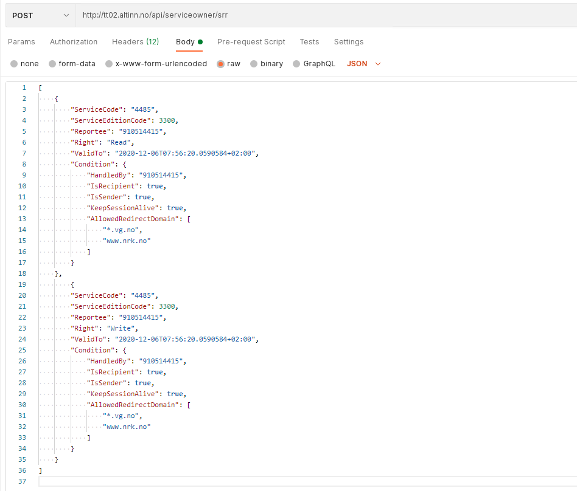

## Om tjenesten 
Tjenesteeier kan gjennom SRR styre to typer modus: consent og reportee. 

- Consent-mode, brukes kun for samtykketjenester, og regulerer hvem som kan motta en delegering (være coveredby)
- Reportee-mode, kan brukes for alle andre tjenestetyper og regulerer hvilke aktør/avgiver som kan delegere en rettighet til andre på egne vegne (se [autorisasjonsmodell](/docs/utviklingsguider/styring-av-tilgang/for-tjenesteeier/#overordnet-om-altinn-autorisasjon-og-styring-av-tilgang) for ytterligere forklaring). For disse gjøres det en opprydding av alle delegeringer som er utført av en gitt avigerreportee-en hvis SRR-regelen i etterkant fjernes.

## Registrere en aktør/avgiver i tjenesteeierstyrt rettighetsregister 

REST-endepunktet for SRR nås med følgende url:

https://tt02.altinn.no/api/serviceowner/srr

Her kan du bruke operasjonene GET (hente én eller alle rettigheter), POST (legge til rettigheter), DELETE (slette en spesifikk rettighet) og PUT (oppdatere en spesifikk rettighet).    
Se ellers API dokumentasjon for tjenesteeiere: https://tt02.altinn.no/api/serviceowner/help 

## Eksempler
Eksempel på en REST-request for å legge til rettigheter (her testet ved bruk av Postman):

  

**ServiceCode** er tjenestekoden og **ServiceEditionCode** er tjenesteutgavekoden for tjenesten. Disse finner du i TUL eller [metadata APIet](https://altinn.no/api/metadata). 

**Reportee** angir hvilken organisasjon (eller person) som skal få tilgang til tjenesten.

**Right** angir hvilken operasjon på tjenesten man skal få rettighet til

**ValidTo** angir hvor lenge rettighet/regel skal gjelde

**Condition** angir hvilke betingelser som skal knyttes til rettigheten. Disse kan være: 

- **AllowedRedirectDomain** benyttes for samtykketjenester, se [test av samtykketjeneste](/docs/utviklingsguider/samtykke/datakilde/test-tjeneste/) for detaljer

- **KeepSessionAlive** benyttes for samtykketjenester, se [test av samtykketjeneste](/docs/utviklingsguider/samtykke/datakilde/test-tjeneste/) for detaljer

- **HandledBy** benyttes for samtykketjenester, se [test av samtykketjeneste](/docs/utviklingsguider/samtykke/datakilde/test-tjeneste/) for detaljer

- **IsRecipient** for å angi om aktør er mottaker

- **IsSender** angir om aktør er avsender

 

Eksempel på verdier i request header for REST-restrequst (gjelder alle operasjoner):

  

Eksempel på å fjerne en gitt rettighet (REST):

  

 

Uthenting av informasjon om rettigheter kan skje på grunnlag av tjeneste. 
Eksempel på uthenting av gitte rettigheter (REST):

