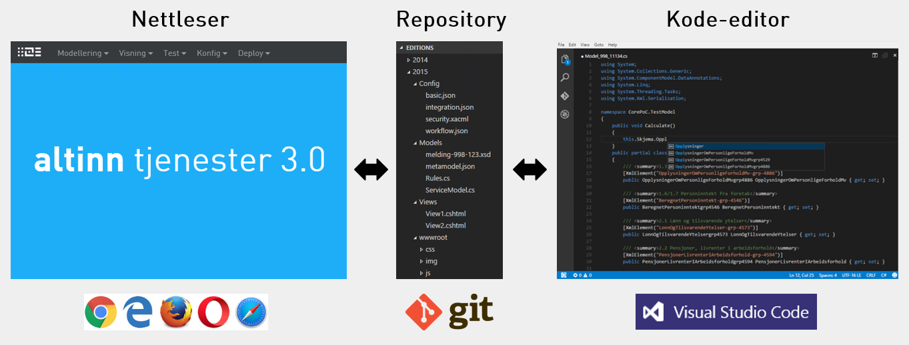

For flere detaljer, se https://docs.altinn.studio/architecture.

## Git

Det distribuerte versjonskontrollsystemet [Git](https://en.wikipedia.org/wiki/Git) er nå det
[klart mest brukte](https://insights.stackoverflow.com/survey/2018/#work-version-control) versjonskontrollsystemet for utvikling av programvare.  
Det er derfor naturlig å benytte Git også for lagring og versjonering av tjenestene som utvikles.  

Hver tjeneste vil lagres i et eget Git-repository, og vil inneholde en eller flere utgaver.

Både tjenesteutvikling i nettleser og tjenesteutvikling i kode-editor vil jobbe mot de samme versjonskontrollerte filene, og ha fullt innsyn i de filene som en tjeneste består av.

## Dokumentasjon

Dokumentasjon av tjenester 3.0 vil ligge åpent tilgjengelig på GitHub slik at alle kan bidra og foreslå forbedringer.  
[Markdown](https://en.wikipedia.org/wiki/Markdown) vil benyttes som format både for dokumentasjon, men også for tekst-ressurser og dokumentasjon for den enkelte tjeneste som utvikles.

## Åpen kildekode, cross platform

Tjenester 3.0 skal være basert på fri og åpen programvare som kan kjøre på alle plattformer, og ikke benytte proprietær programvare.
Selve 3.0-løsningen vil i seg selv også deles som åpen kildekode. Se også [fjerde målsetting](../goals#åpen-kildekode-cross-platform).

## Programvare

Se https://docs.altinn.studio/technology.