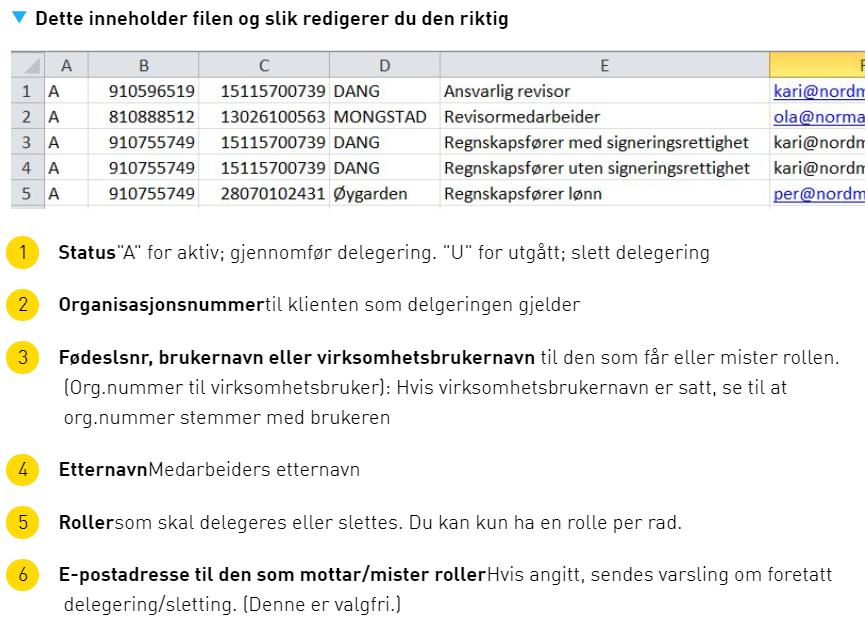

## Portal

Det er gjort flere forbedringer av den nye innboksen som ble [innført i forrige release](../17-2#ny-innboks).

### Søk på tvers av flere aktører i innboks
Det skal i innboksen være mulighet for å få oversikt over elementer i innboks på tvers av flere eller alle aktører slik at brukere som forvalter flere
enn en aktør enkelt skal kunne følge opp ulike innleveringer og mottatt post på en effektiv måte. 

### Soft due date
I [skattemeldingen](https://altinn.no/skjemaoversikt/skatteetaten/skattemelding-for-formues---og-inntektsskatt---lonnstakere-og-pensjonister-mv/)
(og muligens på sikt andre tjenester) brukes fristen som er satt som et *forslag* og ikke en endelig first.

En ny konfigurasjonsverdi i Altinn, `SoftDueDateServices`, lister de tjenestene hvor fristen kun skal være veiledende.
Elementer i innboksen tilhørende disse tjenestene blir da **ikke** listet i "haster"-kategorien, og blir dermed ikke markert med
rødt ikon og rød frist når de er utgått. Utgåtte elementer blir heller ikke plassert i "Under arbeid".

### Andre mindre forbedringer av innboks

- 10055 - Skjema-ikon vises på elemenenter i meldingsboksen som er skjema.

- 10342 - Skjema markeres som lest når brukeren trykker på "tilbake"-knappen etter å ha åpnet et skjema i utfyllings-steget.

- 11497 - Valget "+Vis alle profiler" og "søkefeltet" skal ikke vises for brukere som ikke har flere aktører å velge mellom. 
  - Valget må vises hvis bruker har tilgang til slettede enheter eller kun underenhet koblet til en hovedenhet som han ikke har tilgang til.
  - Når man søker etter aktør så må søk inkludere "slettede enheter" og "singleenheter" (gjelder både lite og stort aktørvalg) selv om man ikke har krysset av.

- 12876 - Søk på tvers vises for brukere som har tilgang til flere enn to aktører.

### Oppdatert veiledning for klientdelegering på fil
Det er laget en ny og bedre illustrasjon som hjelp til klientdelegering på fil.

### Forbedring av "Tjenesteeiers arkiv"
Endringen er gjort for å sikre at tjenesteeier får opp data korrekt i tjenesteeiers arkiv.

## Autorisasjon

### Deleger enkeltrettigheter skal gjelde for alle versjoner av tjenesten
Ved delegering av enkeltrettigheter og opprettelse av lokale roller
så koblet vi kun siste utgave mot tjenesten som ble delegert. Dette er nå utbedret.

## Eksterne grensesnitt

###  Virksomhetsbrukere får lesetilgang til flere elementer
Det er nå gjort en fiks slik at virksomhetsbrukere får lov til å lese elementer selv om tjenesten elementene
er basert på ikke er merket "Tillat bruk av virksomhetssertifikat".

### API'er kan returnere metadata om utgåtte tjenester
Dette gjør det mulig å hente opp informasjon om en tjeneste selv om siste versjon av tjenesten har gått ut.  
Legg merke til at det ikke gjelder utgåtte versjoner av tjenester hvor det fortsatt finnes gyldige versjoner.

## Bugfix :bug:

### Infoportal

Følgende feil er rettet i informasjonsportalen (de sidene som er tilgjengelige uten pålogging).

- 13692 - Søk fungerer nå i sticky-hjelp også når noen spørsmål/svar skal være skjult fra sticky-visningen
- 13082 - Fant du det du lette etter kan skrive til database
- 13795 - Enkelte sidetyper (landringsside/temaside) som ikke var søkbare er nå blitt det
- 13822 - 404-siden gir ikke lenger treff ved eksternsøk
- 13690 - Forbedringer i navngiving av felter i EPiServer redigeringsmodus for Om skjema-malen
- 13689 - Meta-felter blir tilgjengelig også for eksterne søk
- 13688 - Fjernet bug som gjorde at sider dypt i strukturen ble feilaktig nedprioritert i søkeresultatene
- 13828 - Utgåtte driftsmeldinger skal ikke lenger vises i driftsmeldingslista
- 13232 - Forbedret støtte for å finne relevant bokmålsinnhold ved søk i nynorsk infoportal

### Diverse

- 13202 - Feil på åpning av RF-1030 - Altinn I for årene 2005 til 2012.
- 13259 - Kommer til websa-meny ved å trykke "Tilbake" i kvitteringssiden.
- 12576 - Forkast-kladd knapp virker ikke før for element på egen url før man har åpnet aktivitetslogg.
- 12305 - Meldinger skal ikke inneholde lenke til ikke eksisterende arkiv-referanse i miljøet 
- 12626 - Endret varslingsside ved "midlertidig" tilgang til annen bruker ved signering.
- 13583 - Forbedret ytelse for avgiverliste.
- 13678 - Får ikke arkivert meldinger som mangler varslingsinformasjon i serviceEngine
- 13683 - Endring av feilmelding RF-1400.
- 12143 - Remember selected language when User is not authenticated 
- 12283 - Samtykkelogg - ikke mulig å scrolle for å lese all info om samtykke.
- 9595  - Samtykke text er ikke synlig i aktivitetslogg for Engangssamtykke.
- 10940 - Rettet ikon for underenhet i nedtrekkslisten 
- 11027 - Logging av bruk av samtykke må vises i samtykkeloggen.
- 11231 - Ikon for arkivering er skal være aktivert etter at man bekrefter mottatt melding
- 12669 - Delegering i Tjenesteeiersarkiv gir server error i enkelte tilfeller.
- 12687 - Justert visning av firmanavn i Aktivitetslogg
- 12688 - Ikke mulig å registrere sluttbrukersystem i IOS.
- 13277 - SRRDirectRightsCleanupBatch Feiler i PROD og TT02 med `There was an error reading from the pipe: Unrecognized error 109 (0x6d)`.
- 13287 - Forbedringer i søk etter underenhet.
- 13501 - Får ikke åpnet vedlegg uten filangivelse i navnet når disse er videresendte som epost fra Altinn - åpnes nå som pdf hvis ikke annet er angitt
- 12435 - Fallbackløsning; når du går tilbake til meldingsbok etter å ha åpnet et skjema til utfylling blir searchId feil
- 12081 - Feil når man klikker på login ikon
- 12778 - Tatt bort aktør fra aktørliste når virksomhetsbruker ikke har rettighet på vegne av denne
- 11229 - Epost ved delegering av roller er korrigert
