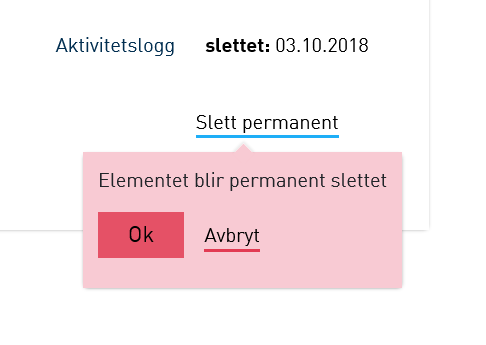
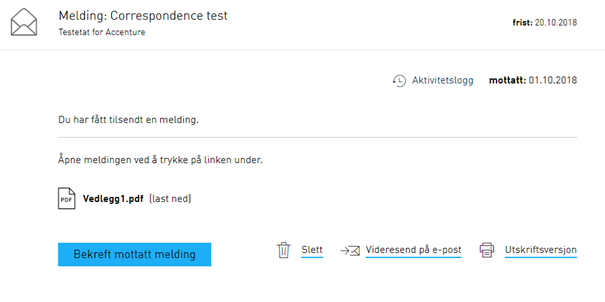
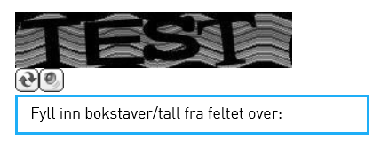
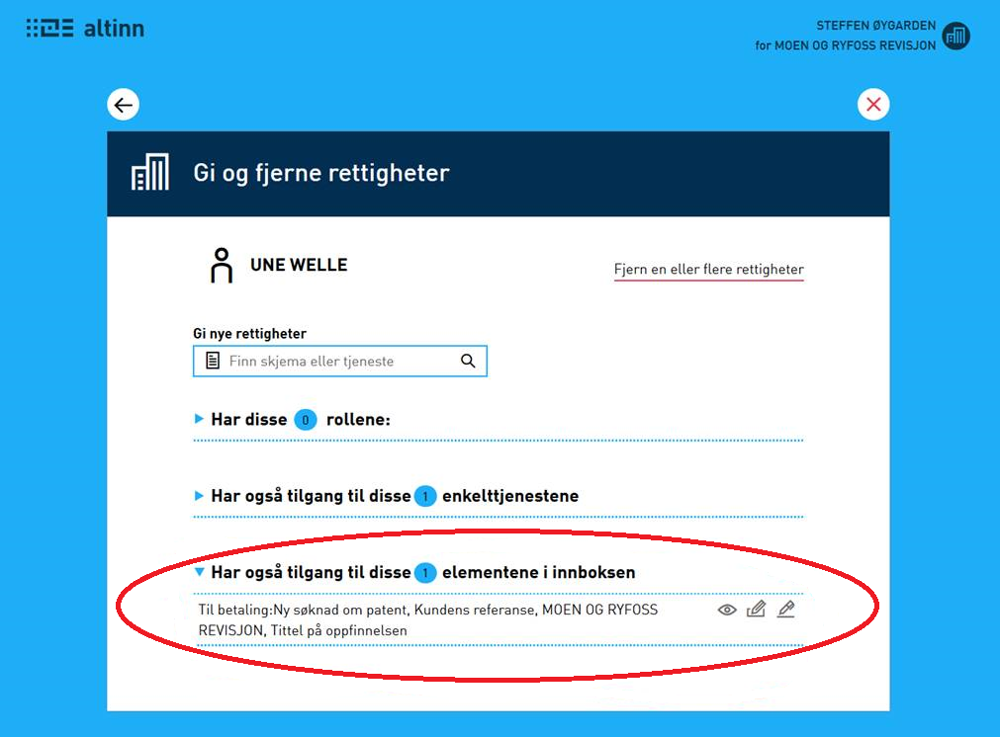
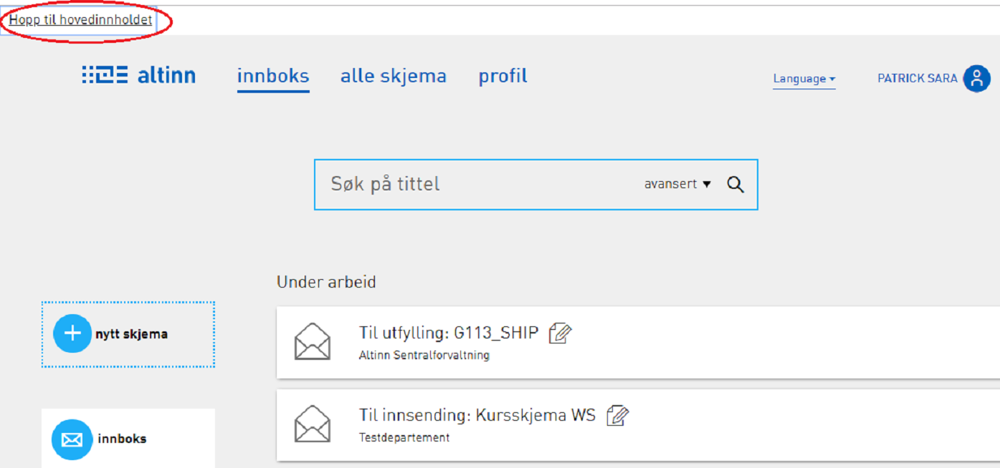

## Endringer i portal

### Brukere som representerer en organisasjon kan nå permanent slette elementer fra “Slettede” i innboksen

Brukere som representerer en organisasjon og som har rollen tilgangsstyring og rettigheter til å slette elementer kan nå permanent slette elementer fra “Slettede” i innboksen.
Når bruker ønsker å permanent slette et element kommer det opp et varsel der brukeren er nødt til å bekrefte sitt ønske.
Varselet kommer også opp når enkeltpersoner prøver å permanent slette elementer fra “Slettede”.

### Altinn husker nå valget brukeren sist hadde ved bruk av “se alle underenheter” og/eller “se slettede enheter”

Når bruker huker av for “se alle underenheter” og/eller “se slettede enheter” vil Altinn nå huske brukerens valg slik at
neste gang brukeren er innom aktørvalg-siden vil avhukningsboksene for “se alle underenheter” og “se slettede enheter” reflektere forrige valg.

### Maksimum størrelse på e-post utvidet til 1.4 MB

 Max størrelse på vedlegg som kan sendes på epost utvidet til 1.4 MB. Varsel kommer opp når meldingen er for stor til å videresende på epost.
 Man kan velge å videresende i altinn (ingen begrensing på størrelse for videresending i altinn) eller takke nei.

### CAPTCHA oppdatert i portalen

Programvare for [CAPTCHA](https://no.wikipedia.org/wiki/CAPTCHA) er nå blitt oppgradert på alle sider det benyttes.

### Operasjonene arkivering og permanent sletting av en aktiv melding skjuler nå utgåtte delegeringer fra oversikt over andres rettigheter

Med denne endringen fjernes all informasjon om tidigere elementdelegeringer som ikke lenger har noen interesse fra oversikten.
Dette gjør det lettere for tilgangsadministrator å se hvilke delegeringer som er aktive.

## Diverse bugfix

### Person med rettighet på enkelttjeneste fikk ikke delegert rettigheten videre

Det ble innført en feil i 18.9 releasen av Altinn som gjorde at personer med tjenesterettigheter ikke fikk delegert videre.
Dette skjedde hvis rettigheten de hadde var eldre enn versjonen av den gjeldende tjenesten. Dette er nå rettet opp.

### Kvitteringen som skal sendes ut etter prosessering av en klientdelegeringsfil ble ikke alltid sendt

Samlekvittering etter klientdelegering ble ikke sendt dersom fila inneholdt e-postadresse. Feilen oppsto etter 18.8 releasen av Altinn. Dette er nå rettet.

### Tabbing i innboks hoppet over slett knappen

Slett knappen blir nå også aktivert ved tabbing på siden.

### Fjerning av ugyldige linker i resultatet fra slettede elementer i REST API

Ved henting av slettede elementer via REST API ble det returnert noen ugyldige linker.
Nå er self-linken korrigert på hele resultatet til å peke på /messages/trashbin istedenfor bare /messages.
Find-elementet på hele listen ble fjernet, samt at det nå bare returneres metadata-link på selve message-element som ligger i slettede enheter (trashbin).
Alle andre linker på message-objektene er fjernet.

### Snarveier for tastaturnavigering lagt til

Meny som blir synlig når tastatur benyttes er lagt til på innboks, arkiv og slettede visningen for å lette navigering fra tastatur.
Dette er samme meny som allerede finnes på Altinns [portal](https://www.altinn.no/) og [www.brreg.no](https://www.brreg.no/).

### Feil lenke til Kontakt- og reservasjonsregisteret fra profilsiden

Personer reservert mot kommunikasjon fra det offentlige får opp en tekst med en [lenke](https://brukerprofil.difi.no/minprofil?locale=nb)
på profilsiden som gir mulighet til å endre reservasjonsstatusen. Lenken gikk til feil side hos Kontakt- og reservasjonsregisteret.
Dette er nå rettet opp. Lenken er dynamisk slik at den leder til riktig sted også i testmiljøene.

