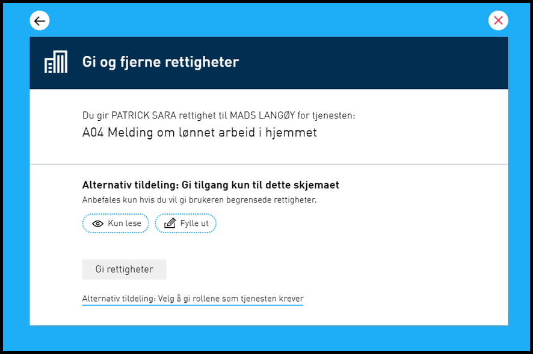
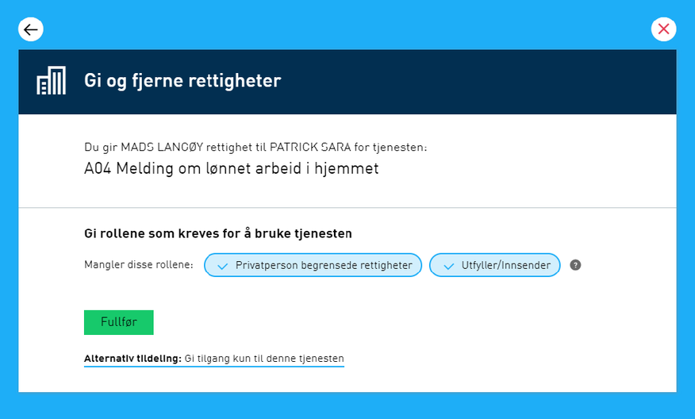
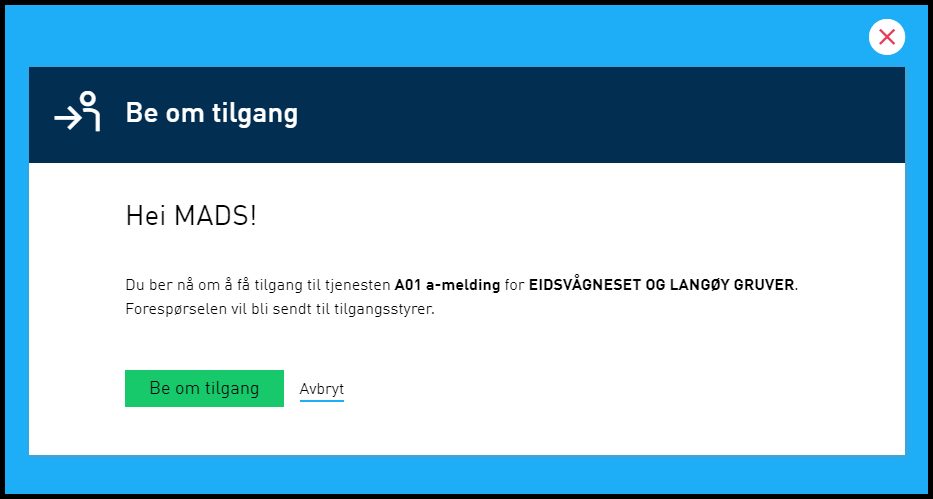
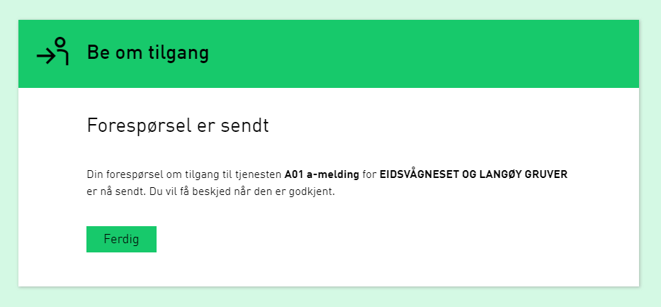
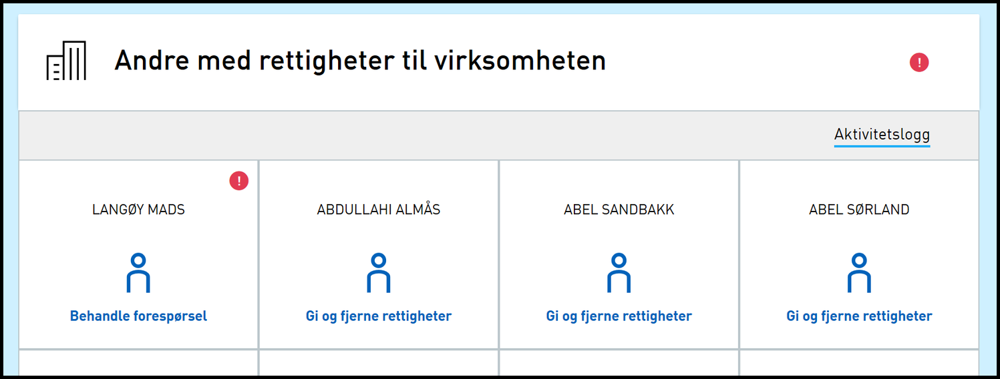
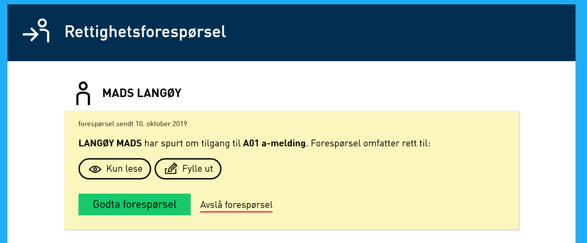

## Endringer i autorisasjon

### Delegerings-vindu prioriterer nå delegering av enkelttjeneste

Når en forsøker å gi tilgang til en tjeneste blir enkeltjeneste-delegering nå foreslått først (fremfor rolledelegering) uansett tjenestetype. Dette blir gjort for å unngå at det uforvarende blir gitt rettighet til mer enn tenkt siden en rolle inneholder flere rettigheter.

## Endringer i portal

### Tilgangsforespørsel er nå mulig i portalen

Hvis man starter en tjeneste uten at man har nødvendig rettighet vil man nå bli spurt om man ønsker å be om rettighet for tjenesten. Den som har rettigheten kan se og behandle disse tilgangsforespørslene.

Når en person som har rollen "tilgangsstyring" logger på vises dette:

## Feilrettinger

### Feilmelding på InformationPointSI når LocalProxy var avslått

Dersom LocalProxy/WCF-bypass løsningen ble slått av fikk man tidligere feilmelding. Dette er nå rettet.

### Ikke mulig å gjenopprette slettet element fra papirkurv

Tidligere så var det krav om at man måtte ha rettigheten ArchiveDelete for å få lov til å gjenopprette et skjema som var slettet, men ikke permanent slettet. Dette er nå endret til at rettighetskravet er ArchiveRead.

### Visningsfeil ved bruk av "IPad" visning

Her var det feil visning to steder. Den første var under valg av tjenester for varsling under “Din kontaktinformasjon for virksomheten” hvor to grønne pop-up bokser var over hverandre. Den andre feilen var under “valg av tjenester for delegering under delegering av tjenesterettigheter og ved opprettelse av lokal rolle” hvor søkeresultatet går ut av skjermen på høyreside. Dette er nå rettet.
