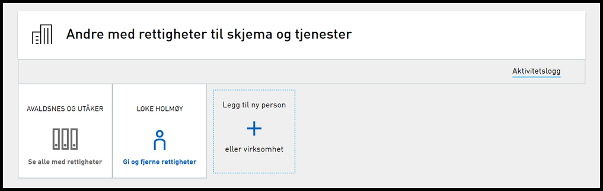
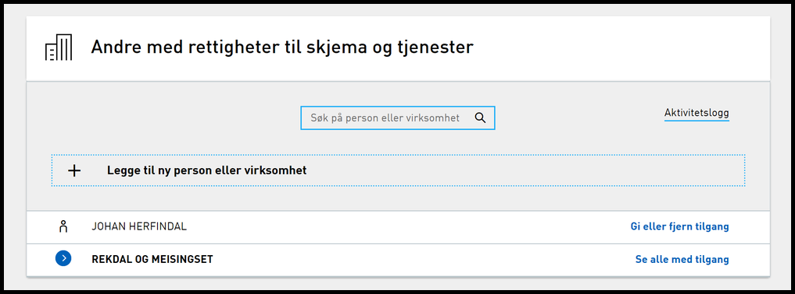

## Endringer i portal

### Panelet for “Andre med rettigheter” har fått listevisning

Kortene som var i “andre med rettigheter” panelet er omgjort til liste. Et ikon kommer opp på tilhørende panel hvis noen har bedt om rettighet. Listen storteres alfabetisk på navn.

&nbsp;

### Nytt søkefelt i “andre med rettigheter”

I panelet “andre med rettigheter” har det også kommet et nytt søkefelt (se bildet over) som kan brukes til å søke etter navn på en persons for- og etternavn eller organisasjon.

Søkemulighetene er:

- Navn på person eller organisasjon som er gitt rolle/rettighet/instansdelegering direkte eller via ekstern autorisasjonskilde (Enhetsregisteret, Folkeregisteret med flere).
- Navn på person eller organisasjon som har fått rolle/rettighet indirekte via nøkkelrolle hos organisasjon med rolle/rettighet.

## Endringer i autorisasjon

Sikkerhet i eOppslag introduseres i pilot-produksjon. [Les mer om denne endringen](../../../../utviklingsguider/sikkerhet-i-eoppslag/).

## REST API

### Unødvendig dokumentasjon på sluttbrukersystemer fjernet

 Dokumentasjonen av sluttbruker-apiet inneholdt tidligere en seksjon for SRR som var tom. Denne er nå fjernet da dette ikke eksisterer på dette APIet.

## Feilrettinger

### Ytelsesforbedringer utført for Download Queue

Forbedrede saneringsrutiner og endel andre mindre tiltak utført. Det ble også utført ytelsesforbedringer ved forrige [release](../19-11).

## Tjenester 3.0

### Utviklingsarbeidet med prosjektet Tjenester 3.0 pågår

Se [egen side her på github](../../../prosjekter/tjenester30) for beskrivelse, status og forventet tid for release.
