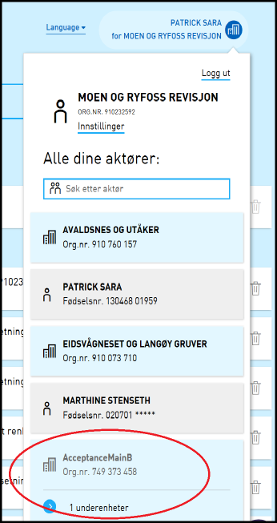

## Endringer i skattemeldingen

### Generelt om årets revisjon av skattemeldingen i Altinn

Hvert år gjøres det oppdateringer og endringer i RF-1030 (skattemeldingen), f.eks. nye poster og underskjema,
endring i eksisterende poster, sletting av utgåtte poster og underskjema.
Disse oppdateringene gjøres i RF-1030 datamodellen, som tas inn i nye utgaver av tjenestene “RF-1030PSA” og “RF-1030PSAN”.
I tillegg oppdateres en rekke tekster og det gjøres også endringer på bl.a. overførings- og valideringsregler.
Nyheter om skattemeldingen vil fremover bli publisere på skatteetaten.no.

### Sammendrag på signeringsside for Skattemelding for formue- og inntektsskatt – personlig næringsdrivende mv

Tidligere endringer har resulterte i en uheldig visning av signeringssiden på Skattemelding for formue- og inntektsskatt – personlig næringsdrivende mv.
Dette er nå utbedret, dersom bruker sender med underskjema som hadde egendefinerte signeringssider (f.eks RF-1175).

### Start skatteberegning i skattemeldingen

Det er nå mulig å starte skatteberegning fra kvitteringssiden for Skattemelding for formue- og inntektsskatt - lønnstakere og pensjonister mv.

### Skattemelding for formue- og inntektsskatt – personlig næringsdrivende mv. og rød markering etter frist

Næringsdrivende sender inn Skattemelding for formue- og inntektsskatt – personlig næringsdrivende mv. etter frist selv om denne tidligere har blitt sendt inn.
Det er da i utgangspunktet ikke behov for ny innsending, med mindre det er nye endringer. Dette skjer spesielt med brukere som sender inn via SBS.

I dag blir Skattemelding for formue- og inntektsskatt – personlig næringsdrivende mv. markert som rød i innboks dersom fristen har gått ut.
Det er lagt inn kode som fjerner DueDate når fristen er utløpt for et element. DueDate fjernes hvis det allerede finnes en annen arkivert instans av samme tjenestetype.
Fjerningen av duedate skjer når brukeren går til Innboksen. Rødmarkering vil nå ikke vises dersom tjenesten allerede er sendt til arkivet.

## Endringer i Portal

### Legge til vedlegg fra signeringssiden

Når man fra signering og innsendingssiden trykker “Tilbake til utfylling” er tanken at alle vedlegg som har blitt lagt til under signeringssiden ikke lenger skal være synlig.
En feil gjorde imidlertid at vedleggene var synlig for brukeren. Dette er nå rettet.

### Hovedenheten er ikke lenger klikkbar i lite aktørvalg hvis man bare har tilgang til underenhet

Tidligere var det mulig å klikke på hovedenheten som man ikke hadde tilgang til, noe som medførte at man kom til en side med en 403 feilmelding.
Denne endringen fjernet muligheten for å klikke på en hovedenhet som man ikke har tilgang til via den lille avgiverlisten (i header).
Dette gjør at aktørlisten i header har lik oppførsel som i den store aktørlisten.

## Endringer i REST API

### Individuelle skjema i PDF

Tidligere lagret Altinn hele skjemasett i PDF formatet. Nå er de separert ut slik at man eksempelvis kan hente ned kun ett underskjema.

## Andre endringer

### Utvidet samtykketoken til å innholde informasjon om hvem som henter data (HandledBy)

I en normal dialog hvor samtykke brukes for å hente data fra en datakilde så består denne av 3 parter:

- Den som gir samtykke (offeredBy)
- Den som får samtykke og som trenger data, datakonsumenten (coveredBy)
- Den som sitter på data som skal utveksles, datakilden

I noen tilfeller så er det mest hensiktsmessig at uthenting av data fra datakilden gjøres av en fjerde aktør som kan behandle samtykket på vegne av mottaker (datahåndterer).
Dette kan f eks være i tilfelle hvor datakilden ikke har mulighet/ønske om å forholde seg til mange datakonsumenter.
Datahåndterer vil da ha ansvar for at data kun formidles videre til datakonsument når det foreligger et gyldig samtykke i altinn.
I token angis den som opptrer som datahåndterer som «HandledBy», se [her](/docs/guides/samtykke/datakilde/bruk-av-token/#handledby) for mer informasjon.

### Utsending av varsel til organisasjoner vil kreve tjenesteinformasjon for å sende varsel til personer rundt organisasjonen

Dette er en endring i logikken som identifiserer de som skal ha varsel når tjenesteeier ønsker å sende varsel til en organisasjon.
Endringen innebærer at de som har registrert personlig kontaktinformasjon for virksomheten ikke vil bli sendtvarsel
hvis tjenesteeier ikke oppgir tjenesteinformasjon: ServiceCode og ServiceEdition.

Tjenesteinformasjonen brukes til å autorisere hver enkelt person slik at det kun er de med leserettigheter på tjenesten som får varsel.
Hvis det ikke blir oppgitt noe tjenesteinformasjon kan ikke Altinn autorisere tilgang og derfor heller ikke sende varsel.
I praksis gjelder denne endringen kun tjenesten for å sende uavhengig varsel SendStandAloneNotification.
De andre tjenestene med varsel mekanismer har tjenesteinformasjon som obligatorisk input. I tidligere versjoner ville alle bli varslet.

### Maskering av fødselsnummer i kvitteringer og varsler sendt pr e-post og SMS

Samtlige meldinger som blir sendt fra løsningen blir nå scannet for fødselsnummer og de siste fem sifrene sladdes før SMS eller e-post sendes ut.

### Betinget lagring av meldinger i tjenesteeiers arkiv

Når en tjenesteeier sender inn en melding vil denne ikke lenger legges inn i tjenesteeiers arkiv hvis lagringsperioden for Tjenesteeiers arkiv er satt til 0 i TUL.

## Feilrettinger

### Avgiverliste for inaktive enheter fungerte ikke for underenheter via REST

Det var en feil når man ønsket å hente ut avgiverlisten via REST der man ikke ønsket å se inaktive enheter.
Inaktive underenheter ble da ikke filtrert riktig. Dette er nå rettet slik at også underenheter blir filtrert korrekt.

### Hjelp på signeringssiden fungerte ikke

Man fikk bare en feilmelding når det ble trykket på "Hjelp" knappen/lenken som kommer opp på signeringssiden. Dette er nå rettet.
