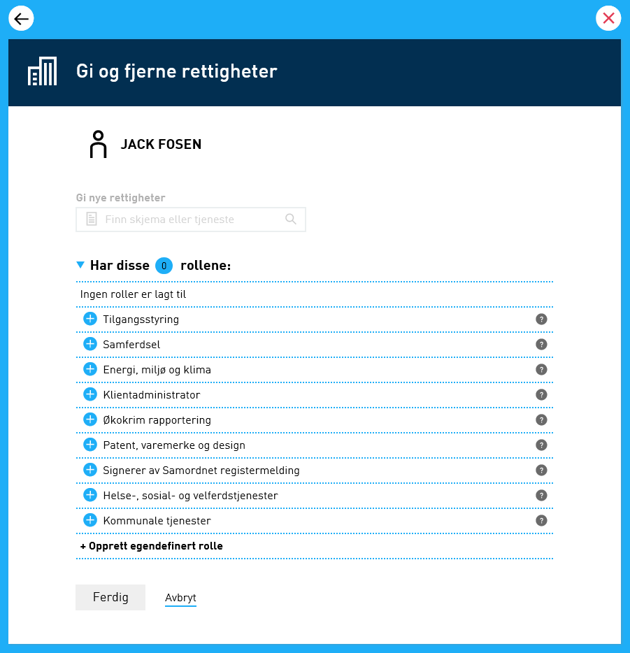
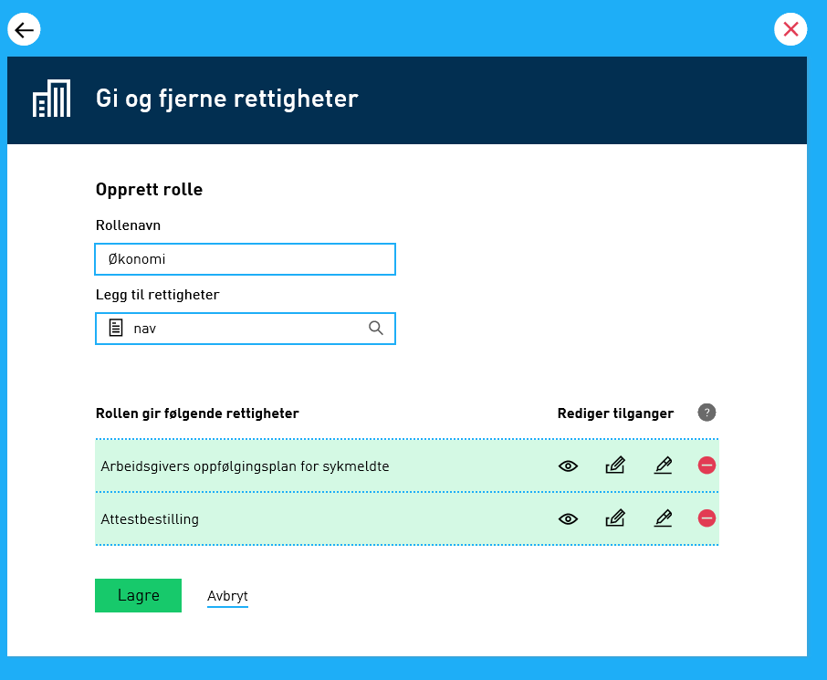
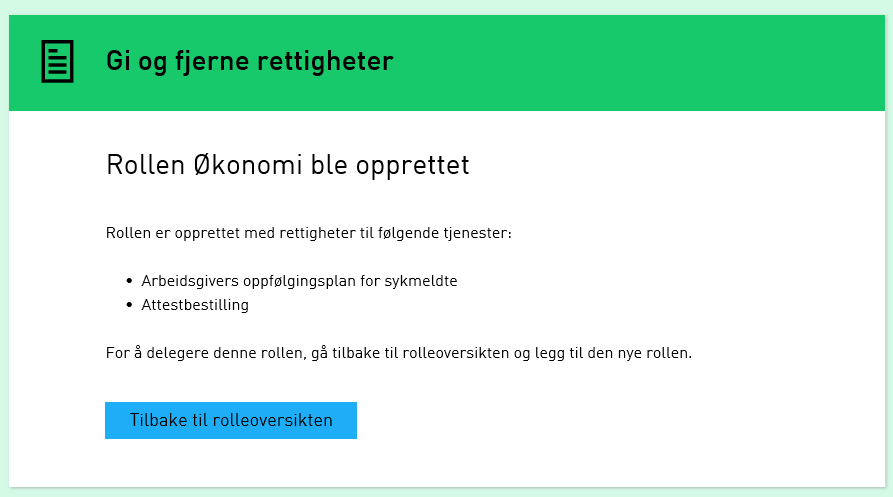

## Endringer i Portal

### Forenkle prosessen med opprettelse av lokal rolle som skal inneholde mange rettigheter

Prosessen for å opprette lokal rolle har blitt forbedret. Man har ved denne endringen fjernet rettighetsvisningen
hvor man delegerer rettigheter på en og en tjeneste når man oppretter en lokal rolle.
Istedenfor blir tjenestene nå lagt til i oversikten under søkeresultatet, og rettighetene kan enkelt styres fra oversikten direkte.
Endringen er implementert slik at alle rettighetene man har tilgang til for den gitte tjenesten, vil bli lagt til i rollen.

**Steg 1:** Velg opprett egendefinert rolle

**Steg 2:** Gi rollen et navn og søk opp de tjenester du ønsker å gi tilgang til.
Du kan søke på navnet til tjenesten og sortere på etat/tjenesteeier

**Steg 3:** De tildelte rollene vil legge seg i listen under søkefeltet.
Ikonene viser hvilke tilganger som er gitt, og disse kan endres ved å klikke på ikonene.
Man kan bare gi videre tilganger man selv har.

**Steg 4:** Etter delegeringen vil man få opp en kvittering. Klikk tilbake til rolleoversikten for å knytte rollen til mottakeren

**Steg 5:** Klikk på den nye rollen. Den vil nå bli lagt til.

### Ny tjenestesøkresultatvisning i andre med rettigheter og varsling kun for enkelttjenester

Søkeresultatet for delegering av tjenester under andre med rettigheter og søk i aktive tjenester under varsling kun for enkettjenester har blitt endret.
Tjenesteeier for tjenesten vises nå i en ny kolonne i tjenestesøket sammen med navnet på tjenesten.
Under varsling for enkelttjenester er det også lagt til en tekst som sier noe om tjenesten allerede er lagt til eller ikke fra søkeresultatet.

## Endringer i REST API

### Forbedrede feilmeldinger når det er noe feil med OData parametere i en forespørsel

Feilhåndtering i REST API er blitt utvidet til å håndtere ODataExceptions.
Alle ODataExceptions vil nå gi HttpStatus 400 (BadRequest) og begrunnelsen (ReasonPhrase) vil settes til det samme som meldingen i ODataException.
Se tabell under for detaljer,

| Eksempel                                        | Feilmelding                                                                                          |
| ----------------------------------------------- | ---------------------------------------------------------------------------------------------------- |
| api/metadata?$top=10001                         | The limit of ‘10000’ for Top query has been exceeded. The value from the incoming request is ‘10001’ |
| api/metadata?$orderby=ValidTil                  | Could not find property named ‘ValidTil’ on type ‘Altinn.SBL.AltinnWebAPI.Models.ServiceMetaData’    |
| api/metadata?$filter=ServiceOwnerCode neq ‘ACN’ | Syntax error at position 20 in ‘ServiceOwnerCode neq ‘ACN”                                           |

## Diverse bugfix

### Oppretting av lokal rolle basert på direkte delegerte tjenesterettigheter ble ikke laget

En intern bug i autorisasjonskomponenten resulterte i at en bruker ikke fikk laget eller oppdatert en lokal rolle
med tjenesterettigheter som var direkte delegert til brukeren. Dette er nå rettet.

### Satt respons språk til Engelsk for frittstående varsel (StandAloneNotification) i Soap API

Språk i respons for frittstående varsel er nå Engelsk. Tidligere ble siste varsel brukt for å avgjøre språket til responsen.

### Mulighet for å kontrollere skjema også når det inneholder feil

Denne endringen skal gjøre at regelmotoren fullfører en “Kontroller alle/oppgave” operasjon selv om det skjer en teknisk feil
i en av reglene som er angitt i regelfilen til skjema. I tillegg er det lagt inn støtte for å vise disse feilene i portalen.
Dette er kun ment for skjemautviklere i utviklingsfasen og funksjonen skal ikke benyttes i produksjonsmiljøet.
Funksjonaliteten kan skrus på for hver enkelt tjeneste ved å angi dette i regelfilen til tjenesten.

### Gi fullmakt på profilsiden - manglende mellomrom

Denne endringen legger til et mellomrom i teksten etter at et skjema blir delt med en bruker som ikke har rettigheter.
Det manglet tidligere et mellomrom mellom delegerings status og delegerings tittel.

### Meny overlappet med det lille aktørvalget på mobil

Feilen oppsto når en bruker byttet mellom meny og aktørlisten flere ganger etter hverandre på mobil.
Løsningen på problemet ble å lage en obervatør som sikrer at menyen er lukket før man kan åpne aktørvalget, og vice versa.