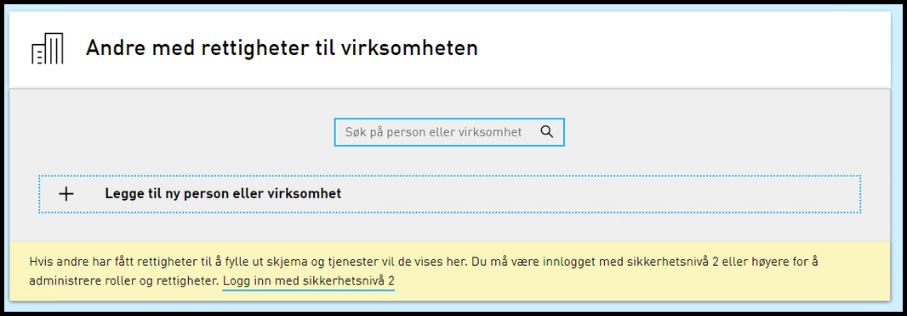

## Endringer i Autorisasjon

### Håndtere nøkkelrotering i Maskinporten-autentisering

Dette implementerer støtte for flere nøkler signering av access_tokens oppgitt i OIDC-JWK endepunktet til Maskinporten.

## Endringer i skattemeldingen

### Generelt om årets revisjon av skattemeldingen i Altinn

Hvert år gjøres det oppdateringer og endringer i RF-1030 (skattemeldingen), f.eks. nye poster og underskjema, endring i eksisterende poster, sletting av utgåtte poster og underskjema. Disse oppdateringene gjøres i RF-1030 datamodellen, som tas inn i nye utgaver av tjenestene “RF-1030PSA” og “RF-1030PSAN”. I tillegg oppdateres en rekke tekster og det gjøres også endringer på bl.a. overførings- og valideringsregler. Nyheter om skattemeldingen vil bli publisere på skatteetaten.no.

### Bedre feilmelding til sluttbrukersystem ved mangler i forhåndsutfylt data

Tidligere har en vist en liste i feilmelding over manglende orid dersom det sendes for lite prefill data. Dette blir nå også vist dersom en sender for mye prefill data.

### Start skatteberegning i skattemeldingen

Det er nå mulig å starte skatteberegning på vegne av andre dersom en representerer andre aktører i RF-1030 Skattemelding for formues- og inntektsskatt – lønnstakere og pensjonister mv. Dette kan utføres via webSA meny.

### Egen kommuneliste pr inntektsår

Fra inntektsår 2019 og frem er det satt opp egne kommunelister pr inntektsår. For inntektsår 2019 vil kommunene som er gyldige i 2019 være tilgjengelige. Dette vil også gjelde for inntektsår 2020 og fremover.

### NaN verdi i RF-1030 er utbedret

I inntektsår 2018 ble det oppdaget NaN som lagringsverdi i enkelte felt i RF-1030. Dette skyldtes feilverdi i underskjema f. eks bokstaver i tall felt som videre ble overført til RF-1030. Det blir nå foretatt sjekk av verdi fra flere av underskjemaene på om disse er gyldige, før verdioverføring utføres til RF-1030.

### Tilsendte meldinger fra ny skattemelding gir informasjon i webSA meny

Skatteetaten utvikler og leverer ny løsning for skattemeldingen formues- og inntektsskatt – lønnstakere og pensjonister mv, ved SIRIUS prosjektet. I den forbindelse vil personer som kan benytte den nye løsningen motta informasjon om dette i både tilsendtmelding og videre i webSAmeny dersom melding er mottatt.

### Ny rolle A0282 – Skatteforhold for privatpersoner

Ny rolle gjøres tilgjengelig som tillegg for skattemeldingen formues- og inntektsskatt og tjenester tilknyttet denne. Rollen er tenkt kun benyttet av skatteetaten og tjenester knyttet til skattemeldingen.

## Endringer i REST API

### Ny Postman-collection med endepunkte i REST APIet

Det er oppettet en Postman collection med endepunktene og eksempler som nå et tilgjengelig på GitHub. Se [https://github.com/Altinn/postman-examples] for hvordan å ta denne collectionen i bruk.

### Nytt endepunkt for å hente ut Reportee basert på SSN og LastName, eller OrgNo og OrgName via REST

Denne endringen legger til et nytt endepunkt /reportees/ReporteeConversion i REST API. Gjennom dette endepunktet kan man nå hente ut et Reportee-objekt dersom man vet SSN og LastName, eller OrgNo og OrgName, og at den personen eller organisasjonen ligger i brukerens avgiverliste.

Se [https://altinn.no/api/help] for mer informasjon.

### Nytt endpunkt for å hente ut samtykker for en tjeneste via REST på Tjenesteeier APIet

Det er lagt til et nytt endpunkt /serviceowner/Consents i REST API. Dette returnerer alle samtykker som har blitt gitt på en tjenesteeiers tjeneste. Samtykkeinformasjonen inneholder Reportee informasjon om partene, tidspunkt, og status på samtykke.

Det er lagt ut en [ny hjelpeside for /serviceowner/Consents](../../../../api/tjenesteeiere/rest/autorisasjon/samtykke-liste/). Se også [https://altinn.no/api/serviceowner/help] for mer informasjon.

### GUI-url på /consentRequest via REST

Det er innført en ny verdi i ‘_links’-listen på endepuntet /api/consentRequest. Det anbefales å bruke denne veriden i en ekstern integrasjon mot dette endepunktet dersom man skal sende en bruker til samtykkesiden i Altinn. Se også endringer som er gjort i Portal på endepunktet /ui/AccessConsent/{GUID} som nå har blitt endret.

### Advarsel ved tildeling av tilgang til taushetsbelagt post

Rollene "Taushetsbelagt post - helse, sosial og omsorg", "Taushetsbelagt post - oppvekst og utdanning" og "Taushetsbelagt post - administrasjon" får nå den samme advarsel ved tildeling som rollen "Taushetsbelagt post fra kommunen" har hatt.

## Endringer i SOAP API

### Ny operasjon i Formidlingstjenesten

Ny operasjon CheckIfAvailableFiles. Input: Liste med ssn/orgnr. Metoden returnerer true/false i forhold til om det finnes nye filer for mottakerne i input lista. Aktører som "poller", dvs har behov for å sjekke hyppig om det har kommet en forsendelse i Formidlingstjenesten, uten at de vet "at" det er kommet bør utføre disse spørringene med den nye metoden i stedet for GetAvailableFiles. GetaAvailableFiles bør kun kalles etter at CheckIfAvailableFiles har returnert true.

## Endringer i portal

### Nytt endepunkt for forhåndsregistrerte samtykkeforespørsler

Endepunktet for å laste samtykkesiden er nå endret fra /ui/AccessConsent/{GUID}?languageCode={en|nn-NO|nb-NO} til /ui/AccessConsent/request?id={GUID}&languageCode={en|nn-NO|nb-NO}. Det anbefales å benytte seg av gui-lenken som er implementert på GET /api/consentRequest/{GUID} i sin implementasjon da endeputet i fremtiden kan endre seg. Det er lagt inn en redirect til det nye endepunktet inntil videre, men det gamle endepunktet vil bli fjernet i en senere release.

## Feilrettinger

### E-post ved klientdelegering

Ved klientdelegering fikk ikke bruker e-post etter delegeringen når personen hadde kontaktinformasjon registrert i Kontakt- og reservasjonsregisteret. Dette er nå rettet.

### Ytelsesoptimalisering av filtert uthenting av avgiverliste i REST

Det er utført ytelsesoptimalisering ved bruk av filtert uthenting av avgiverliste i REST

### Fjernet visning av panel for søk og “Legge til ny person eller virksomhet” knapp under “Andre med rettigheter” ved for lavt sikkerhetsnivå

Listevisning “Andre med rettigheter” viser “Legg til” knapp selv med for lavt sikkerhetsnivå.

 Gammel visning

Ny visning

### Fikk ikke valgt underenhet (BEDR) i A-meldingen (A01)

Databaseprosedyren som hentet underenheter gikk mot en foreldet databasetabell. Dette er nå rettet opp.
