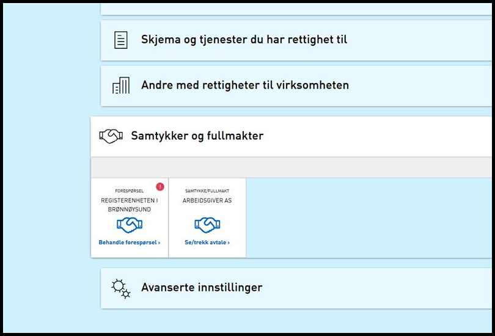

## Endringer i Portal

### Visning av Samtykkeforespørsler i samtykkepanelet

Samtykkepanelet er utvidet slik at det er synlig når brukeren har innkomende forespørsler. Innkommende samtykkeforespørsler kommer nå opp som forespørsler i “Samtykker og fullmakter”-panelet. Det er nå mulig for den innloggede brukeren å gå inn på forespørselen for å godta eller slette denne. Dersom forespørselen ikke er gyldig lengre kan den fjernes.

## Endringer i Autorisasjon

### Ny rolle opprettet slik at tilgang til lenketjeneste (eller annen ekstern tjeneste) kun kan gis eksplisitt

Det er opprettet en rolle som heter EKTJ (eksplisitt tjeneste delegering). Denne rollen er ikke delegerbar og det er ingen som arver den. Tjenester knyttet til rollen vil da bare være tilgjengelig gjennom direkte delegeringer gjort av brukere med Hovedadministrator.

## Endringer i REST-API

### Hente liste over samtykkeforespørsler for en datakonsument via REST - for sluttbruker system API

## Diverse bugfix

### Forbedret feilmelding i forbindelse med vedleggstype

Tidligere fikk man beskjed i feilmelding om at 30MB var grensen for vedlegg uansett hva grensen var satt til. Nå vises den grensen som faktisk gjelder for størrelse i feilmeldingen.

### Egenregistrert bruker fikk e-post uten innhold etter opprettelse av bruker

Teksten som skal vises i e-posten forsvant etter en endring som ble gjort i [20.2](../20-2) versjonen av Altinn. Teksten er nå lagt inn igjen.

### Ytelsesproblemer i DownloadQueue

Det har vært høyt CPU forbruk i forbindelse med bruk av [DownloadQueue](../../../../api/tjenesteeiere/soap/grensesnitt/downloadqueue). Optimalisering er derfor utført.
