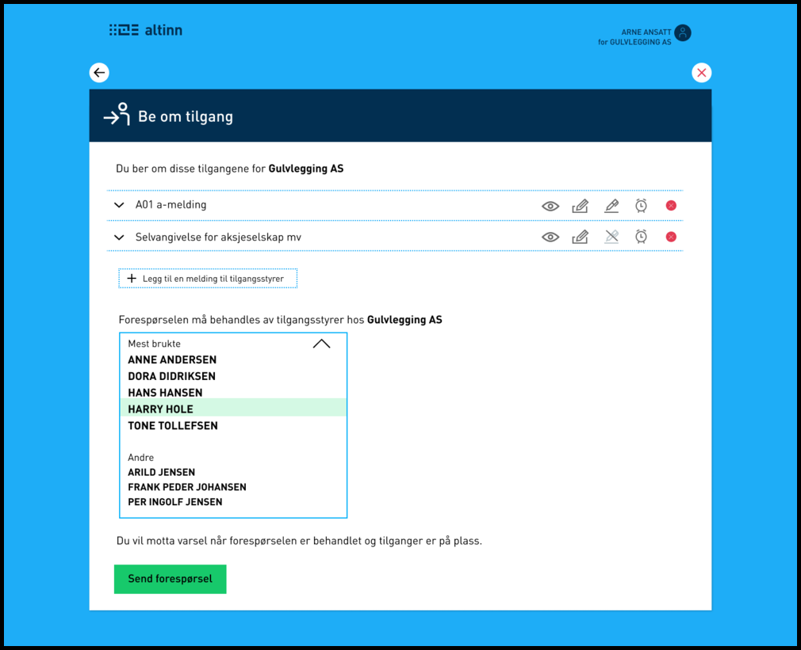

---
title: 20.4
description: Mindre endringer og feilrettinger
weight: 100
type: releasenote
releasenote_info: Release 20.4, produksjonssatt 22. april 2020
---                     

## Endringer i portal

### Sende bruker tilbake etter å ha benyttet "Be om rettighet"

Når en bruker benytter "Be om rettighet" fra en ekstern applikasjon kan man nå komme tilbake etter at 
brukeren er ferdig.

### Når man ber om rettighet er det mulig å velge tilgangsstyrer

Når en bruker ber om tilgang til en eller flere tjenester vedkommende mangler tilgang til kommer det nå opp en liste over personer som kan godkjenne forespørselen og velge hvem forespørselen skal sendes til.

## Feilrettinger

### Varsingsmaler må nå ha unikt navn

Varslingsmaler med samme navn ga feilsituasjoner i løsningen, så unikt navn kreves nå.

### Det ble gitt feil ved forsøk på å opprette tomt skjema med preutfylling via REST API

Dette er nå rettet slik at tomt skjema kan opprettes med preutfylling uten at det gis feilmelding.

### Epost ved klientdelegering der emne feltet fikk tekst med linjeskift feilet

Dette er rettet ved at linjeskift erstattes med mellomrom.

### Bruker ble sendt til meldingsboks etter oppgradering av sikkerhetsnivå ved delegering

Bruker blir nå tatt tilbake til delegering etter å ha oppgradert sikkerhetsnivået.

### Forhindre feilmelding i API for rollefiltrert søk på avgiverliste

Det ble en feil i reportees endepunktet for brukere som ikke har logget inn i Altinn før. Nå gis det feilkode 403 med melding: "User does not have an active Altinn profile".
